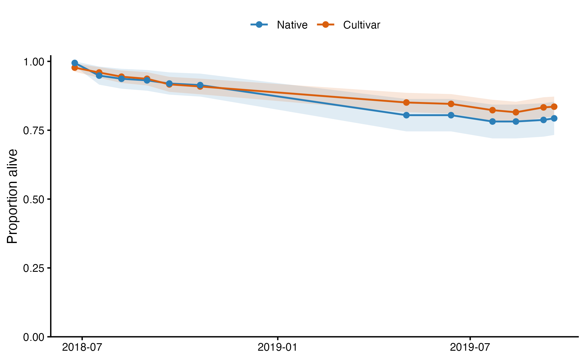
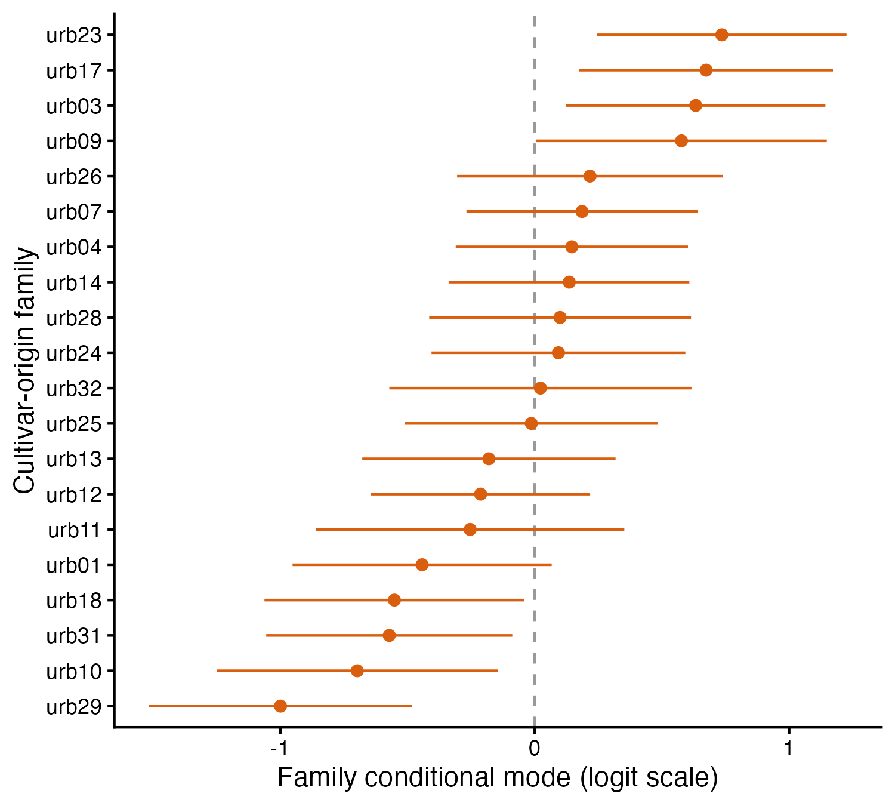

# Early fitness consequences of cultivar gene escape in flowering dogwood (*Cornus florida*, Cornaceae L.)

Jane Remfert  
Center for Life Science Education  
Virginia Commonwealth University  
Richmond, Virginia 23284

Andrew Eckert, Rodney Dyer[^1]  
School of Life Sciences and Sustainability  
Virginia Commonwealth University  
Richmond, Virginia 23116

***
# Abstract

Ornamental cultivars of native plants are now abundant in urban and suburban landscapes, creating large reservoirs of individuals, whose traits have been selected for cultivar use, adjacent to wild populations. Whether cultivar alleles that escape into wild populations persist depends on how cultivar-origin offspring perform when they recruit into natural habitats. We tested two competing hypotheses for flowering dogwood (*Cornus florida*): that cultivar ancestry imposes an early fitness penalty in a wild forest understory (*maladaptation*), or that cultivar-origin seedlings perform at least as well as wild seedlings, leaving early viability selection unable to restrain gene escape (*cultivar persistence*) and introgression of cultivar genotypes into native populations. We grew 569 open-pollinated seedlings from 36 maternal families (20 from managed landscapes, 16 from second-growth forest) in a common garden in a deeply shaded forest understory and monitored survival, growth, and biomass over two growing seasons. Seedlings were classified both by maternal-tree origin (cultivar/native) and, genetically using admixture of shared alleles with known cultivar vouchers. Survival was high (82%) and did not differ with origin or admixture, and origin explained little variation in any growth trait. Maternal family, however, accounted for significant variation among cultivar-origin seedlings, with moderate narrow-sense heritabilities for height, above-ground biomass, and stem biomass (h² ≈ 0.3–0.5) and heterogeneous family survival. Cultivar-origin seedlings were not disadvantaged in a wild understory, indicating that early viability selection is unlikely to limit the establishment of escaped cultivar alleles and that the potential for longer-term introgression into wild *C. florida* populations warrants attention.

**Keywords:** gene escape · crop-to-wild gene flow · cultivar · common garden · narrow-sense heritability · *Cornus florida* · urban landscape genetics

***
# Introduction

The flowering dogwood (*Cornus florida* L. Cornaceae) is an ecologically important understory tree in mesic forests of eastern North America. Populations of native *C. florida* currently face several demographic pressures, the most important of which include the fungal pathogen *Discula destructiva* (Redlin 1991; Sherald et al. 1996; Carr and Banas 2000; Jenkins and White 2002), which thrives in the moist and shaded understories resulting in significant mortality, and exotic invasive species such as *Microstegium vimineum* (Trin.) A. Camus, whose dense groundcover significantly limits seedling recruitment (Pierce et al. 2008; Suchecki and Gibson 2008).  Since the mid-1700s, dogwoods have been cultivated for their copious floral displays, striking bract color, and exceptional growth vigor in open spaces.  As a result of cultivation, many recognized cultivars are assayable through multilocus genotyping (Wadl et al. 2008). In residential and commercial landscapes, these trees are commonly grown with significant canopy openings, are completely free from overstory competition, and benefit from extensive human provisioning, including irrigation, fertilization, and pest control. This long-standing commercial demand, with an estimated annual sales rate of $31 million, has created a massive, highly managed suburban and urban reservoir of cultivar genotypes, selected to persist under environmental conditions divergent from the species’ native environment spatially proximate to remnant natural forests.

This spatial proximity suggests that the potential for asymmetric gene escape of cultivars into native forest populations is substantial. *Cornus florida* possesses several life-history traits that facilitate either pollen- or seed-mediated gene flow across the urban-native interface. The species has a predominantly outcrossing mating system with strong prezygotic barriers to selfing (Reed 2004; Dyer et al. 2012). Although there is support for environmental influence on flowering time (Reader 1975), there remains significant phenological overlap in the approximately 2-4-week flowering window between urban cultivars and native *C. florida* individuals. Pollination services are provided by a broad suite of insect pollinators spanning at least 11 insect families, many of which are commonly found in both forest and urban habitats (Carr 2010; Rhoades et al. 2011). *Cornus florida* produces bright red drupes in the fall, which are an important food resource for a variety of forest species and may be dispersed via endozoochory (Herrera 1981; Dyer et al. 2012). These dispersal mechanisms have historically functioned to maintain high levels of genetic diversity within the species (Hadziabdic et al. 2010, 2012; Pais et al. 2017).

The long-term demographic and evolutionary consequences depend heavily on how cultivar-origin offspring perform when they recruit into natural habitats. Cultivated dogwoods have been selected to maximize reproductive output (for showy displays, though not through realized survival of cultivar offspring) and thrive in open, high-light environments, so these traits may represent a severe physiological mismatch in native forest conditions. Artificial selection to persist in human-managed environments—where resources are abundant, there is no native recruitment through the seed pool, resource competition is reduced during early growth stages, and canopy competition is largely absent—has the potential to relax selection on traits related to resource-use efficiency, early growth, and shade tolerance. These tradeoffs may result in cultivar-origin offspring being less able to establish in deeply shaded, resource-competitive, and unmanaged forest understories. If cultivar-origin genotypes carry such maladaptive traits, early-stage viability selection will likely weed them out, mitigating the evolutionary impact of gene escape. However, if cultivar-origin seedlings perform as well as or better than native forest genotypes despite these novel selection pressures, there is no expectation that cultivar genes would not establish and persist, raising the long-term consequences of genetic introgression and the loss of unique, locally adapted wild alleles.

In this study, we tested two competing hypotheses regarding the consequences of cultivar gene escape into proximate native populations of flowering dogwood. If human selection for copious floral displays and vigor in open, high-light environments has relaxed selection for shade tolerance, understory competitiveness, and early seedling growth, cultivar-origin seedlings are expected to exhibit a fitness penalty under a wild forest canopy growing conditions manifest in reduced survival, growth, and/or biomass accumulation compared to seedlings with non-cultivar heritage.  We will refer to this as the *maladaptation hypothesis*.  Conversely, if the vigor and physiological growth traits selected under cultivation carry over as a general performance advantage in natural environments, cultivar-origin seedlings will perform at least as well as or better than their wild counterparts. Under this scenario, early-stage viability selection will not be restraining gene escape, signaling that cultivar alleles can readily establish and persist, setting the stage for long-term genetic introgression of cultivar genotypes, into surrounding native populations—the *cultivar persistence* hypothesis.

To differentiate between these two hypothese, we sampled offspring arrays from maternal trees from managed landscapes and adjacent native second-growth forests surrounding the metropolitan region of Richmond, Virginia.  We classified offspring in two ways.  First, we used the location of the maternal tree in the landscape to designate *cultivar* if the tree was located in a landscaped and managed location (commercial and residental properties in Richmond, Virginia) or as *native* if the maternal tree was sampled from second growth forests (Pocahontas State Park and the Rice Rivers Center).  To correct for potential pollen-mediated gene flow from native populations onto cultivar trees or longer term introgression of cultivar genes into native populations, we also used multilocus genotyping to compare genetic admixture of offspring genotypes from well-known cultivar varieties planted in the mid-Atlantic region.  Seeds were germinated and 569 seedlings were transplanted into a common garden located within the deeply shaded understory of a second-growth mixed hardwood forest at the VCU Rice Rivers Center.  All seedlings were monitored across two growing seasons for survival, growth (height and stem diameter), and dry above- and below-ground biomass. 

***
# Methods

## Study species

*Cornus florida* is a common understory tree native to the forests of eastern North America with a natural range that extends from northern Florida to southern New York and eastward to Michigan, Missouri, and parts of eastern Texas. Cultivated varieties of *C. florida* can be found in residential landscaping throughout the native range.  Native *C. florida* individuals are common members of second-growth forests throughout its range competing as a subcanopy tree commonly reaching no more than 10m in height. Flowering occurs over approximately 2-4 weeks in early spring with inflorescences containing 20-30 perfect flowers subtended by four large white bracts.  Pollination is provided by a variety of insects spanning 11 taxonomic families that vary according to the surrounding habitat (Carr 2010; Rhoades et al. 2011).

## Sampling Design

Maternal trees were identified in both managed urban environments and from second growth forests around Richmond, Virginia.  In the urban environment, maternal trees were sampled from residential yards, with landowner permission, and public spaces. Native maternal dogwood trees were sampled in the deciduous and pine second-growth forests of Pocahontas State Park in Chesterfield, VA, and at the Virginia Commonwealth University (VCU) Rice Rivers Center in Charles City County, VA.  We found no evidence that native tree sampling location impacted survival or any phenotypic trait (Tab_SiteEffect) and felt justified in combining samples from the Rice Rivers Center and Pocahontas State Park trees into the single *native* category. 

Open-pollinated seeds were sampled from 36 focal maternal individuals in both the urban and native environments in fall 2017.  Trees sampled from the secondary understories (native) had much lower seed set than those mothers in urban environments.  Seeds were depulped, given an acid wash (following ==REF==), and weighed; family-seed weight was used later as a covariate for material provisioning.  Seeds were then planted in a 2:1 sphagnum-perlite mixture and sealed in gas-permeable bags. After stratification at 4°C for at least 90 days, seeds were monitored for signs of germination.  Germination occurred over an extended period and we recorded the germination date for each individual seed to account for differences in developmental time between germination and subsequent trait measurements. Following cotyledon expansion, seedlings were planted in 4-inch nursery pots and grown indoors before being transplanted into the common garden location. 

## Common Garden

We established a common garden in the understory of a second-growth mixed hardwood forest at the VCU Rice Rivers Center.  To prevent seedling loss to deer browsing (Long *et al.* 2007), the common garden was surrounded by an 8-ft exclosure fence (Redick *et al.* 2020).  At plating, we had 20 family arrays ($n$ \= 395 seedlings) collected from maternal trees classified as *cultivar* and 16 family arrays ($n$ \= 174 seedlings; see Tab_Samples) whose maternal location was designated as *native*.  Each seedling was transplanted into a 2-gallon plastic nursery pot randomly placed within the garden.  

We monitored seedling growth and survival over two growing seasons with survival censuses conducted each year at both peak growth (May/June) and end of the growing season prior to leaf drop (September/October).  All seedlings were measured for the following traits.  Height was measured from the base of the plant to the apical meristem, and stem diameter was measured just below the cotyledons (when present) or the cotyledon scar (thereafter). In spring of year 2, there was evidence of a powdery mildew infection, as commonly found in nursery populations. We were not specifically testing disease susceptibility and felt mildew mortality would impact the statistical power for early growth traits and thus treated all seedlings for two weeks with a rotation of Cleary’s 3336F, mixed to the manufacturer’s recommendation, neem oil (2%), or diluted milk (10%). At the end of the second growing season, before leaf drop, all plants were harvested.  Stem and leaf tissue were separated from the roots, placed in brown paper bags, and dried at 62°C for 72 hrs. Samples were subsequently weighed to determine above- and below-ground biomass (AGB and BGB, respectively). Above-ground biomass was further separated into leaf (leaf AGB) and stem biomass (stem AGB).

## Genetic Analyses

Leaves from maternal individuals were collected, and fresh tissue was frozen at -20°C until DNA extraction. Seedling leaf tissue was collected after seedlings were established in the common garden. We also collected samples from known *C. florida* cultivar varieties provided by the Rutgers University horticultural program and from individuals in commercial nurseries in the greater Richmond, VA metropolitan area. 

Genomic DNA was extracted from approximately 50 mg of plant tissue following standard Qiagen DNeasy plant kit protocols, with concentrations standardized using a Nanodrop 8000 (Nanodrop, Wilmington, DE, USA). Qiagen Type-It Microsatellite PCR kits were used to perform 20 µL amplification reactions with ~20 ng of DNA. Samples were amplified at 9 microsatellite loci identified as diagnostic for cultivar strains: *cf213*, *cf273*, *cf581*, *cf585*, *cf597*, *cf634* (Table 2, Wadl et al. 2008), *cf020*, *cf125*, *cf701* (Table 3, Wang et al. 2009).  Polymerase Chain Reaction (PCR) amplification settings were: 5 min 95°C, 90s 60°C, 30s 72°C, x 34, 30 min 60 °C. Amplicons were sent to the Nevada Genomics Center for fragment analysis. Peaks were called in Geneious Prime (v. 2021.0.3). The presence of null alleles was assessed with the `nulls` function in the `genepop` R package (v. 1.2.17; Rousset 2008), which returns a maximum-likelihood estimate of null-allele frequency and its confidence interval for each locus. Genetic diversity of maternal trees and offspring arrays was quantified across the nine microsatellite loci as number of alleles per locus ($A$), effective number of alleles ($A_e$), observed and expected heterozygosity ($H_o$, $H_e$), and single-locus and combined multilocus exclusion probabilities ($P_e$) using the `gstudio` R package (v. 1.14; Dyer 2009). 

Multilocus genotypes of maternal trees and offspring arrays were used to develop a secondary classification system based on shared ancestry with cultivar varieties, following the approach of Wadl *et al.* (2008), who used a six-locus subset of our panel (*cf213*, *cf273*, *cf581*, *cf585*, *cf597*, *cf634*) as a diagnostic key for identifying specific named cultivar lineages. We instead used the full nine-locus panel, including three loci not part of that original key (*cf020*, *cf125*, *cf701*; Wang et al. 2009), for a broader, similarity-based admixture score rather than exact lineage matching. Each seedling was compared with every cultivar voucher genotype and scored at each locus and classified as the proportion of alleles shared with known cultivar varities (Admixture Percentage; AP). We did not have sufficient sample sizes to distinguish among individual cultivar varieties, so we treated all cultivars identically.  Both maternal sample location (*cultivar* vs. *native*) and admixture percentage were used as covaraites in the following analyses.  

## Cultivar Impact Analysis

After harvest and tissue processing, we evaluated the following traits intended to differentiate between the *cultivar persistence* and *maladaptation* hypotheses. Germination date (GD) was evaluated as an early indicator of vigor. Seedling survival (SS) was used to estimate the consequences of origin and admixture on early seedling viability. Quantitative plant traits—plant height (PH), stem diameter (SD), number of leaves (NL), below-ground biomass (BGB), and , above-ground biomass (AGB), which was future partitioned into leaf biomass (LB), and stem biomass (SB)—were used to evaluate quantitative genetic differences in performance expressed by seedlings growing in a native understory environment.  

Mixed-effects models with continuous response variables were fitted using the *lme4* package (version 2.0.6; Bates et al. 2015), with significance of fixed effects evaluated from *t*-tests with Satterthwaite degrees of freedom (*lmerTest*; Kuznetsova et al. 2017). Survival was fitted with a binomial error distribution and logit link (*lme4*; Bates et al. 2015). Variance-component and heritability estimates were taken from models fit by restricted maximum likelihood (REML); models compared by AIC were fit by maximum likelihood. Models included maternal family and, under the location-based classification, origin as random effects, with developmental time since germination (a proxy for germination timing; excluded when modeling germination date itself) and the maternal family's mean seed weight included as fixed covariates to account for early developmental and maternal effects. Under the admixture-based classification, each seedling's AP was included as a continuous fixed covariate in place of the origin random effect. Traits measured repeatedly across the two growing seasons (height, stem diameter, number of leaves) additionally included individual plant as a random effect and a fixed term for census. For each trait, we compared models with and without origin (or AP) using Akaike Information Criterion (AIC), to evaluate whether cultivar ancestry explained variation in seedling performance beyond that attributable to maternal family alone.

Heritability was estimated for each trait from the top-supported model, using both the combined sample and, separately, each putative origin subset. Maternal family is nested within origin — no family contributed both native and cultivar offspring — so a model fit to the combined sample yields a single family-variance estimate shared across all families, which need not represent either origin class individually; fitting the family model separately within each origin subset instead lets family-level variance differ freely between native and cultivar lineages, allowing origin-specific heritability to be estimated directly. Survival heritability was estimated on the latent liability scale following Gilmour et al. (1985). For quantitative plant traits, we estimated narrow-sense heritability under a half-sib design, in which maternal family variance is treated as one-quarter of the additive genetic variance. Full model structure, variance decomposition, and heritability derivations, along with model diagnostics and sensitivity analyses, are provided in the Appendix.  All statistical analyses were performed in `R` (version 4.5.3; R Core Team 2026) and all code and data used are available in the online supplementary materials.

# Results

## Genetic Analysis 

The nine microsatellite markers assayed had moderate to high levels of polymorphism (with 5–26 alleles per locus) in maternal individuals and comparable diversity among the offspring genotypes (Tab_MarkerDiversity). Maximum-likelihood estimates of null-allele frequency were low at every locus (all point estimates < 0.07) but their confidence intervals excluded zero at four loci (cf020, cf585, cf597, cf701) found in both native and cultivar samples (Tab_NullAlleles).  Genetic marker panels, including either the full set of loci or only those subset that are not indicated of having any null alleles retained almost identical discriminatory power ($P_{excl,multi,full} > 0.9999$ vs $P_{excl,multi} = 0.9990$).

The sampled cultivar voucher panel comprised 21 named accessions, spanning the disease-resistant Appalachian series, the Cherokee series, and several other commercial lines (Tab_CultivarVoucherPanel), genotyped alongside the target maternal individuals and their offspring arrays to serve as the reference key for admixture scoring.

Admixture percentage (AP), the proportion of alleles shared with the best-matching cultivar voucher, was broadly distributed rather than clustering into two discrete groups. Among the 58 genotyped maternal trees, AP averaged 49.210% (range 33.333–88.889%), and across the 828 genotyped offspring it averaged 49.263% (range 27.778–75.000%), with the offspring distribution largely overlapping that of the maternal generation. Restricting the comparison to the six loci Wadl *et al.* (2008) used as a cultivar-identification key gave a similar picture: AP averaged 51.667% (range 33.333–91.667%) among maternal trees and 52.104% (range 25.000–100.000%) among offspring under this reduced panel — slightly higher on average and somewhat more variable than under the full nine-locus panel, but showing the same broad overlap between generations rather than a sharper separation (Tab_AdmixturePanelComparison). This diffuse pattern of allele sharing with cultivar vouchers, evident under both marker sets and across both the maternal and offspring generations, suggests that the diagnostic loci, while collectively providing strong discriminatory power (above), are not privately fixed to cultivar lineages individually — consistent with cultivars being derived from wild-collected material, though perhaps not long enough in the past to have unique lineage sorting.

## Cultivar Impacts

Under maternal location classification, seedling survival to the end of the second growing season was high in both groups (native 79.310%, cultivar 83.544%), and similar to previous findings (Redwine, 2013).  Mortality remained relatively consistent across the entire experiment (Fig_Survival).  Adding *native*/*cultivar* origin to the generalized linear mixed model did not improve fit over maternal family alone (family: ΔAICc = 0.000, wAICc = 0.538; fixed-effects only: ΔAICc = 1.398, wAICc = 0.267; origin + family: ΔAICc = 2.036, wAICc = 0.194; Tab_Survival), and the origin random effect explained little of the unexplained variance (likelihood-ratio test, χ² = 1.431 × 10⁻⁷, p = 0.500). 

Origin also did not account for significantly variation in the timing of germination: adding origin did not improve model fit for germination date over maternal family alone (ΔAICc = 2.036; likelihood-ratio test *p* = 0.475), although germination timing was itself heritable among families (h² = 0.421 [95% CI 0.145, 0.722]; Tab_GerminationTiming).

For plant growth traits, the *family* and *family + origin* models were within ΔAICc ≤ 2 of one another for plant height (PH), stem diameter (SD), number of leaves (NL), above-ground biomass (AGB), below-ground biomass (BGB), and stem biomass (SB), indicating that origin added little beyond family alone (Tab_GrowthAIC); the bootstrap confidence interval for the variance attributed to origin included zero for every trait (Tab_GrowthHeritability). Leaf biomass (LB) was the exception: the origin-inclusive model was clearly favored (ΔAICc = 4.886, wAICc = 0.916 vs. 0.080; Tab_GrowthAIC), although its origin variance component's confidence interval also included zero (Tab_GrowthHeritability). Repeated-measures models showed the same pattern (Tab_RepeatedAIC and Tab_RepeatedHeritability). Together, these results indicate that origin contributed little to trait variation under the location-based classification, with the partial exception of leaf biomass, and that considerable uncertainty remains about the magnitude of any effect.

Under the admixture-based classification, adding Admixture Percentage as a fixed covariate also did not improve model fit over maternal family alone for any trait (family alone favored or tied in every case; Tab_GrowthAIC), and the AP coefficient was not significant for any trait (the smallest of which was for plant height, *p* = 0.112) or for survival (*p* = 0.879). We therefore found no evidence that cultivar ancestry, whether inferred from maternal location or from genetic admixture, had a meaningful effect on seedling survival, growth, or persistence.

### Family-Level Variation and Trait Heritability

Maternal family is nested within origin, so we compared heritability estimated from the combined sample to that estimated separately within each putative origin subset. Maternal family explained substantially more variation in survival and growth among putative cultivar-origin seedlings than among native-origin seedlings, based on the same location-based origin split described above.  The family model was the best model for the cultivar offspring for every growth trait except leaf biomass, whereas the fixed-effects-only model was best supported for every trait in the native set (Tab_GrowthAIC and Tab_OriginHeritability). For survival, the same split showed that adding family improved model fit in the cultivar subset (ΔAICc = 1.481, wAICc = 0.677 vs. 0.323; likelihood-ratio test χ² = 3.522, df = 1, *p* = 0.030) but not in the native subset, where the fixed-effects-only model remained best supported (ΔAICc = 2.096, wAICc = 0.740 vs. 0.260; Tab_Survival). While there was evidence for family-level variance in survival among cultivar-origin families, the heritability estimate was highly uncertain (h² = 0.510, 95% CI [0.000, 1.072]). However, family-specific conditional modes (analogous to BLUPs in linear models) extracted from the putative cultivar survival GLMM show variation in survival was heterogeneous among cultivar-origin families (Fig_BLUPs).  

Confidence intervals for the family variance component in the native subset included zero for all plant growth traits, but in the putative cultivar set the variance attributed to family was significant, though modest, for PH (11.853% of phenotypic variance), AGB (8.061%), and SB (10.946%; Tab_OriginHeritability). Heritability estimates were treated as significant when their confidence intervals excluded zero. In the putative cultivar set, heritabilities were significant for the same three traits, ranging from h² = 0.322 [95% CI 0.030, 0.720] for AGB to h² = 0.474 [0.112, 0.933] for PH (Tab_OriginHeritability), consistent with heritable variation among cultivar families and the potential for evolutionary responses to selection when seedlings are grown in understory conditions. 

Sensitivity tests included the removal of influential observations at the family and individual levels. Results for putative cultivar families were robust to the removal of outlier individual observations; if anything, the family effect strengthened (e.g., NL and BGB; Tab_OriginHeritability), and the largest heritability shift was in BGB (h² = 0.233 → 0.363). Removal of the single most influential maternal family had a larger effect on the variance-component and heritability estimates. In most growth traits this family was urb09: for stem biomass, removing urb09 reduced the family variance component ($V_{family}$ = 0.046 → 0.016) and heritability ($h^2$ = 0.512 → 0.188), and weakened but did not eliminate support for the family random effect (likelihood-ratio test χ² = 5.251, df = 1, *p* = 0.022; Tab_GrowthHeritability).   

Native-origin mothers were sampled from only two nearby forest sites, whereas cultivar-origin mothers represent potentially subsets of independently propagated named lines.  We tested whether native mothers are more closely related to one another than cultivar mothers are, which could confound origin with kinship structure rather than a genuine origin effect (Table S3, Appendix S1). We found no evidence of such a difference, suggesting that the family-level variance asymmetry described above is unlikely to simply reflect unequal relatedness between the adults grouped into native and cultivar designations.

Earlier germination was a strong positive predictor of survival and of every growth trait except number of leaves, in both origin classes (Tab_CovariateEffects), indicating that a developmental head start is an important early advantage regardless of origin. Maternal seed weight had a weaker and more variable effect. It did not predict survival in the cultivar subset (though it was negatively associated with survival overall and in the native subset), and among cultivar-origin seedlings it was negatively associated with above-ground, below-ground, and leaf biomass: seedlings from families with smaller mean seed weight accumulated more biomass. Seed weight was not a significant predictor of any growth trait among native-origin seedlings.

# Discussion

In this study, we investigated how early fitness consequences associated with cultivar gene escape from urban enviornments into surrounding native populations of flowering dogwood.  Seedlings from maternal individuals sampled in cultivated and natural landscapes were grown in conditions representative of native environments.  We classified seedling  based on the sampling location of the maternal individual (cultivar vs. native) and by estimating admixture percentages with known cultivar lineages.  Following survival and growth over two years, we found that maternal families contributed significantly, though modestly, to variance in plant traits. In contrast, the variance attributed to origin was small and inconsistent across traits. Likewise, when cultivar admixture was not a significant predictor of any plant trait or of survival. Moderate heritability estimates for plant traits among putative cultivar seedlings are consistent with among-family variation upon which selection could act. High overall survival indicates gene flow from cultivated genotypes into native populations may not be self-limiting due to early viability selection. Together, these results indicate that, if established, cultivar-origin offspring are not likely to be disadvantaged compared to native genotypes and therefore have the potential to persist in native forested habitats. This has important implications for the evolutionary trajectory and conservation of conspecifics which inhabit the areas adjacent to human tended cultivars. 

While maternal origin was an important factor in quantifying variation in survial and early fitness traits across all the data, when partitioned into cultivar and natives subsets, we did see 

We did not find evidence that seedlings with cultivar provenance will experience different outcomes from native seedlings in terms of survival. However, when the data were analyzed separately for offspring from putative native and cultivar maternal trees, different levels of variation among families became apparent (Fig_BLUPs). While the estimate of narrow-sense heritability of survival among putative cultivar seedlings was imprecise (h² = 0.510 [0.000, 1.072]), differences among families accounted for 12.741% of the latent-scale variance in survival. In contrast, no latent-scale survival variance was attributable to family among putative native families. Thus, we found no evidence that early survival differed among broad classifications of origin, but rather family variation among putative cultivar offspring arrays may play an important role. This indicates that which cultivar-origin families escape may be an important factor in cultivar escape and establishment. 

Our results indicate a similar pattern for growth traits. Evidence that origin contributed significantly to trait variation was weak and inconsistent, though the origin conditional modes from the origin + family models were consistently positive for cultivar origin and negative for native origin (height, above- and below-ground biomass, and stem biomass), indicating higher model-predicted growth for putative cultivar-origin seedlings. Since early height and biomass advantages are linked to adult fitness (Younginger et al. 2017) these patterns suggest that cultivar-origin seedlings are not at a growth disadvantage in native understories. More consistent was the contribution of maternal family to variance among cultivar-origin seedlings. Significant family-level variation in growth traits further supports the possibility that certain cultivar families will outperform others. This is consistent with other findings where different cultivar varieties of switchgrass performed as well or better than native-sourced seedlings (Palik et al. 2016). It is possible that cultivar selection for vigor and showy floral displays could translate into overall superior lineages that will do well beyond urban landscaping environments. 

Significant heritability estimates for PH, AGB, and SB for putative cultivar-origin seedlings were moderate and consistent with those reported in other tree species (Galeano and Thomas 2023), indicating that some of the variation in seedling growth-related traits may have a genetic basis that can provide variation upon which selection may act. Following realized gene flow between differentiated populations or species, the persistence or extinction of one or both populations is, in part, shaped by relative fitness of hybrids. Feurtey et al. (2017) found increased fitness of domestic × native hybrid apple trees and significant levels of introgression has led to concerns about the conservation status of European crab apples while, transfer of advantageous alleles may alter native populations as in frost resistant ornamental × wild holly that may be driving range expansion in Denmark (Skou et al. 2012).

While our results do not demonstrate disadvantages to cultivar-origin seedlings in native habitats, a general fitness advantage over native seedlings is not strictly necessary for introgression to occur (Lenormand 2002). Pollen migration can be species, population, and season specific, but is generally considered the dominant driver of gene flow in plant populations (Ellstrand 1992). Evidence of local isolation by distance in *C. florida* indicates that seed migration is likely restricted (Dyer et al. 2012). Thus, in forested habitats, it is possible that cultivar pollen × wild ovules may be a more likely form of hybridization, though the forest/urban margin could experience some seed migration from cultivars. Cultivar trees, particularly in adjacent, peri-urban locations, could represent sources of pollen migrants that are subsidized by human tending and higher light environments. Additionally, in this system, there will likely be high selective pressure against all seedlings in urban lawns, with the exception of natural green spaces. Thus, wild pollen flow to cultivar ovules may be less likely to result in successful establishment unless seeds are dispersed into urban natural areas or the adjacent forest.

With indications that cultivar seedlings can readily survive and perform as well as wild seedlings, an additional factor shaping the persistence of cultivar alleles in native forests is landscape-level parameters that influence gene flow, such as the shape and size of donor populations and the matrix through which gene flow occurs. Much of urban landscape genetics investigates whether urban land cover impedes or facilitates gene flow, and the answer to that question is often organism-specific (Miles et al. 2019). Previous research has found that conspecific canopy cover is a significant facilitator of pollen flow in C. florida (DiLeo et al. 2014), but has provided conflicting evidence regarding the influence of canopy openings, with scale likely an important factor (Sork et al. 2005; DiLeo et al. 2014). The permeability of the intervening environment will shape whether gene flow can repeatedly facilitate the establishment of cultivar genotypes in forested habitats. Linear landscape elements have been found to promote insect-mediated pollen flow in urban spaces (Van Rossum and Triest 2012). Additionally, natural areas within cities can experience increased pollen immigration (Noreen et al. 2016) and serve as hybridization zones that facilitate the establishment of hybrid populations (Roe et al. 2014). Thus, urban natural areas represent a possible repository for seed and pollen migration.

Importantly, our experimental design eliminated certain forces such as selection pressure imposed by disease. Some cultivar lines are known to have differential resistance to a variety of diseases, from the susceptibility of *Cherokee Chief* to canker caused by *Lasiodiplodia theobromae* (Mullen 1991), to the spot anthracnose (Elsinoe corni Jenkins & Bitanc. (1948)) resistant ‘*Cherokee Brave*’ (Hagan et al. 1998). Powdery mildew (*Erysiphe pulchra* Cooke & Peck, Braun & Takamatsu, 2000) resistance is a highly heritable trait in *C. florida* (Parikh, Mmbaga, Kodati, Blair, et al. 2016), with ‘*Kay’s Appalachian Mist*‘, ‘*Jean’s Appalachian Snow*’, and *‘Karen’s Appalachian Blush*’ all showing resistance (Windham et al. 2003). Although these diseases are mostly cosmetic for adult trees, they can be impactful for seedlings and inhibit growth (Hagan et al. 1998; Mmbaga and Sauvé 2004). *D. destructiva*, however, has been highly destructive to *C. florida* populations, and resistance could pose a significant advantage in the cooler, more humid parts of the *C. florida* range. ‘Appalachian Spring’ is a *C. florida* cultivar derived from a resistant individual found in Catoctin Mountain, MD, amongst a high incidence of conspecific loss to *D. destructiva* (Windham et al. 1998). The vigor and prolific blooming of this strain do not indicate a defense-growth trade-off common in crop breeding (Gao et al. 2024). Transfer of disease resistance to nearby wild populations of *C. florida* could benefit them, particularly those under disease pressure.

Disease resistance is a major cost-saving trait for nurseries and a desirable trait for home landscaping (Klingeman et al. 2004), so the pursuit of disease resistance will continue to factor into breeding programs (Parikh et al. 2016). This includes interspecific hybrids between *C. florida* and the generally highly resistant *C. kousa*. Artificial methods to overcome non-overlap in flowering timing between species successfully produced hybrids with intermediate phenological characteristics, and increased vigor (Mattera et al. 2015). Though *Cornus* × *rutgersensis* hybrids often produce sterile fruits, some fertile seeds can be produced (Mattera et al. 2015). Certain C. kousa cultivars and *C. florida* × *C. kousa* hybrids have been assessed as disease-resistant varieties (Hagan et al. 1998; Ranney et al. 1995). Even among *C. florida* cultivars, differences in disease resistance have been shown to have high heritabilities (Parikh, Mmbaga, Kodati, and Zhang 2016). These all pose potential pathways for genetic leakage from urban and peri-urban landscapes into wild *C. florida* populations.

In this study, we compared seedling genotypes with known cultivar genotypes and subsequently included Admixture Percentage as a continuous fixed covariate to account for cultivar ancestry in our models of plant trait variation. As described in the methods, our allele sizes did not match those of Wadl et al. 2008, so we relied on our own genotyped samples. Several caveats may be applicable to this classification. First, our voucher panel comprised only the cultivar lines we were able to obtain (approximately 19 distinct named lines), and though it included several popular lines, many remain unrepresented. Next, we do not know the exclusive fidelity of these alleles to cultivar lines. Many cultivars are derived from wild individuals through vegetative propagation, so there may be allelic overlap with wild individuals, as the alleles likely existed in the surrounding population at some frequency. Indeed, the broadly overlapping distribution of admixture percentage between maternal trees and their offspring array (Results, Genetic Analysis) is consistent with this concern, and suggests that the loci identified as cultivar-diagnostic in prior work (Wadl et al. 2008; Wang et al. 2009) may not be as exclusively informative for distinguishing cultivar from native ancestry in our sampled populations as previously assumed. As a further check, we tested for non-random multilocus allelic association (linkage disequilibrium) among these nine loci within each origin group, restricted to the 58 unrelated maternal trees to avoid the confound of family structure present among the offspring arrays, and found no evidence of it in either the native ($I_A$ = -0.071, *p* = 0.717) or cultivar ($I_A$ = 0.063, *p* = 0.235) samples (index of association; Agapow and Burt 2001; `poppr`; Kamvar, Tabima, and Grünwald 2014; Table S1, Appendix S1). As a complementary multivariate test, we also used discriminant analysis of principal components (DAPC; Jombart, Devillard, and Balloux 2010) to ask whether native and cultivar maternal trees separate on their full nine-locus genotype; even allowing a large number of retained principal components (18 of a maximum 20, chosen by cross-validation), which would tend to favor overfitting and inflate apparent separability, cross-validated classification accuracy (56.061%) was indistinguishable from chance given the sample's class balance (no-information rate 55.172%) and from a permutation null built by re-running the same procedure on 999 relabelings of the same 58 trees (*p* = 0.237), again finding no evidence that the two groups separate on multivariate genotype (Table S2, Appendix S1). Finally, while shared neutral alleles may indicate a degree of shared ancestry among individuals, we do not observe a positive relationship with differences in fitness-related phenotypic traits. This suggests either that seedlings sharing more cultivar alleles perform similarly to native seedlings under understory conditions or that our marker set lacks the resolution to capture ancestry in genomic regions that influence these traits.

Our current study is limited by temporal scope, as two growing seasons did not allow us to collect data on reproduction. We relied on early fitness traits, which overall have a positive allometric relationship with reproductive output (Younginger et al. 2017), but C. florida generally does not flower in the first 6 years, making measures of reproductive structures not feasible in our study. Furthermore, a critical component of cultivar x wild gene escape is the breakdown of hybrid vigor after subsequent generations of backcrossing (Hooftman et al. 2007), which we are not able to assess here.

Our results do not indicate immediate detrimental impacts for native *C. florida* populations in the Piedmont region of the Eastern United States. Cultivar seedlings performed as well or better than native seedlings and showed no difference in survival. It is quite possible that hybridization has been occurring continuously as urban areas have expanded and ornamental C. florida has become ubiquitous in residential plantings. Deforestation and reforestation in the Eastern United States also provide a land-use history that may have included cultivar C. florida in rural residential landscaping, which was later abandoned. Further investigation into the impacts of cultivar gene escape in C. florida that includes disease challenge, or pull from populations heavily affected by D. destructiva, may provide different results if disease resistance is conferred from cultivar to native trees.

***

## Data availability

The anonymized data and the annotated R code that reproduce every table and figure are available at [GitHub repository URL — to be added on acceptance] and archived at Zenodo (DOI to be minted from the release).

## Competing interests

The authors declare no competing interests.

## Author contributions

<!-- TODO: confirm with co-authors. Draft: J.R. designed the study, collected the data, and led the analysis; A.E. contributed to the quantitative-genetic analysis and interpretation; R.D. contributed to the genetic analysis, supervised the work, and revised the manuscript. All authors approved the final version. -->

## Funding

<!-- TODO: add funding sources and grant numbers. -->

## Ethics and permissions

Maternal trees on private property were sampled with landowner permission. Sampling in Pocahontas State Park and at the VCU Rice Rivers Center was conducted under [permit numbers — to be added].

[^1]: Corresponding author: rjdyer@vcu.edu.

***

# Literature Cited

Agapow, Paul-Michael, and Austin Burt. 2001\. “Indices of Multilocus Linkage Disequilibrium.” Molecular Ecology Notes 1 (1–2): 101–2\. [https://doi.org/10.1046/j.1471-8278.2000.00014.x](https://doi.org/10.1046/j.1471-8278.2000.00014.x).  

Arias, D. M., and L. H. Rieseberg. 1994\. “Gene Flow Between Cultivated and Wild Sunflowers.” Theoretical and Applied Genetics 89 (6): 655–60. [https://doi.org/10.1007/BF00223700](https://doi.org/10.1007/BF00223700).  

Arnaud, J. F., F. Viard, M. Delescluse, and J. Cuguen. 2003\. “Evidence for Gene Flow via Seed Dispersal from Crop to Wild Relatives in Beta Vulgaris (Chenopodiaceae): Consequences for the Release of Genetically Modified Crop Species with Weedy Lineages.” Proceedings of the Royal Society of London. Series B: Biological Sciences 270 (1524): 1565–71. [https://doi.org/10.1098/rspb.2003.2407](https://doi.org/10.1098/rspb.2003.2407).  

Auer, Carol. 2008\. “Ecological Risk Assessment and Regulation for Genetically-Modified Ornamental Plants.” Critical Reviews in Plant Sciences 27 (4): 255–71. [https://doi.org/10.1080/07352680802237162](https://doi.org/10.1080/07352680802237162).  

Avolio, Meghan L. 2023\. “The Unexplored Effects of Artificial Selection on Urban Tree Populations.” American Journal of Botany 110 (7): e16187. [https://doi.org/10.1002/ajb2.16187](https://doi.org/10.1002/ajb2.16187).  

Bates, Douglas, Martin Mächler, Ben Bolker, and Steve Walker. 2015\. “Fitting Linear Mixed-Effects Models Using Lme4.” Journal of Statistical Software 67 (1). [https://doi.org/10.18637/jss.v067.i01](https://doi.org/10.18637/jss.v067.i01).  

Beaury, Evelyn M, Jenica M Allen, Annette E Evans, Matthew E Fertakos, William G Pfadenhauer, and Bethany A Bradley. 2023\. “Horticulture Could Facilitate Invasive Plant Range Infilling and Range Expansion with Climate Change.” BioScience 73 (9): 635–42. [https://doi.org/10.1093/biosci/biad069](https://doi.org/10.1093/biosci/biad069).  

Carr, Daniel. 2010\. Canopy Disturbance and Reproduction in Cornus Florida L.  

Carr, D, and L Banas. 2000\. Dogwood Anthracnose (Discula Destructiva): Effects of and Consequences for Host (Cornus Florida) Demography. American Midland Naturalist.  

Chapman, Mark A., and John M. Burke. 2006\. “Letting the Gene Out of the Bottle: The Population Genetics of Genetically Modified Crops.” New Phytologist 170 (3): 429–43. [https://doi.org/10.1111/j.1469-8137.2006.01710.x](https://doi.org/10.1111/j.1469-8137.2006.01710.x).  

Charbonneau, Amanda, David Tack, Allison Lale, et al. 2018\. “Weed Evolution: Genetic Differentiation Among Wild, Weedy, and Crop Radish.” Evolutionary Applications 11 (10): 1964–74. [https://doi.org/10.1111/eva.12699](https://doi.org/10.1111/eva.12699).  

Corbi, Jonathan, Eric J. Baack, Jennifer M. Dechaine, Gerald Seiler, and John M. Burke. 2018\. “Genome-Wide Analysis of Allele Frequency Change in Sunflower Crop–Wild Hybrid Populations Evolving Under Natural Conditions.” Molecular Ecology 27 (1): 233–47. [https://doi.org/10.1111/mec.14202](https://doi.org/10.1111/mec.14202).  

Cornille, Amandine, Pierre Gladieux, and Tatiana Giraud. 2013\. “Crop-to-Wild Gene Flow and Spatial Genetic Structure in the Closest Wild Relatives of the Cultivated Apple.” Evolutionary Applications 6 (5): 737–48. [https://doi.org/10.1111/eva.12059](https://doi.org/10.1111/eva.12059).  

Cruzan, Mitchell B., and Elizabeth C. Hendrickson. 2020\. “Landscape Genetics of Plants: Challenges and Opportunities.” Plant Communications 1 (6). [https://doi.org/10.1016/j.xplc.2020.100100](https://doi.org/10.1016/j.xplc.2020.100100).  

Dida, Gudeta. 2022\. “Ecological and Evolutionary Consequences of Gene Flow Through Pollen from Transgenic Crops to Their Wild Relatives.” Journal of Ecology & Natural Resources 6 (4). [https://doi.org/10.23880/jenr-16000315](https://doi.org/10.23880/jenr-16000315).  

DiLeo, Michelle F., Jenna C. Siu, Matthew K. Rhodes, et al. 2014\. “The Gravity of Pollination: Integrating at-Site Features into Spatial Analysis of Contemporary Pollen Movement.” Molecular Ecology 23 (16): 3973–82. [https://doi.org/10.1111/mec.12839](https://doi.org/10.1111/mec.12839).  

Dyer, Rodney J., David M. Chan, Vicki A. Gardiakos, and Crystal A. Meadows. 2012\. “Pollination Graphs: Quantifying Pollen Pool Covariance Networks and the Influence of Intervening Landscape on Genetic Connectivity in the North American Understory Tree, Cornus Florida L.” Landscape Ecology 27 (2): 239–51. [https://doi.org/10.1007/s10980-011-9696-x](https://doi.org/10.1007/s10980-011-9696-x).  

Ebeling, S. K., J. Stocklin, I. Hensen, and H. Auge. 2011\. “Multiple Common Garden Experiments Suggest Lack of Local Adaptation in an Invasive Ornamental Plant.” Journal of Plant Ecology 4 (4): 209–20. [https://doi.org/10.1093/jpe/rtr007](https://doi.org/10.1093/jpe/rtr007).  

ElIstrand, Norman C. 1992\. “Gene Flow by Pollen: Implications for Plant Conservation Genetics.” Oikos 63 (1): 77–86. [https://doi.org/DOI:10.2307/3545517](https://doi.org/DOI:10.2307/3545517).  

Ellstrand, Norman C. 2003\. “Current Knowledge of Gene Flow in Plants: Implications for Transgene Flow.” Philosophical Transactions of the Royal Society of London. Series B: Biological Sciences 358 (1434): 1163–70. [https://doi.org/10.1098/rstb.2003.1299](https://doi.org/10.1098/rstb.2003.1299).  

Ellstrand, Norman C, Honor C Prentice, and James F Hancock. 1999\. “Gene Flow and Introgression from Domesticated Plants into Their Wild Relatives.” Annual Review of Ecology, Evolution, and Systematics 30: 539–63. [https://doi.org/10.1146/annurev.ecolsys.30.1.539](https://doi.org/10.1146/annurev.ecolsys.30.1.539).  

Feurtey, Alice, Amandine Cornille, Jacqui A. Shykoff, Alodie Snirc, and Tatiana Giraud. 2017\. “Crop-to-Wild Gene Flow and Its Fitness Consequences for a Wild Fruit Tree: Towards a Comprehensive Conservation Strategy of the Wild Apple in Europe.” Evolutionary Applications 10 (2): 180–88. [https://doi.org/10.1111/eva.12441](https://doi.org/10.1111/eva.12441).  

Feurtey, Alice, Ellen Guitton, Marie De Gracia Coquerel, et al. 2020\. “Threat to Asian Wild Apple Trees Posed by Gene Flow from Domesticated Apple Trees and Their ‘Pestified’ Pathogens.” Molecular Ecology 29 (24): 4925–41. [https://doi.org/10.1111/mec.15677](https://doi.org/10.1111/mec.15677).  

Galeano, Esteban, and Barb R. Thomas. 2023\. “Unraveling Genetic Variation Among White Spruce Families Generated Through Different Breeding Strategies: Heritability, Growth, Physiology, Hormones and Gene Expression.” Frontiers in Plant Science 14 (April): 1052425\. [https://doi.org/10.3389/fpls.2023.1052425](https://doi.org/10.3389/fpls.2023.1052425).  

Gao, Mingjun, Zeyun Hao, Yuese Ning, and Zuhua He. 2024\. “Revisiting Growth–Defence Trade-Offs and Breeding Strategies in Crops.” Plant Biotechnology Journal 22 (5): 1198–205. [https://doi.org/10.1111/pbi.14258](https://doi.org/10.1111/pbi.14258).  

Gilmour, A. R., R. D. Anderson, and A. L. Rae. 1985\. “The Analysis of Binomial Data by a Generalized Linear Mixed Model.” Biometrika 72 (3): 593–99.  

Hadziabdic, Denita, Xinwang Wang, Phillip A. Wadl, Timothy A. Rinehart, Bonnie H. Ownley, and Robert N. Trigiano. 2012\. “Genetic Diversity of Flowering Dogwood in the Great Smoky Mountains National Park.” Tree Genetics & Genomes 8 (4): 855–71. [https://doi.org/10.1007/s11295-012-0471-1](https://doi.org/10.1007/s11295-012-0471-1).  

Hadziabdic, D., B. M. Fitzpatrick, X. Wang, et al. 2010\. “Analysis of Genetic Diversity in Flowering Dogwood Natural Stands Using Microsatellites: The Effects of Dogwood Anthracnose.” Genetica 138 (9-10): 1047–57. [https://doi.org/10.1007/s10709-010-9490-8](https://doi.org/10.1007/s10709-010-9490-8).  

Hagan, A. K., B. Hardin, C. H. Gilliam, G. J. Keever, J. D. Williams, and J. Eakes. 1998\. “Susceptibility of Cultivars of Several Dogwood Taxa to Powdery Mildew and Spot Anthracnose.” Journal of Environmental Horticulture 16 (3): 147–51. [https://doi.org/10.24266/0738-2898-16.3.147](https://doi.org/10.24266/0738-2898-16.3.147).  

Hartig, Florian. 2016\. DHARMa: Residual Diagnostics for Hierarchical (Multi-Level / Mixed) Regression Models. Comprehensive R Archive Network. [https://doi.org/10.32614/CRAN.package.DHARMa](https://doi.org/10.32614/CRAN.package.DHARMa).  

Herrera, Carlos M. 1981\. “Fruit Variation and Competition for Dispersers in Natural Populations of Smilax Aspera.” Oikos 36 (1): 51\. [https://doi.org/10.2307/3544378](https://doi.org/10.2307/3544378).  

Hobbs, Richard J., Salvatore Arico, James Aronson, et al. 2006\. “Novel Ecosystems: Theoretical and Management Aspects of the New Ecological World Order.” Global Ecology and Biogeography 15 (1): 1–7. [https://doi.org/10.1111/j.1466-822X.2006.00212.x](https://doi.org/10.1111/j.1466-822X.2006.00212.x).  

Holzmueller, Eric, Shibu Jose, Michael Jenkins, Ann Camp, and Alan Long. 2006\. “Dogwood Anthracnose in Eastern Hardwood Forests: What Is Known and What Can Be Done?” Journal of Forestry 104 (1): 21–26. [https://doi.org/10.1093/jof/104.1.21](https://doi.org/10.1093/jof/104.1.21).  

Hooftman, Danny A. P, Maaike J. De Jong, J. Gerard B Oostermeijer, and Hans (J.) C. M Den Nijs. 2007\. “Modelling the Long-Term Consequences of Crop–Wild Relative Hybridization: A Case Study Using Four Generations of Hybrids.” Journal of Applied Ecology 44 (5): 1035–45. [https://doi.org/10.1111/j.1365-2664.2007.01341.x](https://doi.org/10.1111/j.1365-2664.2007.01341.x).  

Jenczewski, Eric, Joëlle Ronfort, and Anne-Marie Chèvre. 2003\. “Crop-to-Wild Gene Flow, Introgression and Possible Fitness Effects of Transgenes.” Environmental Biosafety Research 2 (1): 9–24. [https://doi.org/10.1051/ebr:2003001](https://doi.org/10.1051/ebr:2003001).  

Jenkins, Michael A., and Peter S. White. 2002\. “Cornus Florida L. Mortality and Understory Composition Changes in Western Great Smoky Mountains National Park.” Journal of the Torrey Botanical Society 129 (3): 194\. [https://doi.org/10.2307/3088770](https://doi.org/10.2307/3088770).  

Jombart, Thibaut. 2008\. “adegenet: A R Package for the Multivariate Analysis of Genetic Markers.” Bioinformatics 24 (11): 1403–5\. [https://doi.org/10.1093/bioinformatics/btn129](https://doi.org/10.1093/bioinformatics/btn129).  

Jombart, Thibaut, Sébastien Devillard, and François Balloux. 2010\. “Discriminant Analysis of Principal Components: A New Method for the Analysis of Genetically Structured Populations.” BMC Genetics 11: 94\. [https://doi.org/10.1186/1471-2156-11-94](https://doi.org/10.1186/1471-2156-11-94).  

Kamvar, Zhian N., Javier F. Tabima, and Niklaus J. Grünwald. 2014\. “Poppr: An R Package for Genetic Analysis of Populations with Clonal, Partially Clonal, and/or Sexual Reproduction.” PeerJ 2: e281\. [https://doi.org/10.7717/peerj.281](https://doi.org/10.7717/peerj.281).  

Johnson, Linda M. K., and Laura F. Galloway. 2008\. “From Horticultural Plantings into Wild Populations: Movement of Pollen and Genes in Lobelia Cardinalis.” Plant Ecology 197 (1): 55–67. [https://doi.org/10.1007/s11258-007-9359-9](https://doi.org/10.1007/s11258-007-9359-9).  

Johnson, Marc T. J., Cindy M. Prashad, Mélanie Lavoignat, and Hargurdeep S. Saini. 2018\. “Contrasting the Effects of Natural Selection, Genetic Drift and Gene Flow on Urban Evolution in White Clover ( Trifolium Repens ).” Proceedings of the Royal Society B: Biological Sciences 285 (1883): 20181019\. [https://doi.org/10.1098/rspb.2018.1019](https://doi.org/10.1098/rspb.2018.1019).  

Klingeman, William E., David B. Eastwood, John R. Brooker, Charles R. Hall, Bridget K. Behe, and Patricia R. Knight. 2004\. “Consumer Survey Identifies Plant Management Awareness and Added Value of Dogwood Powdery Mildew Resistance.” HortTechnology 14 (2): 275–82. [https://doi.org/10.21273/HORTTECH.14.2.0275](https://doi.org/10.21273/HORTTECH.14.2.0275).  

Kuhman, Timothy R., Scott M. Pearson, and Monica G. Turner. 2011\. “Agricultural Land-Use History Increases Non-Native Plant Invasion in a Southern Appalachian Forest a Century After Abandonment.” Canadian Journal of Forest Research 41 (5): 920–29. [https://doi.org/10.1139/x11-026](https://doi.org/10.1139/x11-026).  

Kuznetsova, Alexandra, Per B. Brockhoff, and Rune H. B. Christensen. 2017\. “lmerTest Package: Tests in Linear Mixed Effects Models.” Journal of Statistical Software 82 (13). [https://doi.org/10.18637/jss.v082.i13](https://doi.org/10.18637/jss.v082.i13).  

Lenormand, T. 2002\. “Gene Flow and the Limits to Natural Selection.” Trends in Ecology & Evolution 17 (4): 183–89. [https://doi.org/10.1016/S0169-5347(02)02497-7](https://doi.org/10.1016/S0169-5347\(02\)02497-7).  

Mandel, Jennifer R., Adam J. Ramsey, Massimo Iorizzo, and Philipp W. Simon. 2016\. “Patterns of Gene Flow Between Crop and Wild Carrot, Daucus Carota (Apiaceae) in the United States.” PLOS ONE 11 (9): e0161971. [https://doi.org/10.1371/journal.pone.0161971](https://doi.org/10.1371/journal.pone.0161971).  

Manel, Stéphanie, Michael K. Schwartz, Gordon Luikart, and Pierre Taberlet. 2003\. “Landscape Genetics: Combining Landscape Ecology and Population Genetics.” Trends in Ecology & Evolution 18 (4): 189–97. [https://doi.org/10.1016/S0169-5347(03)00008-9](https://doi.org/10.1016/S0169-5347\(03\)00008-9).  

Mattera, Robert, Thomas Molnar, and Lena Struwe. 2015\. “Cornus  Elwinortonii and Cornus  Rutgersensis (Cornaceae), New Names for Two Artificially Produced Hybrids of Big-Bracted Dogwoods.” PhytoKeys 55 (August): 93–111. [https://doi.org/10.3897/phytokeys.55.9112](https://doi.org/10.3897/phytokeys.55.9112).  

McRae, Brad H., Brett G. Dickson, Timothy H. Keitt, and Viral B. Shah. 2008\. “USING CIRCUIT THEORY TO MODEL CONNECTIVITY IN ECOLOGY, EVOLUTION, AND CONSERVATION.” Ecology 89 (10): 2712–24. [https://doi.org/10.1890/07-1861.1](https://doi.org/10.1890/07-1861.1).  

Miles, Lindsay S., L. Ruth Rivkin, Marc T. J. Johnson, Jason Munshi-South, and Brian C. Verrelli. 2019\. “Gene Flow and Genetic Drift in Urban Environments.” Molecular Ecology 28 (18): 4138–51. [https://doi.org/10.1111/mec.15221](https://doi.org/10.1111/mec.15221).  

Mmbaga, M. T., and R. J. Sauvé. 2004\. “Management of Powdery Mildew in Flowering Dogwood in the Field with Biorational and Conventional Fungicides.” Canadian Journal of Plant Science 84 (3): 837–44. [https://doi.org/10.4141/P03-104](https://doi.org/10.4141/P03-104).  

Molnar, T. J., and J. M. Capik. 2013\. “THE RUTGERS UNIVERSITY WOODY ORNAMENTALS BREEDING PROGRAM: PAST, PRESENT, AND FUTURE.” Acta Horticulturae, no. 990 (May): 271–80. [https://doi.org/10.17660/ActaHortic.2013.990.32](https://doi.org/10.17660/ActaHortic.2013.990.32).  

Moreau, Erin L. P., Ava N. Medberry, Josh A. Honig, and Thomas J. Molnar. 2024\. “Genetic Diversity Analysis of Big-Bracted Dogwood (Cornus Florida and C. Kousa) Cultivars, Interspecific Hybrids, and Wild-Collected Accessions Using RADseq.” PLOS ONE 19 (7): e0307326. [https://doi.org/10.1371/journal.pone.0307326](https://doi.org/10.1371/journal.pone.0307326).  

Mullen, J. M. 1991\. “Canker of Dogwood Caused by Lasiodiplodia Theobromae, a Disease Influenced by Drought Stress or Cultivar Selection.” Plant Disease 75 (9): 886\. [https://doi.org/10.1094/PD-75-0886](https://doi.org/10.1094/PD-75-0886).  

Nieuwenhuis, Rense, Manfred te Grotenhuis, and Ben Pelzer. 2012\. Influence.ME: Tools for Detecting Influential Data in Mixed Effects Models. [https://doi.org/10.32614/RJ-2012-011](https://doi.org/10.32614/RJ-2012-011).  

Noreen, A M E, M A Niissalo, S K Y Lum, and E L Webb. 2016\. “Persistence of Long-Distance, Insect-Mediated Pollen Movement for a Tropical Canopy Tree Species in Remnant Forest Patches in an Urban Landscape.” Heredity 117 (6): 472–80. [https://doi.org/10.1038/hdy.2016.64](https://doi.org/10.1038/hdy.2016.64).  

Oswalt, Christopher M., Sonja N. Oswalt, and Christopher W. Woodall. 2012\. “An Assessment of Flowering Dogwood (\&Lt;i\&gt;Cornus Florida\&lt;/i\&gt; L.) Decline in the Eastern United States.” Open Journal of Forestry 02 (02): 41–53. [https://doi.org/10.4236/ojf.2012.22006](https://doi.org/10.4236/ojf.2012.22006).  

Padulles Cubino, Josep, Josep Vila Subirós, and Carles Barriocanal Lozano. 2015\. “Propagule Pressure from Invasive Plant Species in Gardens in Low-Density Suburban Areas of the Costa Brava (Spain).” Urban Forestry & Urban Greening 14 (4): 941–51. [https://doi.org/10.1016/j.ufug.2015.09.002](https://doi.org/10.1016/j.ufug.2015.09.002).  

Pais, Andrew L., Ross W. Whetten, and Qiu-Yun (Jenny) Xiang. 2017\. “Ecological Genomics of Local Adaptation in Cornus Florida L. By Genotyping by Sequencing.” Ecology and Evolution 7 (1): 441–65. [https://doi.org/10.1002/ece3.2623](https://doi.org/10.1002/ece3.2623).  

Papa, R., and P. Gepts. 2003\. “Asymmetry of Gene Flow and Differential Geographical Structure of Molecular Diversity in Wild and Domesticated Common Bean (Phaseolus Vulgaris L.) from Mesoamerica.” Theoretical and Applied Genetics 106 (2): 239–50. [https://doi.org/10.1007/s00122-002-1085-z](https://doi.org/10.1007/s00122-002-1085-z).  

Parece, Tammy, and James Campbell. 2018\. “Intra-Urban Microclimate Effects on Phenology.” Urban Science 2 (1): 26\. [https://doi.org/10.3390/urbansci2010026](https://doi.org/10.3390/urbansci2010026).  

Parikh, Lipi, M. T. Mmbaga, S. Kodati, M. Blair, D. Hui, and G. Meru. 2016\. “Broad-Sense Heritability and Genetic Gain for Powdery Mildew Resistance in Multiple Pseudo-F2 Populations of Flowering Dogwoods (Cornus Florida L.).” Scientia Horticulturae 213 (December): 216–21. [https://doi.org/10.1016/j.scienta.2016.09.038](https://doi.org/10.1016/j.scienta.2016.09.038).  

Parikh, Lipi, M. T. Mmbaga, S. Kodati, and G. Zhang. 2016\. “Estimation of Narrow Sense Heritability of Powdery Mildew Resistance in Pseudo F2 (F1) Population of Flowering Dogwoods (Cornus Florida L).” European Journal of Plant Pathology 145 (1): 17–25. [https://doi.org/10.1007/s10658-015-0806-5](https://doi.org/10.1007/s10658-015-0806-5).  

Pierce, Aaron R., William R. Bromer, and Kerry N. Rabenold. 2008\. “Decline of Cornus Florida and Forest Succession in a Quercus–Carya Forest.” Plant Ecology 195 (1): 45–53. [https://doi.org/10.1007/s11258-007-9297-6](https://doi.org/10.1007/s11258-007-9297-6).  

R Core Team. 2026\. “R: A Language and Environment for Statistical Computing.” R Foundation for Statistical Computing, Vienna, Austria.  

Ranney, Thomas, Larry Grand, and John Knighten. 1995\. “Susceptibility of Cultivars and Hybrids of Kousa Dogwood to Dogwood Anthracnose and Powdery Mildew.” Arboriculture & Urban Forestry 21 (1): 11–16. [https://doi.org/10.48044/jauf.1995.003](https://doi.org/10.48044/jauf.1995.003).  

Reader, R. J. 1975\. “Effect of Air Temperature on the Flowering Date of Dogwood ( Cornus Florida ).” Canadian Journal of Botany 53 (15): 1523–34. [https://doi.org/10.1139/b75-183](https://doi.org/10.1139/b75-183).  

Redlin, Scott C. 1991\. “Discula Destructiva Sp. Nov., Cause of Dogwood Anthracnose.” Mycologia 83 (5): 633–42. [https://doi.org/doi.org/10.1080/00275514.1991.12026062](https://doi.org/doi.org/10.1080/00275514.1991.12026062).  

Redwine, Angela Hutto. 2013\. REPRODUCTION AND FUNCTIONAL RESPONSE OF CORNUS FLORIDA ACROSS AN URBAN LANDSCAPE GRADIENT.  MS Thesis. Virginia Commonwealth University. [https://scholarscompass.vcu.edu/etd/3136/](https://scholarscompass.vcu.edu/etd/3136/).    

Reed, Sandra M. 2004\. “Self-Incompatibility in Cornus Florida.” HortScience 39 (2): 335–38. [https://doi.org/10.21273/HORTSCI.39.2.335](https://doi.org/10.21273/HORTSCI.39.2.335).  

Reichard, Sarah Hayden, and Clement W. Hamilton. 1997\. “Predicting Invasions of Woody Plants Introduced into North America: Predicción de Invasiones de Plantas Leñosas Introducidas a Norteamérica.” Conservation Biology 11 (1): 193–203. [https://doi.org/10.1046/j.1523-1739.1997.95473.x](https://doi.org/10.1046/j.1523-1739.1997.95473.x).  

Rhoades, Paul R., William E. Klingeman, Robert N. Trigiano, and John A. Skinner. 2011\. “Evaluating Pollination Biology of Cornus Florida L. And C. Kousa (Buerger Ex. Miq.) Hance (Cornaceae: Cornales).” Journal of the Kansas Entomological Society 84 (4): 285–97. [https://doi.org/10.2317/JKES110418.1](https://doi.org/10.2317/JKES110418.1).  

Roach, Deborah A., and Renata D. Wulff. 1987\. “MATERNAL EFFECTS IN PLANTS.” Annual Review of Ecology and Systematics 18 (1): 209–35. [https://doi.org/10.1146/annurev.es.18.110187.001233](https://doi.org/10.1146/annurev.es.18.110187.001233).  

Roe, Amanda D., Chris J. K. MacQuarrie, Marie-Claude Gros-Louis, et al. 2014\. “Fitness Dynamics Within a Poplar Hybrid Zone: II . Impact of Exotic Sex on Native Poplars in an Urban Jungle.” Ecology and Evolution 4 (10): 1876–89. [https://doi.org/10.1002/ece3.1028](https://doi.org/10.1002/ece3.1028).  

Rousset, François. 2008\. “genepop’007: A Complete Re-Implementation of the genepop Software for Windows and Linux.” Molecular Ecology Resources 8 (1): 103–6. [https://doi.org/10.1111/j.1471-8286.2007.01931.x](https://doi.org/10.1111/j.1471-8286.2007.01931.x).  

Santamour, Frank S., and Alice Jacot McArdle. 1985\. “Cultivar Checklists of the Large-Bracted Dogwoods: Cornus Florida, C. Kousa, and C. Nuttallii.” Arboriculture & Urban Forestry 11 (1): 29–36. [https://doi.org/10.48044/jauf.1985.008](https://doi.org/10.48044/jauf.1985.008).  

Sherald, J L, T M Stidham, J M Hadidian, J E Hoeldtke, and MacArthur Boulevard. 1996\. “Progression of the Dogwood Anthracnose Epidemic and the Status of Flowering Dogwood in Catoctin Mountain Park.” Plant Diseases 80 (3): 310–12. [https://doi.org/10.1094/PD-80-0310](https://doi.org/10.1094/PD-80-0310).  

Skou, Anne-Marie T., Fiorello Toneatto, and Johannes Kollmann. 2012\. “Are Plant Populations in Expanding Ranges Made up of Escaped Cultivars? The Case of Ilex Aquifolium in Denmark.” Plant Ecology 213 (7): 1131–44. [https://doi.org/10.1007/s11258-012-0071-z](https://doi.org/10.1007/s11258-012-0071-z).  

Sork, Victoria L., Peter E. Smouse, Victoria J. Apsit, Rodney J. Dyer, and Robert D. Westfall. 2005\. “A Two-Generation Analysis of Pollen Pool Genetic Structure in Flowering Dogwood, Cornus Florida (Cornaceae), in the Missouri Ozarks.” American Journal of Botany 92 (2): 262–71. [https://doi.org/10.3732/ajb.92.2.262](https://doi.org/10.3732/ajb.92.2.262).  

Suchecki, Paul F., and David J. Gibson. 2008\. “Loss of Cornus Florida L. Leads to Significant Changes in The Seedling and Sapling Strata in An Eastern Deciduous Forest1.” The Journal of the Torrey Botanical Society 135 (4): 506–15. [https://doi.org/10.3159/08-RA-018R.1](https://doi.org/10.3159/08-RA-018R.1).  

Trigiano, Robert N., Alan S. Windham, Mark T. Windham, and Phillip A. Wadl. 2016\. “‘Appalachian Joy’ Is a Supernumerary, White-bracted Cultivar of Flowering Dogwood (Cornus Florida) Resistant to Powdery Mildew (Erysiphe Pulchra).” HortScience 51 (5): 592–94. [https://doi.org/10.21273/HORTSCI.51.5.592](https://doi.org/10.21273/HORTSCI.51.5.592).  

Tumpa, Katarina, Zlatko Šatović, Zlatko Liber, et al. 2022\. “Gene Flow Between Wild Trees and Cultivated Varieties Shapes the Genetic Structure of Sweet Chestnut (Castanea Sativa Mill.) Populations.” Scientific Reports 12 (1): 15007\. [https://doi.org/10.1038/s41598-022-17635-9](https://doi.org/10.1038/s41598-022-17635-9).  

USDA. 2020\. 2019 Census of Horticultural Specialties.  

Van Kleunen, Mark, Franz Essl, Jan Pergl, et al. 2018\. “The Changing Role of Ornamental Horticulture in Alien Plant Invasions.” Biological Reviews 93 (3): 1421–37. [https://doi.org/10.1111/brv.12402](https://doi.org/10.1111/brv.12402).  

Van Rossum, Fabienne, and Ludwig Triest. 2012\. “Stepping-Stone Populations in Linear Landscape Elements Increase Pollen Dispersal Between Urban Forest Fragments.” Plant Ecology and Evolution 145 (3): 332–40. [https://doi.org/10.5091/plecevo.2012.737](https://doi.org/10.5091/plecevo.2012.737).  

Wadl, Phillip A., Xinwang Wang, Andrew N. Trigiano, et al. 2008\. “Molecular Identification Keys for Cultivars and Lines of Cornus Florida and C. Kousa Based on Simple Sequence Repeat Loci.” Journal of the American Society for Horticultural Science 133 (6): 783–93. [https://doi.org/10.21273/JASHS.133.6.783](https://doi.org/10.21273/JASHS.133.6.783).  

Wang, Nan, Shuo Cao, Zhongjie Liu, et al. 2023\. “Genomic Conservation of Crop Wild Relatives: A Case Study of Citrus.” PLOS Genetics 19 (6): e1010811. [https://doi.org/10.1371/journal.pgen.1010811](https://doi.org/10.1371/journal.pgen.1010811).  

Wang, Xinwang, Phillip A. Wadl, Timothy A. Rinehart, et al. 2009\. “A Linkage Map for Flowering Dogwood (Cornus Florida L.) Based on Microsatellite Markers.” Euphytica 165 (1): 165–75. [https://doi.org/10.1007/s10681-008-9802-6](https://doi.org/10.1007/s10681-008-9802-6).  

Windham, M. T., E. T. Graham, W. T. Witte, J. L. Knighten, and R. N. Trigiano. 1998\. “Cornus Florida ‘Appalachian Spring’: A White Flowering Dogwood Resistant to Dogwood Anthracnose.” HortScience 33 (7): 1265–67. [https://doi.org/10.21273/HORTSCI.33.7.1265](https://doi.org/10.21273/HORTSCI.33.7.1265).  

Windham, M. T., W. T. Witte, and R. N. Trigiano. 2003\. “Three White-bracted Cultivars of Cornus Florida Resistant to Powdery Mildew.” HortScience 38 (6): 1253–55. [https://doi.org/10.21273/HORTSCI.38.6.1253](https://doi.org/10.21273/HORTSCI.38.6.1253).  

Yakub, Mohamed, and Peter Tiffin. 2017\. “Living in the City: Urban Environments Shape the Evolution of a Native Annual Plant.” Global Change Biology 23 (5): 2082–89. [https://doi.org/10.1111/gcb.13528](https://doi.org/10.1111/gcb.13528).  

Younginger, Brett S., Dagmara Sirová, Mitchell B. Cruzan, and Daniel J. Ballhorn. 2017\. “Is Biomass a Reliable Estimate of Plant Fitness?” Applications in Plant Sciences 5 (2): 1600094\. [https://doi.org/10.3732/apps.1600094](https://doi.org/10.3732/apps.1600094).

***

# Tables

<!-- Regenerated from the reproducible pipeline (R/). Rearing location is not a model term; Admixture Percentage (AP) is a continuous fixed covariate; confidence intervals are 1000-replicate parametric bootstraps. Source CSVs and the machine-generated version are in data/results/. -->

***

*Tab_Samples.* Number of *Cornus florida* seedlings per maternal family at the start of the common garden (Beginning) and alive at the final census, 2019-09-18 (End). Families are labelled by anonymized code (`urb` = cultivar origin, from managed landscapes; `nat` = native origin, from second-growth forest).

| Origin | Family | Beginning | End | | Origin | Family | Beginning | End |
| :-- | :-- | --: | --: | -- | :-- | :-- | --: | --: |
| Cultivar | urb01 | 16 | 12 | | Cultivar | urb24 | 16 | 13 |
| Cultivar | urb03 | 28 | 27 | | Cultivar | urb25 | 22 | 19 |
| Cultivar | urb04 | 25 | 21 | | Cultivar | urb26 | 17 | 15 |
| Cultivar | urb07 | 24 | 20 | | Cultivar | urb28 | 22 | 20 |
| Cultivar | urb09 | 26 | 26 | | Cultivar | urb29 | 13 | 8 |
| Cultivar | urb10 | 14 | 10 | | Cultivar | urb31 | 23 | 19 |
| Cultivar | urb11 | 19 | 17 | | Cultivar | urb32 | 20 | 19 |
| Cultivar | urb12 | 25 | 17 | | Native | nat18 | 3 | 3 |
| Cultivar | urb13 | 15 | 11 | | Native | nat19 | 41 | 28 |
| Cultivar | urb14 | 23 | 20 | | Native | nat20 | 8 | 6 |
| Cultivar | urb17 | 16 | 14 | | Native | nat21 | 10 | 9 |
| Cultivar | urb18 | 14 | 7 | | Native | nat22 | 14 | 13 |
| Cultivar | urb23 | 17 | 15 | | Native | nat23 | 9 | 7 |
| Native | nat24 | 5 | 4 | | Native | nat29 | 14 | 14 |
| Native | nat25 | 7 | 6 | | Native | nat30 | 8 | 4 |
| Native | nat26 | 17 | 16 | | Native | nat31 | 3 | 2 |
| Native | nat27 | 16 | 10 | | Native | nat32 | 10 | 7 |
| Native | nat28 | 6 | 6 | | Native | nat33 | 3 | 3 |

Totals: 395 cultivar-origin seedlings (20 families), 174 native-origin seedlings (16 families); 569 seedlings total, 468 alive at the final census.

***

*Tab_SiteEffect.* Test of native collection site (Pocahontas State Park, 11 families / 147 seedlings; VCU Rice Rivers Center, 5 families / 27 seedlings) on survival and each growth trait, native-origin seedlings only. Each row is a likelihood-ratio test of a `site` fixed-effect term added to a model with germination timing, seed weight, and maternal family.

| Response | *n* | Site coefficient (SE) | χ² | df | *p* |
| :-- | --: | --: | --: | --: | --: |
| Survival | 174 | −0.424 (0.523) | 0.640 | 1 | 0.424 |
| Plant height | 138 | −0.026 (0.063) | 0.169 | 1 | 0.681 |
| Stem diameter | 138 | −0.047 (0.056) | 0.698 | 1 | 0.403 |
| Number of leaves | 137 | 0.131 (0.119) | 1.215 | 1 | 0.270 |
| Above-ground biomass | 138 | −0.121 (0.158) | 0.582 | 1 | 0.446 |
| Below-ground biomass | 138 | −0.222 (0.197) | 1.259 | 1 | 0.262 |
| Leaf biomass | 138 | −0.119 (0.223) | 0.286 | 1 | 0.593 |
| Stem biomass | 138 | −0.212 (0.146) | 2.089 | 1 | 0.148 |

***

*Tab_MarkerDiversity.* Diversity of the nine cultivar-diagnostic microsatellite loci in the maternal trees and in the offspring arrays: number of alleles (*A*), effective number of alleles (*A*ₑ), observed and expected heterozygosity (*H*ₒ, *H*ₑ), inbreeding coefficient (*F*IS), and single-locus exclusion probability (*P*ₑ).

| Sample | Locus | *A* | *A*ₑ | *H*ₒ | *H*ₑ | *F*IS | *P*ₑ |
| :-- | :-- | --: | --: | --: | --: | --: | --: |
| Maternal | cf020 | 13 | 8.309 | 0.842 | 0.880 | 0.043 | 0.883 |
| Maternal | cf125 | 5 | 3.296 | 0.707 | 0.697 | −0.015 | 0.670 |
| Maternal | cf213 | 26 | 16.291 | 0.948 | 0.939 | −0.010 | 0.942 |
| Maternal | cf273 | 9 | 2.220 | 0.552 | 0.549 | −0.004 | 0.581 |
| Maternal | cf581 | 5 | 1.384 | 0.207 | 0.278 | 0.255 | 0.245 |
| Maternal | cf585 | 18 | 9.737 | 0.862 | 0.897 | 0.039 | 0.893 |
| Maternal | cf597 | 11 | 7.258 | 0.810 | 0.862 | 0.060 | 0.875 |
| Maternal | cf634 | 13 | 6.513 | 0.828 | 0.846 | 0.022 | 0.841 |
| Maternal | cf701 | 9 | 4.904 | 0.690 | 0.796 | 0.134 | 0.792 |
| Maternal | **all loci** | 109 | 59.912 | 0.716 | 0.749 | 0.058 | — |
| Offspring | cf020 | 18 | 8.569 | 0.816 | 0.883 | 0.077 | 0.883 |
| Offspring | cf125 | 6 | 3.008 | 0.670 | 0.668 | −0.004 | 0.670 |
| Offspring | cf213 | 33 | 17.352 | 0.933 | 0.942 | 0.010 | 0.942 |
| Offspring | cf273 | 10 | 2.398 | 0.571 | 0.583 | 0.020 | 0.581 |
| Offspring | cf581 | 7 | 1.321 | 0.234 | 0.243 | 0.036 | 0.245 |
| Offspring | cf585 | 21 | 9.333 | 0.810 | 0.893 | 0.093 | 0.893 |
| Offspring | cf597 | 18 | 8.035 | 0.790 | 0.876 | 0.098 | 0.875 |
| Offspring | cf634 | 17 | 6.250 | 0.830 | 0.840 | 0.012 | 0.841 |
| Offspring | cf701 | 13 | 4.803 | 0.729 | 0.792 | 0.079 | 0.792 |
| Offspring | **all loci** | 143 | 61.068 | 0.709 | 0.747 | 0.047 | — |

***

*Tab_NullAlleles.* Maximum-likelihood estimates of null-allele frequency per locus for the cultivar- and native-origin samples (Genepop; Rousset 2008), with 95% confidence intervals. A locus is excluded from the reduced marker panel when its confidence interval excludes zero in both origin classes.

| Locus | Cultivar | Native | In reduced panel |
| :-- | :-- | :-- | :--: |
| cf020 | 0.043 [0.026, 0.062] | 0.023 [0.006, 0.045] | no |
| cf125 | 0.004 [0.000, 0.029] | 0.010 [0.000, 0.042] | yes |
| cf213 | 0.011 [0.002, 0.025] | 0.000 [0.000, 0.012] | yes |
| cf273 | 0.028 [0.011, 0.051] | 0.013 [0.000, 0.040] | yes |
| cf581 | 0.009 (no CI) | 0.018 [0.000, 0.053] | yes |
| cf585 | 0.062 [0.045, 0.083] | 0.017 [0.004, 0.035] | no |
| cf597 | 0.042 [0.025, 0.062] | 0.033 [0.012, 0.059] | no |
| cf634 | 0.010 [0.000, 0.027] | 0.002 [0.000, 0.022] | yes |
| cf701 | 0.022 [0.004, 0.043] | 0.043 [0.021, 0.070] | no |

Combined multilocus exclusion probability (gstudio; Dyer 2009): full nine-locus panel *P*excl = 1.00000; reduced five-locus panel (cf125, cf213, cf273, cf581, cf634) *P*excl = 0.99904.

***

*Tab_CultivarVoucherPanel.* Named cultivar accessions genotyped as the reference voucher panel for admixture scoring, sorted alphabetically. Sample tags are lab shorthand; a trailing number is part of an accession's identity, not a replicate index.

| Accession | Sample tag |
| :-- | :-- |
| Appalachian Blush | Appalachianblush |
| Appalachian Joy | Appalachianjoy |
| Appalachian Mist | Appalachianmist |
| Appalachian Snow | Appalchiansnow |
| Appalachian Snow 15 | Appalachiansnow15 |
| Appalachian Spring | Appalachianspring |
| Cherokee Brave | Cherokeebrave |
| Cherokee Chief | Cherokeechief |
| Cherokee Princess | Cherokeeprincess |
| Cherokee Princess 3 | Cherokeeprincess3 |
| Cloud Nine | Cloudnine |
| Cornus Hyperion | Cornushyperion |
| Double Pink | Doublepink |
| Little Princess | Littleprincess |
| Plena | Plena |
| Red Beauty | RedBeauty |
| Red Pygmy | Redpygmy |
| Rubra | Rubra |
| Rubra Pink 15 | Rubrapink15 |
| Spring Grove | Springgrove |
| Stellar Pink | Stellarpink |

***

*Tab_AdmixturePanelComparison.* Admixture Percentage (AP), summarized separately for maternal trees and their offspring array, computed from the full nine-locus panel versus the six-locus subset used by Wadl *et al.* (2008) as a cultivar lineage-identification key.

| Group | Marker set | *n* | Mean AP (%) | SD | Range (%) |
| :-- | :-- | --: | --: | --: | :-- |
| Maternal | full (9 loci) | 58 | 49.210 | 10.494 | 33.333–88.889 |
| Offspring | full (9 loci) | 828 | 49.263 | 8.287 | 27.778–75.000 |
| Maternal | Wadl (6 loci) | 58 | 51.667 | 10.288 | 33.333–91.667 |
| Offspring | Wadl (6 loci) | 828 | 52.104 | 10.102 | 25.000–100.000 |

***

*Tab_Survival.* Model selection and latent-scale quantitative-genetic parameters for seedling survival, from binomial generalized linear mixed models (logit link). Subsets: Total (all seedlings), Native and Cultivar (split by maternal-tree location), AP (seedlings with a genotype, comparing the family model with and without Admixture Percentage as a fixed covariate). Variance components, proportion of latent-scale variance, and half-sib heritability (*h*²) with 1000-replicate bootstrap 95% CIs; residual variance fixed at π²/3.

| Subset | Model | AICc | ΔAICc | *w*AICc | *V*origin | *V*family | *P*family | *h*² |
| :-- | :-- | --: | --: | --: | :-- | :-- | --: | :-- |
| Total | family | 409.822 | 0.000 | 0.538 | — | 0.289 [0.000, 0.780] | 0.081 | 0.323 [0.000, 0.766] |
| Total | fixed only | 411.220 | 1.398 | 0.267 | — | — | — | — |
| Total | origin + family | 411.858 | 2.036 | 0.194 | 0.000 [0.000, 0.000] | 0.289 [0.000, 0.748] | 0.081 | 0.323 [0.000, 0.741] |
| Native | fixed only | 157.240 | 0.000 | 0.740 | — | — | — | — |
| Native | family | 159.335 | 2.096 | 0.260 | — | 0.000 [0.000, 0.475] | 0.000 | 0.000 [0.000, 0.505] |
| Cultivar | family | 252.722 | 0.000 | 0.677 | — | 0.480 [0.000, 1.205] | 0.127 | 0.510 [0.000, 1.072] |
| Cultivar | fixed only | 254.203 | 1.481 | 0.323 | — | — | — | — |
| AP | family | 130.452 | 0.000 | 0.734 | — | 0.000 [0.000, 1.084] | 0.000 | 0.000 [0.000, 0.992] |
| AP | AP + family | 132.480 | 2.028 | 0.266 | — | — | — | — |

Likelihood-ratio tests: family effect χ² = 3.427, *p* = 0.032 (Total) and χ² = 3.522, *p* = 0.030 (Cultivar); origin effect χ² = 1.431 × 10⁻⁷, *p* = 0.500.

***

*Tab_GrowthAIC.* Comparison of mixed-effects models for the end-of-experiment growth traits, by AIC and AICc. Candidate models: fixed effects only (germination timing + seed weight), + maternal family, + family and origin (origin as a random effect). For the AP subset (seedlings with a genotype) the comparison is the family model with and without Admixture Percentage as a fixed covariate. Native and Cultivar subsets are split by maternal-tree location. Models compared by maximum likelihood.

(A) Plant height

| Subset | Model | AIC | ΔAIC | *w*AIC | AICc | ΔAICc | *w*AICc |
| :-- | :-- | --: | --: | --: | --: | --: | --: |
| Total | origin + family | −28.579 | 0.000 | 0.639 | −28.397 | 0.000 | 0.633 |
| Total | family | −27.434 | 1.146 | 0.361 | −27.304 | 1.093 | 0.367 |
| Total | fixed only | 15.898 | 44.478 | 0.000 | 15.985 | 44.382 | 0.000 |
| AP | AP + family | −21.695 | 0.000 | 0.529 | −21.469 | 0.000 | 0.521 |
| AP | family | −21.462 | 0.233 | 0.471 | −21.301 | 0.168 | 0.479 |
| Native | fixed only | 3.351 | 0.000 | 0.695 | 3.652 | 0.000 | 0.711 |
| Native | family | 4.997 | 1.646 | 0.305 | 5.452 | 1.800 | 0.289 |
| Cultivar | family | −40.918 | 0.000 | 0.999 | −40.733 | 0.000 | 0.999 |
| Cultivar | fixed only | −27.009 | 13.909 | 0.001 | −26.886 | 13.847 | 0.001 |

(B) Stem diameter

| Subset | Model | AIC | ΔAIC | *w*AIC | AICc | ΔAICc | *w*AICc |
| :-- | :-- | --: | --: | --: | --: | --: | --: |
| Total | family | −120.778 | 0.000 | 0.698 | −120.648 | 0.000 | 0.702 |
| Total | origin + family | −118.778 | 2.000 | 0.257 | −118.596 | 2.052 | 0.252 |
| Total | fixed only | −115.276 | 5.502 | 0.045 | −115.189 | 5.459 | 0.046 |
| AP | family | −116.555 | 0.000 | 0.703 | −116.395 | 0.000 | 0.709 |
| AP | AP + family | −114.835 | 1.720 | 0.297 | −114.610 | 1.785 | 0.291 |
| Native | fixed only | −10.576 | 0.000 | 0.731 | −10.275 | 0.000 | 0.746 |
| Native | family | −8.576 | 2.000 | 0.269 | −8.121 | 2.154 | 0.254 |
| Cultivar | family | −117.136 | 0.000 | 0.817 | −116.951 | 0.000 | 0.813 |
| Cultivar | fixed only | −114.138 | 2.997 | 0.183 | −114.015 | 2.935 | 0.187 |

(C) Number of leaves

| Subset | Model | AIC | ΔAIC | *w*AIC | AICc | ΔAICc | *w*AICc |
| :-- | :-- | --: | --: | --: | --: | --: | --: |
| Total | family | 742.013 | 0.000 | 0.609 | 742.144 | 0.000 | 0.611 |
| Total | origin + family | 744.013 | 2.000 | 0.224 | 744.197 | 2.053 | 0.219 |
| Total | fixed only | 744.606 | 2.593 | 0.167 | 744.693 | 2.549 | 0.171 |
| AP | family | 605.483 | 0.000 | 0.645 | 605.646 | 0.000 | 0.652 |
| AP | AP + family | 606.676 | 1.192 | 0.355 | 606.904 | 1.258 | 0.348 |
| Native | fixed only | 198.909 | 0.000 | 0.731 | 199.212 | 0.000 | 0.746 |
| Native | family | 200.909 | 2.000 | 0.269 | 201.367 | 2.155 | 0.254 |
| Cultivar | family | 545.847 | 0.000 | 0.873 | 546.033 | 0.000 | 0.869 |
| Cultivar | fixed only | 549.701 | 3.854 | 0.127 | 549.825 | 3.792 | 0.131 |

(D) Above-ground biomass

| Subset | Model | AIC | ΔAIC | *w*AIC | AICc | ΔAICc | *w*AICc |
| :-- | :-- | --: | --: | --: | --: | --: | --: |
| Total | origin + family | 908.434 | 0.000 | 0.682 | 908.617 | 0.000 | 0.676 |
| Total | family | 909.958 | 1.524 | 0.318 | 910.088 | 1.471 | 0.324 |
| Total | fixed only | 931.516 | 23.082 | 0.000 | 931.602 | 22.986 | 0.000 |
| AP | family | 738.513 | 0.000 | 0.729 | 738.674 | 0.000 | 0.736 |
| AP | AP + family | 740.497 | 1.984 | 0.271 | 740.723 | 2.049 | 0.264 |
| Native | fixed only | 273.607 | 0.000 | 0.731 | 273.908 | 0.000 | 0.746 |
| Native | family | 275.607 | 2.000 | 0.269 | 276.062 | 2.154 | 0.254 |
| Cultivar | family | 627.096 | 0.000 | 0.976 | 627.282 | 0.000 | 0.975 |
| Cultivar | fixed only | 634.523 | 7.427 | 0.024 | 634.646 | 7.364 | 0.025 |

(E) Below-ground biomass

| Subset | Model | AIC | ΔAIC | *w*AIC | AICc | ΔAICc | *w*AICc |
| :-- | :-- | --: | --: | --: | --: | --: | --: |
| Total | family | 1067.096 | 0.000 | 0.683 | 1067.227 | 0.000 | 0.688 |
| Total | origin + family | 1068.654 | 1.557 | 0.313 | 1068.837 | 1.610 | 0.308 |
| Total | fixed only | 1077.354 | 10.258 | 0.004 | 1077.441 | 10.214 | 0.004 |
| AP | family | 857.423 | 0.000 | 0.731 | 857.584 | 0.000 | 0.737 |
| AP | AP + family | 859.423 | 2.000 | 0.269 | 859.649 | 2.065 | 0.263 |
| Native | fixed only | 335.546 | 0.000 | 0.731 | 335.847 | 0.000 | 0.746 |
| Native | family | 337.546 | 2.000 | 0.269 | 338.000 | 2.154 | 0.254 |
| Cultivar | family | 721.340 | 0.000 | 0.829 | 721.526 | 0.000 | 0.825 |
| Cultivar | fixed only | 724.497 | 3.157 | 0.171 | 724.621 | 3.095 | 0.175 |

(F) Leaf biomass

| Subset | Model | AIC | ΔAIC | *w*AIC | AICc | ΔAICc | *w*AICc |
| :-- | :-- | --: | --: | --: | --: | --: | --: |
| Total | origin + family | 1239.516 | 0.000 | 0.918 | 1239.699 | 0.000 | 0.916 |
| Total | family | 1244.455 | 4.938 | 0.078 | 1244.585 | 4.886 | 0.080 |
| Total | fixed only | 1250.497 | 10.981 | 0.004 | 1250.583 | 10.885 | 0.004 |
| AP | family | 1016.455 | 0.000 | 0.657 | 1016.616 | 0.000 | 0.664 |
| AP | AP + family | 1017.752 | 1.297 | 0.343 | 1017.978 | 1.362 | 0.336 |
| Native | fixed only | 368.745 | 0.000 | 0.731 | 369.046 | 0.000 | 0.746 |
| Native | family | 370.745 | 2.000 | 0.269 | 371.200 | 2.154 | 0.254 |
| Cultivar | fixed only | 864.652 | 0.000 | 0.571 | 864.775 | 0.000 | 0.579 |
| Cultivar | family | 865.226 | 0.575 | 0.429 | 865.412 | 0.637 | 0.421 |

(G) Stem biomass

| Subset | Model | AIC | ΔAIC | *w*AIC | AICc | ΔAICc | *w*AICc |
| :-- | :-- | --: | --: | --: | --: | --: | --: |
| Total | family | 826.163 | 0.000 | 0.597 | 826.293 | 0.000 | 0.603 |
| Total | origin + family | 826.948 | 0.785 | 0.403 | 827.131 | 0.838 | 0.397 |
| Total | fixed only | 856.894 | 30.731 | 0.000 | 856.981 | 30.688 | 0.000 |
| AP | family | 660.622 | 0.000 | 0.729 | 660.783 | 0.000 | 0.736 |
| AP | AP + family | 662.604 | 1.982 | 0.271 | 662.830 | 2.047 | 0.264 |
| Native | fixed only | 253.847 | 0.000 | 0.731 | 254.147 | 0.000 | 0.746 |
| Native | family | 255.847 | 2.000 | 0.269 | 256.301 | 2.154 | 0.254 |
| Cultivar | family | 566.636 | 0.000 | 0.999 | 566.823 | 0.000 | 0.999 |
| Cultivar | fixed only | 580.704 | 14.068 | 0.001 | 580.828 | 14.005 | 0.001 |

***

*Tab_GrowthHeritability.* Variance components (origin, family, residual), proportion of phenotypic variance, and narrow-sense heritability (*h*²) for the end-of-experiment growth traits, from the origin + family and family models, with 1000-replicate bootstrap 95% CIs. Each is shown for the original data and after a sensitivity pass: removing individual observations with |standardised residual| > 3 (obs), or removing the single most influential maternal family (fam; family shown). Random-effect significance from `ranova`: · *p* < 0.1, * *p* < 0.05, ** *p* < 0.01, *** *p* < 0.001.

| Trait | Model | Sensitivity | Removed | *V*origin | *V*family | *V*residual | *h*² |
| :-- | :-- | :-- | :-- | :-- | :-- | :-- | :-- |
| Plant height | origin + family | original | — | 0.023 [0.000, 0.127]** | 0.005 [0.001, 0.011]*** | 0.050 [0.043, 0.057] | 0.276 [0.000, 0.641] |
| Plant height | origin + family | obs | 2 | 0.021 [0.000, 0.109]* | 0.006 [0.002, 0.011]*** | 0.047 [0.040, 0.054] | 0.311 [0.061, 0.676] |
| Plant height | origin + family | fam | urb09 | 0.012 [0.000, 0.062]* | 0.002 [0.000, 0.006]· | 0.050 [0.043, 0.058] | 0.142 [0.000, 0.380] |
| Plant height | family | original | — | — | 0.009 [0.004, 0.017]*** | 0.050 [0.043, 0.056] | 0.626 [0.254, 1.051] |
| Plant height | family | obs | 2 | — | 0.009 [0.004, 0.016]*** | 0.047 [0.041, 0.053] | 0.652 [0.295, 1.061] |
| Plant height | family | fam | urb09 | — | 0.004 [0.001, 0.009]*** | 0.050 [0.044, 0.057] | 0.325 [0.050, 0.641] |
| Stem diameter | origin + family | original | — | 0.003 [0.000, 0.020] | 0.002 [0.000, 0.005]* | 0.043 [0.037, 0.049] | 0.163 [0.000, 0.396] |
| Stem diameter | origin + family | obs | 4 | 0.003 [0.000, 0.015] | 0.002 [0.000, 0.005]** | 0.038 [0.032, 0.043] | 0.195 [0.000, 0.425] |
| Stem diameter | origin + family | fam | urb09 | 0.000 [0.000, 0.006] | 0.001 [0.000, 0.003] | 0.044 [0.038, 0.050] | 0.079 [0.000, 0.290] |
| Stem diameter | family | original | — | — | 0.003 [0.000, 0.006]** | 0.043 [0.037, 0.048] | 0.226 [0.000, 0.504] |
| Stem diameter | family | obs | 4 | — | 0.003 [0.000, 0.005]** | 0.038 [0.033, 0.043] | 0.251 [0.021, 0.523] |
| Stem diameter | family | fam | urb03 | — | 0.002 [0.000, 0.005]* | 0.043 [0.037, 0.050] | 0.193 [0.000, 0.443] |
| Number of leaves | origin + family | original | — | 0.000 [0.000, 0.024] | 0.012 [0.000, 0.030]* | 0.275 [0.240, 0.314] | 0.168 [0.000, 0.412] |
| Number of leaves | origin + family | obs | 5 | 0.000 [0.000, 0.029] | 0.016 [0.001, 0.034]** | 0.234 [0.202, 0.265] | 0.250 [0.010, 0.509] |
| Number of leaves | origin + family | fam | urb09 | 0.000 [0.000, 0.023] | 0.004 [0.000, 0.019] | 0.280 [0.242, 0.319] | 0.052 [0.000, 0.266] |
| Number of leaves | family | original | — | — | 0.012 [0.000, 0.031]* | 0.275 [0.237, 0.316] | 0.168 [0.000, 0.431] |
| Number of leaves | family | obs | 5 | — | 0.016 [0.001, 0.034]** | 0.234 [0.201, 0.268] | 0.250 [0.015, 0.550] |
| Number of leaves | family | fam | urb09 | — | 0.004 [0.000, 0.017] | 0.280 [0.242, 0.320] | 0.052 [0.000, 0.248] |
| Above-ground biomass | origin + family | original | — | 0.127 [0.000, 0.666]** | 0.022 [0.000, 0.048]** | 0.380 [0.330, 0.433] | 0.165 [0.000, 0.436] |
| Above-ground biomass | origin + family | obs | 6 | 0.119 [0.000, 0.627]** | 0.024 [0.003, 0.053]*** | 0.313 [0.273, 0.356] | 0.207 [0.025, 0.527] |
| Above-ground biomass | origin + family | fam | urb09 | 0.058 [0.000, 0.294]* | 0.004 [0.000, 0.025] | 0.384 [0.333, 0.436] | 0.039 [0.000, 0.235] |
| Above-ground biomass | family | original | — | — | 0.041 [0.009, 0.081]*** | 0.380 [0.329, 0.435] | 0.392 [0.082, 0.713] |
| Above-ground biomass | family | obs | 6 | — | 0.041 [0.012, 0.078]*** | 0.313 [0.272, 0.360] | 0.463 [0.151, 0.821] |
| Above-ground biomass | family | fam | urb09 | — | 0.013 [0.000, 0.038]· | 0.384 [0.330, 0.438] | 0.130 [0.000, 0.380] |
| Below-ground biomass | origin + family | original | — | 0.089 [0.000, 0.482]· | 0.029 [0.000, 0.065]* | 0.541 [0.467, 0.618] | 0.175 [0.000, 0.421] |
| Below-ground biomass | origin + family | obs | 7 | 0.076 [0.000, 0.393] | 0.047 [0.011, 0.091]*** | 0.425 [0.367, 0.485] | 0.341 [0.083, 0.673] |
| Below-ground biomass | origin + family | fam | urb09 | 0.025 [0.000, 0.147] | 0.007 [0.000, 0.032] | 0.546 [0.468, 0.618] | 0.046 [0.000, 0.223] |
| Below-ground biomass | family | original | — | — | 0.043 [0.008, 0.094]*** | 0.541 [0.471, 0.616] | 0.295 [0.053, 0.607] |
| Below-ground biomass | family | obs | 6 | — | 0.054 [0.014, 0.106]*** | 0.437 [0.377, 0.501] | 0.441 [0.121, 0.814] |
| Below-ground biomass | family | fam | urb03 | — | 0.042 [0.006, 0.090]*** | 0.533 [0.462, 0.616] | 0.290 [0.045, 0.607] |
| Leaf biomass | origin + family | original | — | 0.241 [0.000, 1.295]** | 0.010 [0.000, 0.046] | 0.794 [0.690, 0.905] | 0.039 [0.000, 0.211] |
| Leaf biomass | origin + family | obs | 8 | 0.160 [0.000, 0.854]** | 0.017 [0.000, 0.050]· | 0.537 [0.463, 0.612] | 0.093 [0.000, 0.316] |
| Leaf biomass | origin + family | fam | urb09 | 0.131 [0.000, 0.667]** | 0.000 [0.000, 0.034] | 0.812 [0.702, 0.920] | 0.000 [0.000, 0.154] |
| Leaf biomass | family | original | — | — | 0.045 [0.000, 0.104]** | 0.796 [0.691, 0.909] | 0.215 [0.000, 0.469] |
| Leaf biomass | family | obs | 7 | — | 0.044 [0.007, 0.096]*** | 0.551 [0.475, 0.631] | 0.295 [0.051, 0.610] |
| Leaf biomass | family | fam | urb13 | — | 0.043 [0.000, 0.100]** | 0.741 [0.646, 0.848] | 0.218 [0.000, 0.505] |
| Stem biomass | origin + family | original | — | 0.093 [0.000, 0.461]* | 0.031 [0.007, 0.064]*** | 0.316 [0.275, 0.362] | 0.282 [0.066, 0.641] |
| Stem biomass | origin + family | obs | 5 | 0.087 [0.000, 0.455]* | 0.032 [0.008, 0.061]*** | 0.273 [0.237, 0.311] | 0.328 [0.076, 0.689] |
| Stem biomass | origin + family | fam | urb09 | 0.033 [0.000, 0.179] | 0.010 [0.000, 0.032] | 0.319 [0.276, 0.364] | 0.113 [0.000, 0.359] |
| Stem biomass | family | original | — | — | 0.046 [0.016, 0.089]*** | 0.316 [0.274, 0.362] | 0.512 [0.191, 0.907] |
| Stem biomass | family | obs | 4 | — | 0.046 [0.016, 0.085]*** | 0.278 [0.241, 0.320] | 0.567 [0.213, 0.956] |
| Stem biomass | family | fam | urb09 | — | 0.016 [0.000, 0.038]* | 0.318 [0.276, 0.368] | 0.188 [0.000, 0.441] |

***

*Tab_OriginHeritability.* Within-origin variance components and narrow-sense heritability (family model only), analysed separately for putative native and putative cultivar seedlings, with 1000-replicate bootstrap 95% CIs and the same sensitivity pass as Tab_GrowthHeritability. Significance from `ranova`: · *p* < 0.1, * *p* < 0.05, ** *p* < 0.01, *** *p* < 0.001.

| Trait | Subset | Sensitivity | Removed | *V*family | *V*residual | *h*² |
| :-- | :-- | :-- | :-- | :-- | :-- | :-- |
| Plant height | Native | original | — | 0.003 [0.000, 0.014] | 0.055 [0.042, 0.069] | 0.238 [0.000, 0.877] |
| Plant height | Native | obs | 1 | 0.004 [0.000, 0.013] | 0.051 [0.040, 0.064] | 0.275 [0.000, 0.832] |
| Plant height | Native | fam | nat19 | 0.005 [0.000, 0.017] | 0.049 [0.037, 0.064] | 0.356 [0.000, 1.053] |
| Plant height | Cultivar | original | — | 0.006 [0.001, 0.014]*** | 0.047 [0.040, 0.055] | 0.474 [0.112, 0.933] |
| Plant height | Cultivar | obs | 1 | 0.006 [0.001, 0.014]*** | 0.045 [0.038, 0.052] | 0.501 [0.113, 0.975] |
| Plant height | Cultivar | fam | urb09 | 0.002 [0.000, 0.006] | 0.047 [0.039, 0.055] | 0.163 [0.000, 0.458] |
| Stem diameter | Native | original | — | 0.000 [0.000, 0.006] | 0.052 [0.039, 0.064] | 0.008 [0.000, 0.457] |
| Stem diameter | Native | obs | 1 | 0.000 [0.000, 0.007] | 0.045 [0.035, 0.056] | 0.040 [0.000, 0.539] |
| Stem diameter | Native | fam | nat19 | 0.000 [0.000, 0.007] | 0.047 [0.035, 0.060] | 0.040 [0.000, 0.542] |
| Stem diameter | Cultivar | original | — | 0.003 [0.000, 0.006]* | 0.038 [0.032, 0.044] | 0.247 [0.000, 0.592] |
| Stem diameter | Cultivar | obs | 3 | 0.002 [0.000, 0.005]* | 0.035 [0.029, 0.040] | 0.193 [0.000, 0.502] |
| Stem diameter | Cultivar | fam | urb11 | 0.002 [0.000, 0.005]· | 0.037 [0.031, 0.043] | 0.181 [0.000, 0.493] |
| Number of leaves | Native | original | — | 0.000 [0.000, 0.000] | 0.241 [0.188, 0.300] | 0.000 [0.000, 0.000] |
| Number of leaves | Native | obs | 1 | 0.000 [0.000, 0.000] | 0.223 [0.172, 0.277] | 0.000 [0.000, 0.000] |
| Number of leaves | Native | fam | nat19 | 0.000 [0.000, 0.000] | 0.258 [0.197, 0.329] | 0.000 [0.000, 0.000] |
| Number of leaves | Cultivar | original | — | 0.020 [0.000, 0.051]** | 0.289 [0.245, 0.336] | 0.263 [0.000, 0.622] |
| Number of leaves | Cultivar | obs | 4 | 0.025 [0.003, 0.054]*** | 0.239 [0.201, 0.276] | 0.378 [0.049, 0.779] |
| Number of leaves | Cultivar | fam | urb09 | 0.009 [0.000, 0.032] | 0.296 [0.246, 0.342] | 0.123 [0.000, 0.405] |
| Above-ground biomass | Native | original | — | 0.000 [0.000, 0.039] | 0.410 [0.307, 0.506] | 0.000 [0.000, 0.365] |
| Above-ground biomass | Native | obs | 2 | 0.000 [0.000, 0.000] | 0.325 [0.252, 0.403] | 0.000 [0.000, 0.000] |
| Above-ground biomass | Native | fam | nat29 | 0.000 [0.000, 0.062] | 0.403 [0.304, 0.491] | 0.000 [0.000, 0.575] |
| Above-ground biomass | Cultivar | original | — | 0.032 [0.003, 0.078]*** | 0.366 [0.310, 0.424] | 0.322 [0.030, 0.720] |
| Above-ground biomass | Cultivar | obs | 4 | 0.031 [0.004, 0.073]*** | 0.310 [0.264, 0.358] | 0.364 [0.047, 0.779] |
| Above-ground biomass | Cultivar | fam | urb09 | 0.009 [0.000, 0.032] | 0.369 [0.310, 0.428] | 0.090 [0.000, 0.327] |
| Below-ground biomass | Native | original | — | 0.017 [0.000, 0.113] | 0.630 [0.468, 0.778] | 0.103 [0.000, 0.666] |
| Below-ground biomass | Native | obs | 1 | 0.023 [0.000, 0.109] | 0.529 [0.409, 0.657] | 0.165 [0.000, 0.722] |
| Below-ground biomass | Native | fam | nat19 | 0.028 [0.000, 0.117] | 0.512 [0.378, 0.657] | 0.209 [0.000, 0.821] |
| Below-ground biomass | Cultivar | original | — | 0.031 [0.000, 0.082]* | 0.496 [0.420, 0.574] | 0.233 [0.000, 0.589] |
| Below-ground biomass | Cultivar | obs | 5 | 0.040 [0.004, 0.089]*** | 0.398 [0.336, 0.459] | 0.363 [0.038, 0.776] |
| Below-ground biomass | Cultivar | fam | urb09 | 0.005 [0.000, 0.038] | 0.494 [0.409, 0.571] | 0.042 [0.000, 0.291] |
| Leaf biomass | Native | original | — | 0.000 [0.000, 0.095] | 0.817 [0.605, 1.003] | 0.000 [0.000, 0.440] |
| Leaf biomass | Native | obs | 2 | 0.000 [0.000, 0.083] | 0.647 [0.490, 0.797] | 0.000 [0.000, 0.494] |
| Leaf biomass | Native | fam | nat19 | 0.000 [0.000, 0.106] | 0.789 [0.578, 1.001] | 0.000 [0.000, 0.493] |
| Leaf biomass | Cultivar | original | — | 0.026 [0.000, 0.091] | 0.775 [0.655, 0.898] | 0.130 [0.000, 0.427] |
| Leaf biomass | Cultivar | obs | 6 | 0.031 [0.000, 0.079]* | 0.484 [0.406, 0.560] | 0.238 [0.000, 0.585] |
| Leaf biomass | Cultivar | fam | urb09 | 0.002 [0.000, 0.042] | 0.809 [0.678, 0.936] | 0.010 [0.000, 0.204] |
| Stem biomass | Native | original | — | 0.008 [0.000, 0.060] | 0.349 [0.259, 0.431] | 0.090 [0.000, 0.635] |
| Stem biomass | Native | obs | 2 | 0.019 [0.000, 0.077] | 0.279 [0.213, 0.349] | 0.252 [0.000, 0.936] |
| Stem biomass | Native | fam | nat19 | 0.019 [0.000, 0.076] | 0.311 [0.229, 0.399] | 0.235 [0.000, 0.861] |
| Stem biomass | Cultivar | original | — | 0.037 [0.006, 0.083]*** | 0.304 [0.258, 0.353] | 0.438 [0.072, 0.891] |
| Stem biomass | Cultivar | obs | 3 | 0.035 [0.006, 0.073]*** | 0.273 [0.231, 0.315] | 0.450 [0.081, 0.883] |
| Stem biomass | Cultivar | fam | urb09 | 0.011 [0.000, 0.035] | 0.303 [0.254, 0.355] | 0.141 [0.000, 0.431] |

***

*Tab_RepeatedAIC.* Comparison of repeated-measures models for plant height, stem diameter, and number of leaves across four censuses (start and end of each growing season). Candidate models: fixed effects only; + individual plant; + plant and family; + plant and origin; + plant, family, and origin. Models compared by maximum likelihood.

(A) Plant height

| Model | AIC | ΔAIC | *w*AIC | AICc | ΔAICc | *w*AICc |
| :-- | --: | --: | --: | --: | --: | --: |
| plant + family | −915.247 | 0.000 | 0.517 | −915.158 | 0.000 | 0.520 |
| plant + family + origin | −915.109 | 0.138 | 0.483 | −915.000 | 0.158 | 0.480 |
| plant + origin | −858.968 | 56.279 | 0.000 | −858.879 | 56.279 | 0.000 |
| plant | −801.361 | 113.887 | 0.000 | −801.289 | 113.869 | 0.000 |
| fixed only | −96.875 | 818.372 | 0.000 | −96.820 | 818.338 | 0.000 |

(B) Stem diameter

| Model | AIC | ΔAIC | *w*AIC | AICc | ΔAICc | *w*AICc |
| :-- | --: | --: | --: | --: | --: | --: |
| plant + family | −1389.793 | 0.000 | 0.731 | −1389.703 | 0.000 | 0.733 |
| plant + family + origin | −1387.793 | 2.000 | 0.269 | −1387.683 | 2.020 | 0.267 |
| plant | −1346.875 | 42.918 | 0.000 | −1346.803 | 42.900 | 0.000 |
| plant + origin | −1346.362 | 43.431 | 0.000 | −1346.272 | 43.431 | 0.000 |
| fixed only | −1062.438 | 327.355 | 0.000 | −1062.382 | 327.321 | 0.000 |

(C) Number of leaves

| Model | AIC | ΔAIC | *w*AIC | AICc | ΔAICc | *w*AICc |
| :-- | --: | --: | --: | --: | --: | --: |
| plant + family | 2321.183 | 0.000 | 0.731 | 2321.278 | 0.000 | 0.733 |
| plant + family + origin | 2323.183 | 2.000 | 0.269 | 2323.299 | 2.021 | 0.267 |
| plant + origin | 2342.074 | 20.891 | 0.000 | 2342.169 | 20.891 | 0.000 |
| plant | 2342.144 | 20.961 | 0.000 | 2342.219 | 20.942 | 0.000 |
| fixed only | 2469.840 | 148.656 | 0.000 | 2469.898 | 148.621 | 0.000 |

***

*Tab_RepeatedHeritability.* Variance components (origin, family, plant, residual — residual not shown), proportion of phenotypic variance, and narrow-sense heritability (*h*²) from the repeated-measures origin + family and family models, with 1000-replicate bootstrap 95% CIs, for the original data and after removing outlier observations (obs) or the most influential family (fam). Significance from `ranova`: · *p* < 0.1, * *p* < 0.05, ** *p* < 0.01, *** *p* < 0.001.

| Trait | Model | Sensitivity | *V*origin | *V*family | *V*plant | *h*² |
| :-- | :-- | :-- | :-- | :-- | :-- | :-- |
| Plant height | origin + family | original | 0.021 [0.000, 0.111]* | 0.008 [0.004, 0.014]*** | 0.023 [0.019, 0.027]*** | 0.438 [0.150, 0.849] |
| Plant height | origin + family | obs | 0.019 [0.000, 0.098]* | 0.009 [0.004, 0.014]*** | 0.020 [0.017, 0.024] | 0.517 [0.185, 0.957] |
| Plant height | origin + family | fam | 0.009 [0.000, 0.052] | 0.006 [0.002, 0.011]*** | 0.023 [0.019, 0.026] | 0.381 [0.137, 0.691] |
| Plant height | family | original | — | 0.012 [0.006, 0.019]*** | 0.023 [0.020, 0.027]*** | 0.796 [0.432, 1.158] |
| Plant height | family | obs | — | 0.012 [0.006, 0.021]*** | 0.021 [0.018, 0.024] | 0.926 [0.508, 1.347] |
| Plant height | family | fam | — | 0.007 [0.003, 0.013]*** | 0.023 [0.019, 0.026] | 0.555 [0.280, 0.882] |
| Stem diameter | origin + family | original | 0.000 [0.000, 0.006] | 0.003 [0.001, 0.005]*** | 0.010 [0.008, 0.012]*** | 0.291 [0.109, 0.496] |
| Stem diameter | origin + family | obs | 0.001 [0.000, 0.009] | 0.003 [0.001, 0.004]*** | 0.009 [0.007, 0.010] | 0.337 [0.143, 0.556] |
| Stem diameter | origin + family | fam | 0.002 [0.000, 0.013] | 0.002 [0.001, 0.004]*** | 0.010 [0.008, 0.012] | 0.250 [0.072, 0.452] |
| Stem diameter | family | original | — | 0.003 [0.001, 0.005]*** | 0.010 [0.008, 0.012]*** | 0.303 [0.131, 0.524] |
| Stem diameter | family | obs | — | 0.003 [0.001, 0.005]*** | 0.009 [0.007, 0.010] | 0.375 [0.175, 0.595] |
| Stem diameter | family | fam | — | 0.003 [0.001, 0.005]*** | 0.010 [0.008, 0.012] | 0.310 [0.121, 0.534] |
| Number of leaves | origin + family | original | 0.003 [0.000, 0.030] | 0.008 [0.001, 0.016]*** | 0.043 [0.033, 0.055]*** | 0.153 [0.026, 0.296] |
| Number of leaves | origin + family | obs | 0.004 [0.000, 0.032] | 0.008 [0.002, 0.015]*** | 0.043 [0.033, 0.054] | 0.167 [0.044, 0.311] |
| Number of leaves | origin + family | fam | 0.008 [0.000, 0.053] | 0.007 [0.002, 0.015]*** | 0.041 [0.030, 0.053] | 0.134 [0.031, 0.263] |
| Number of leaves | family | original | — | 0.009 [0.002, 0.017]*** | 0.043 [0.032, 0.055]*** | 0.164 [0.044, 0.316] |
| Number of leaves | family | obs | — | 0.009 [0.003, 0.017]*** | 0.042 [0.032, 0.054] | 0.187 [0.065, 0.353] |
| Number of leaves | family | fam | — | 0.003 [0.000, 0.008]· | 0.043 [0.032, 0.054] | 0.060 [0.000, 0.152] |

***

*Tab_CovariateEffects.* Estimated effects of the two family-level covariates on survival (logit scale) and on each end-of-experiment growth trait (ln scale), from the family model, for the full sample and within each origin class. Cells give the coefficient (SE). Germination timing is scaled developmental time since germination (higher = earlier germination, more growing time before measurement); seed weight is the scaled maternal family mean. · *p* < 0.1, * *p* < 0.05, ** *p* < 0.01, *** *p* < 0.001.

| Response | Subset | Germination timing | Seed weight |
| :-- | :-- | --: | --: |
| Survival | Total | +2.000 (0.241)*** | −0.381 (0.162)* |
| Survival | Native | +1.480 (0.360)*** | −1.036 (0.455)* |
| Survival | Cultivar | +2.336 (0.336)*** | −0.503 (0.349) |
| Plant height | Total | +0.095 (0.012)*** | +0.030 (0.019) |
| Plant height | Native | +0.150 (0.029)*** | −0.016 (0.073) |
| Plant height | Cultivar | +0.080 (0.013)*** | −0.055 (0.031)· |
| Stem diameter | Total | +0.087 (0.011)*** | +0.001 (0.013) |
| Stem diameter | Native | +0.134 (0.027)*** | +0.022 (0.048) |
| Stem diameter | Cultivar | +0.074 (0.011)*** | −0.037 (0.023) |
| Number of leaves | Total | −0.003 (0.027) | −0.017 (0.032) |
| Number of leaves | Native | −0.013 (0.059) | −0.060 (0.102) |
| Number of leaves | Cultivar | −0.004 (0.031) | −0.026 (0.064) |
| Above-ground biomass | Total | +0.265 (0.032)*** | +0.013 (0.045) |
| Above-ground biomass | Native | +0.359 (0.075)*** | −0.081 (0.131) |
| Above-ground biomass | Cultivar | +0.237 (0.035)*** | −0.188 (0.076)* |
| Below-ground biomass | Total | +0.375 (0.039)*** | +0.003 (0.049) |
| Below-ground biomass | Native | +0.576 (0.094)*** | +0.074 (0.203) |
| Below-ground biomass | Cultivar | +0.324 (0.041)*** | −0.190 (0.081)* |
| Leaf biomass | Total | +0.289 (0.046)*** | −0.025 (0.056) |
| Leaf biomass | Native | +0.386 (0.105)*** | −0.174 (0.184) |
| Leaf biomass | Cultivar | +0.256 (0.050)*** | −0.289 (0.089)** |
| Stem biomass | Total | +0.255 (0.030)*** | +0.040 (0.044) |
| Stem biomass | Native | +0.347 (0.070)*** | −0.007 (0.148) |
| Stem biomass | Cultivar | +0.230 (0.032)*** | −0.142 (0.077)· |

***

*Tab_GerminationTiming.* Model comparison and quantitative-genetic parameters for germination timing (developmental time since germination), testing whether origin predicts the timing of germination itself. Origin was fit as a random effect; the germination-timing covariate is omitted because it is the response. 1000-replicate bootstrap 95% CIs.

| | Model / parameter | Value |
| :-- | :-- | :-- |
| AIC | family | AICc = 4636.503, ΔAICc = 0.000, *w*AICc = 0.735 |
| AIC | origin + family | AICc = 4638.538, ΔAICc = 2.036, *w*AICc = 0.265 |
| AIC | fixed only | AICc = 4662.576, ΔAICc = 26.073, *w*AICc = 0.000 |
| Variance | *V*origin | 10.665 [0.000, 71.826] |
| Variance | *V*family | 23.303 [7.617, 42.205] |
| Heritability | *h*² | 0.421 [0.145, 0.722] |
| LRT | origin random effect | *p* = 0.475 |
| LRT | family random effect | *p* < 0.001 |

***

# Figures

**Fig_Survival.** Proportion of *Cornus florida* seedlings alive at each census in the common garden, for native-origin (blue) and cultivar-origin (orange) seedlings, classified by maternal-tree location. Points are observed proportions; shaded bands are 95% confidence intervals. Survival to the final census was 79.310% for native-origin and 83.544% for cultivar-origin seedlings.

***

**Fig_BLUPs.** Maternal-family conditional modes (best linear unbiased predictors) from the binomial generalized linear mixed model of survival fit to cultivar-origin seedlings only, on the logit scale. Points are family estimates, ordered from lowest to highest predicted survival; horizontal bars are ± 1 standard error. Families whose intervals fall entirely above or below zero contribute above- or below-average survival, showing that survival was heterogeneous among cultivar-origin families.
