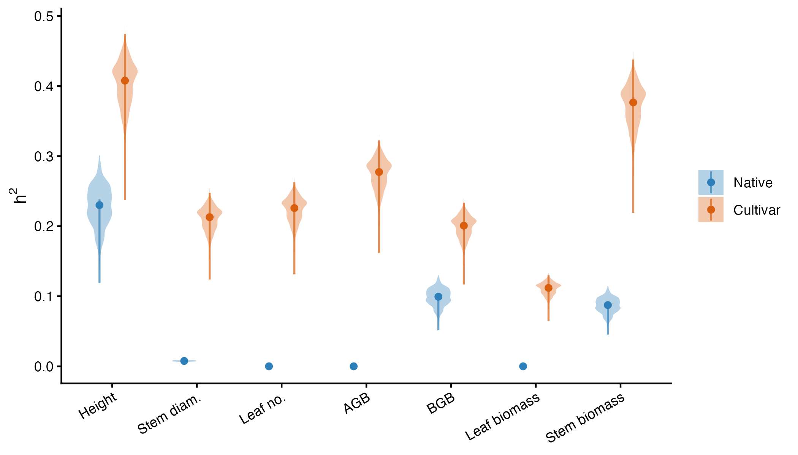

# Early fitness consequences of cultivar gene escape in flowering dogwood (*Cornus florida* L., Cornaceae)

Jane Remfert  
Center for Life Science Education  
Virginia Commonwealth University  
Richmond, Virginia 23284

Andrew Eckert, Rodney Dyer 
School of Life Sciences and Sustainability  
Virginia Commonwealth University  
Richmond, Virginia 23116

# Abstract

Ornamental cultivars of native plants are increasingly abundant in urban landscapes, creating large domestic reservoirs adjacent to wild populations. Whether cultivar alleles that escape into wild stands persist depends on how cultivar-origin offspring perform during early recruitment into natural habitats. We tested two competing hypotheses for flowering dogwood (*Cornus florida*): that cultivar ancestry imposes an early fitness penalty under wild conditions (*maladaptation*), or that cultivar-origin seedlings perform at least as well as wild seedlings, leaving early viability selection unable to restrain gene escape (*cultivar persistence*). We monitored survival, growth, and biomass over two growing seasons for 569 open-pollinated seedlings from 36 maternal families (20 managed landscape, 16 second-growth forest) grown in an unmanipulated, deeply shaded forest understory common garden. Seedlings were classified by landscape provenance (maternal origin) and neutral genetic ancestry (admixture percentage with commercial voucher lines). Overall survival was high (~82%) and did not differ by origin or admixture score. While broad origin explained little growth variation, maternal family accounted for substantial variance among cultivar-origin seedlings, yielding moderate narrow-sense heritabilities for height, above-ground biomass, and stem biomass ($h^2 \approx 0.3–0.5$) alongside heterogeneous family survival. Native families, in contrast, exhibited near-zero heritable variation. Cultivar-origin seedlings were not disadvantaged in a deeply shaded understory, suggesting that early viability selection is unlikely to limit the establishment of escaped cultivar alleles.  These results highlight the potential for long-term introgression and genetic homogenization in declining wild *C. florida* populations.

**Keywords:** crop-to-wild gene flow · cultivar gene escape · narrow-sense heritability · common garden · introgression · Cornus florida

# Introduction

The flowering dogwood (*Cornus florida* L., Cornaceae) is an ecologically important understory tree in mesic forests of eastern North America. Populations of native *C. florida* currently face several demographic pressures, the most important of which include the fungal pathogen *Discula destructiva* (Redlin 1991; Sherald et al. 1996; Carr and Banas 2000; Jenkins and White 2002), which thrives in the moist and shaded understories, resulting in significant mortality, and exotic invasive species such as *Microstegium vimineum* (Trin.) A. Camus, whose dense groundcover significantly limits seedling recruitment (Pierce et al. 2008; Suchecki and Gibson 2008).  Since the mid-1700s, dogwoods have been cultivated for their copious floral displays, striking bract color, and exceptional growth vigor in open spaces.  As a result of cultivation, many recognized cultivars are assayable through multilocus genotyping (Wadl et al. 2008). In residential and commercial landscapes, these trees are commonly grown with significant canopy openings, are completely free from overstory competition, and benefit from extensive human provisioning, including irrigation, fertilization, and pest control. This long-standing commercial demand, with an estimated annual sales rate of $31 million, has created a massive, highly managed suburban and urban reservoir of cultivar genotypes, selected to persist under environmental conditions divergent from the species’ native environment spatially proximate to remnant natural forests.

This spatial proximity suggests that the potential for asymmetric gene escape of cultivars into native forest populations is substantial. *Cornus florida* possesses several life-history traits that facilitate either pollen- or seed-mediated gene flow across the urban-native interface. The species has a predominantly outcrossing mating system with strong prezygotic barriers to selfing (Reed 2004; Dyer et al. 2012). Although there is support for environmental influence on flowering time (Reader 1975), there remains significant phenological overlap in the approximately 2–4-week flowering window between urban cultivars and native *C. florida* individuals. Pollination services are provided by a broad suite of insect pollinators spanning at least 11 insect families, many of which are commonly found in both forest and urban habitats (Carr 2010; Rhoades et al. 2011). *Cornus florida* produces bright red drupes in the fall, which are an important food resource for a variety of forest species and may be dispersed via endozoochory (Herrera 1981; Dyer et al. 2012). These dispersal mechanisms have historically functioned to maintain high levels of genetic diversity within the species (Hadziabdic et al. 2010, 2012; Pais et al. 2017).

The long-term demographic and evolutionary consequences depend heavily on how cultivar-origin offspring perform when they recruit into natural habitats. Cultivated dogwoods have been selected to maximize reproductive output (for showy displays, though not through realized survival of cultivar offspring) and thrive in open, high-light environments, so these traits may represent a severe physiological mismatch in native forest conditions. Artificial selection to persist in human-managed environments—where resources are abundant, there is no native recruitment through the seed pool, resource competition is reduced during early growth stages, and canopy competition is largely absent—has the potential to relax selection on traits related to resource-use efficiency, early growth, and shade tolerance. These tradeoffs may result in cultivar-origin offspring being less able to establish in deeply shaded, resource-competitive, and unmanaged forest understories. If cultivar-origin genotypes carry such maladaptive traits, early-stage viability selection will likely weed them out, mitigating the evolutionary impact of gene escape. However, if cultivar-origin seedlings perform as well as or better than native forest genotypes despite these novel selection pressures, cultivar genes are expected to establish and persist, raising the long-term consequences of genetic introgression and the loss of unique, locally adapted wild alleles.

In this study, we tested two competing hypotheses regarding the consequences of cultivar gene escape into proximate native populations of flowering dogwood. If human selection for copious floral displays and vigor in open, high-light environments has relaxed selection for shade tolerance, understory competitiveness, and early seedling growth, cultivar-origin seedlings are expected to exhibit a fitness penalty under wild forest canopy growing conditions, manifested as reduced survival, growth, and/or biomass accumulation compared to seedlings with non-cultivar heritage.  We will refer to this as the *maladaptation hypothesis*.  Conversely, if the vigor and physiological growth traits selected under cultivation carry over as a general performance advantage in natural environments, cultivar-origin seedlings will perform at least as well as or better than their wild counterparts. Under this scenario, early-stage viability selection will not be restraining gene escape, signaling that cultivar alleles can readily establish and persist, setting the stage for long-term genetic introgression of cultivar genotypes, into surrounding native populations—the *cultivar persistence* hypothesis.

To differentiate between these two hypotheses, we sampled offspring arrays from maternal trees from managed landscapes and adjacent native second-growth forests surrounding the metropolitan region of Richmond, Virginia.  We classified offspring in two ways.  First, we used the location of the maternal tree in the landscape to designate *cultivar* if the tree was located in a landscaped and managed location (commercial and residential properties in Richmond, Virginia) or as *native* if the maternal tree was sampled from second-growth forests (Pocahontas State Park and the Rice Rivers Center).  To correct for potential pollen-mediated gene flow from native populations onto cultivar trees or longer-term introgression of cultivar genes into native populations, we also used multilocus genotyping to compare genetic admixture of offspring genotypes from well-known cultivar varieties planted in the mid-Atlantic region.  Seeds were germinated and 569 seedlings were transplanted into a common garden located within the deeply shaded understory of a second-growth mixed hardwood forest at the VCU Rice Rivers Center.  All seedlings were monitored across two growing seasons for survival, growth (height and stem diameter), and dry above- and below-ground biomass.  Crucially, because light was not experimentally manipulated, our common garden provides a direct empirical test of early seedling performance under natural forest understory conditions—allowing us to evaluate whether cultivar-origin seedlings face a viability bottleneck when recruiting into deeply shaded, natural environments.  

# Methods

## Study species

*Cornus florida* is a common understory tree native to the forests of eastern North America with a natural range that extends from northern Florida to southern New York and eastward to Michigan, Missouri, and parts of eastern Texas. Cultivated varieties of *C. florida* can be found in residential landscaping throughout the native range.  Native *C. florida* individuals are common members of second-growth forests throughout its range, competing as a subcanopy tree commonly reaching no more than 10 m in height. Flowering occurs over approximately 2–4 weeks in early spring with inflorescences containing 20–30 perfect flowers subtended by four large white bracts.  Pollination is provided by a variety of insects spanning 11 taxonomic families that vary according to the surrounding habitat (Carr 2010; Rhoades et al. 2011).

## Sampling Design

Maternal trees were identified in both managed urban environments and from second-growth forests around Richmond, Virginia.  In the urban environment, maternal trees were sampled from residential yards, with landowner permission, and public spaces. Native maternal dogwood trees were sampled in the deciduous and pine second-growth forests of Pocahontas State Park in Chesterfield, VA, and at the Virginia Commonwealth University (VCU) Rice Rivers Center in Charles City County, VA.  We found no evidence that native tree sampling location impacted survival or any phenotypic trait (Tab_SiteEffect, Supplementary Materials) and felt justified in combining samples from the Rice Rivers Center and Pocahontas State Park trees into the single *native* category. 

Open-pollinated seeds were sampled from 36 focal maternal individuals in both the urban and native environments in fall 2017.  Trees sampled from the secondary understories (native) had much lower seed set than those mothers in urban environments.  Seeds were depulped, given an acid wash (following Carr 2010), and weighed; family-seed weight was used later as a covariate for maternal provisioning.  Seeds were then planted in a 2:1 sphagnum-perlite mixture and sealed in gas-permeable bags. After stratification at 4°C for at least 90 days, seeds were monitored for signs of germination.  Germination occurred over an extended period and we recorded the germination date for each individual seed to account for differences in developmental time between germination and subsequent trait measurements. Following cotyledon expansion, seedlings were planted in 4-inch nursery pots and grown indoors before being transplanted into the common garden location. 

## Common Garden

We established a common garden in the understory of a second-growth mixed hardwood forest at the VCU Rice Rivers Center.  The garden’s location was deliberately situated under a deeply shaded canopy to evaluate seedling establishment under natural, unmanipulated understory light regimes. To prevent seedling loss to deer browsing (Long et al. 2007), the common garden was surrounded by an 8-ft exclosure fence (Redick and Jacobs 2020).  At planting, we had 20 family arrays ($n$ = 395 seedlings) collected from maternal trees classified as *cultivar* and 16 family arrays ($n$ = 174 seedlings; see Tab_Samples) whose maternal location was designated as *native*.  Each seedling was transplanted into a 2-gallon plastic nursery pot randomly placed within the garden.  

We monitored seedling growth and survival over two growing seasons with survival censuses conducted each year at both peak growth (May/June) and end of the growing season prior to leaf drop (September/October).  All seedlings were measured for the following traits.  Height was measured from the base of the plant to the apical meristem, and stem diameter was measured just below the cotyledons (when present) or the cotyledon scar (thereafter). 

To control for confounding effects of foliar pathogens during growth measurements, seedlings were treated biweekly with fungicides (Cleary’s 3336F, neem oil, milk solution) upon the first emergence of powdery mildew (*Erysiphe pulchra*) in spring of Year 2. Powdery mildew represents a common foliar disease affecting nursery seedlings in this study region. Managing fungal pressure across all experimental blocks ensured that growth and allocation metrics reflected understory shade and microclimate performance, independent of differential foliar disease defoliation.  At the end of the second growing season, before leaf drop, all plants were harvested.  Stem and leaf tissue were separated from the roots, placed in brown paper bags, and dried at 62°C for 72 hrs. Samples were subsequently weighed to determine above- and below-ground biomass (AGB and BGB, respectively). Above-ground biomass was further separated into leaf biomass (LB) and stem biomass (SB).

## Genetic Analyses

Leaves from maternal individuals were collected, and fresh tissue was frozen at -20°C until DNA extraction. Seedling leaf tissue was collected after seedlings were established in the common garden. We also collected samples from known *C. florida* cultivar varieties provided by the Rutgers University horticultural program and from individuals in commercial nurseries in the greater Richmond, VA metropolitan area. 

Genomic DNA was extracted from approximately 50 mg of plant tissue following standard Qiagen DNeasy plant kit protocols, with concentrations standardized using a Nanodrop 8000 (Nanodrop, Wilmington, DE, USA). Qiagen Type-It Microsatellite PCR kits were used to perform 20 µL amplification reactions with ~20 ng of DNA. Samples were amplified at 9 microsatellite loci identified as diagnostic for cultivar strains: *cf213*, *cf273*, *cf581*, *cf585*, *cf597*, *cf634* (Table 2, Wadl et al. 2008), *cf020*, *cf125*, *cf701* (Table 3, Wang et al. 2009).  Polymerase Chain Reaction (PCR) amplification settings were: 5 min 95°C, 90s 60°C, 30s 72°C, x 34, 30 min 60 °C. Amplicons were sent to the Nevada Genomics Center for fragment analysis. Peaks were called in Geneious Prime (v. 2021.0.3). The presence of null alleles was assessed with the `nulls` function in the `genepop` R package (v. 1.2.17; Rousset 2008), which returns a maximum-likelihood estimate of null-allele frequency and its confidence interval for each locus. Genetic diversity of maternal trees and offspring arrays was quantified across the nine microsatellite loci as number of alleles per locus ($A$), effective number of alleles ($A_e$), observed and expected heterozygosity ($H_o$, $H_e$), and single-locus and combined multilocus exclusion probabilities ($P_e$) using the `gstudio` R package (v. 1.14; Dyer 2009). 

Multilocus genotypes of maternal trees and offspring arrays were used to develop a secondary classification system based on shared ancestry with cultivar varieties, following the approach of Wadl et al. (2008), who used a six-locus subset of our panel (*cf213*, *cf273*, *cf581*, *cf585*, *cf597*, *cf634*) as a diagnostic key for identifying specific named cultivar lineages. We instead used the full nine-locus panel, including three loci not part of that original key (*cf020*, *cf125*, *cf701*; Wang et al. 2009), for a broader, similarity-based admixture score rather than exact lineage matching. Each seedling was compared with every cultivar voucher genotype and scored at each locus and classified as the proportion of alleles shared with known cultivar varieties (Admixture Percentage; AP). We did not have sufficient sample sizes to distinguish among individual cultivar varieties, so we treated all cultivars identically.  Both maternal sample location (*cultivar* vs. *native*) and admixture percentage were used as covariates in the following analyses.  

## Cultivar Impact Analysis

After harvest and tissue processing, we evaluated the following traits intended to differentiate between the *cultivar persistence* and *maladaptation* hypotheses. Germination date (GD) was evaluated as an early indicator of vigor. Seedling survival (SS) was used to estimate the consequences of origin and admixture on early seedling viability. Quantitative plant traits—plant height (PH), stem diameter (SD), number of leaves (NL), below-ground biomass (BGB), and above-ground biomass (AGB), which was further partitioned into leaf biomass (LB) and stem biomass (SB)—were used to evaluate quantitative genetic differences in performance expressed by seedlings growing in a native understory environment.  

Mixed-effects models with continuous response variables were fitted using the *lme4* package (version 2.0.6; Bates et al. 2015), with significance of fixed effects evaluated from *t*-tests with Satterthwaite degrees of freedom (*lmerTest*; Kuznetsova et al. 2017). Survival was fitted with a binomial error distribution and logit link (*lme4*; Bates et al. 2015). Variance-component and heritability estimates were taken from models fit by restricted maximum likelihood (REML); models compared by AIC were fit by maximum likelihood. Models included maternal family and, under the location-based classification, origin as random effects, with developmental time since germination (a proxy for germination timing; excluded when modeling germination date itself) and the maternal family's mean seed weight included as fixed covariates to account for early developmental and maternal effects. Under the admixture-based classification, each seedling's AP was included as a continuous fixed covariate in place of the origin random effect. Traits measured repeatedly across the two growing seasons (height, stem diameter, number of leaves) additionally included individual plant as a random effect and a fixed term for census. For each trait, we compared models with and without origin (or AP) using Akaike Information Criterion (AIC), to evaluate whether cultivar ancestry explained variation in seedling performance beyond that attributable to maternal family alone.

Narrow-sense heritability (*$h^2$*) was estimated assuming open-pollinated maternal arrays represent half-sib families (*$h^2 = \frac{4 V_{\text{family}}}{V_{\text{total}}}$*). Because open-pollinated seed arrays in natural and/or urban environments may contain fractions of full-sibs, selfed offspring, or correlated paternity, this standard formulation represents an upper-bound estimate of narrow-sense heritability. Estimates for each trait were taken from the best supported model, using both the combined sample and, separately, each putative origin subset. Maternal family is nested within origin — no family contributed both native and cultivar offspring — so a model fit to the combined sample yields a single family-variance estimate shared across all families, which need not represent either origin class individually; fitting the family model separately within each origin subset instead lets family-level variance differ freely between native and cultivar lineages, allowing origin-specific heritability to be estimated directly. Survival heritability was estimated on the latent liability scale following Gilmour et al. (1985). For quantitative plant traits, we estimated narrow-sense heritability under a half-sib design, in which maternal family variance is treated as one-quarter of the additive genetic variance. Full model structure, variance decomposition, and heritability derivations, along with model diagnostics and sensitivity analyses, are provided in the Supplementary Materials.  All statistical analyses were performed in `R` (version 4.5.3; R Core Team 2026) and all code and data used are available in the online supplementary materials.

# Results

## Genetic Analysis 

The nine microsatellite markers assayed had moderate to high levels of polymorphism (with 5–26 alleles per locus) in maternal individuals and comparable diversity among the offspring genotypes (Tab_MarkerDiversity, Supplementary Materials). Maximum-likelihood estimates of null-allele frequency were low at every locus (all point estimates < 0.07) but their confidence intervals excluded zero at four loci (cf020, cf585, cf597, cf701) found in both native and cultivar samples (Tab_NullAlleles, Supplementary Materials).  Genetic marker panels, including either the full set of loci or only the subset not indicated as having any null alleles, retained almost identical discriminatory power ($P_{excl,multi,full} > 0.9999$ vs $P_{excl,multi} = 0.9990$).

The sampled cultivar voucher panel comprised 21 named accessions, spanning the disease-resistant Appalachian series, the Cherokee series, and several other commercial lines (Tab_CultivarVoucherPanel, Supplementary Materials), genotyped alongside the target maternal individuals and their offspring arrays to serve as the reference key for admixture scoring.

Admixture percentage (AP), the proportion of alleles shared with the best-matching cultivar voucher, was broadly distributed rather than clustering into two discrete groups. Among the 58 genotyped maternal trees, AP averaged 49.210% (range 33.333–88.889%), and across the 828 genotyped offspring it averaged 49.263% (range 27.778–75.000%), with the offspring distribution largely overlapping that of the maternal generation. Restricting the comparison to the six loci Wadl et al. (2008) used as a cultivar-identification key gave a similar picture: AP averaged 51.667% (range 33.333–91.667%) among maternal trees and 52.104% (range 25.000–100.000%) among offspring under this reduced panel — slightly higher on average and somewhat more variable than under the full nine-locus panel, but showing the same broad overlap between generations rather than a sharper separation (Tab_AdmixturePanelComparison). This diffuse pattern of allele sharing with cultivar vouchers, evident under both marker sets and across both the maternal and offspring generations, suggests that the diagnostic loci, while collectively providing strong discriminatory power (above), are not privately fixed to cultivar lineages individually — consistent with cultivars being derived from wild-collected material, though perhaps not long enough in the past to have unique lineage sorting.

## Cultivar Impacts

To evaluate whether early seedling performance was shaped by landscape provenance and/or continuous genetic ancestry, we tested seedling survival and growth traits under two parallel frameworks, a categorical maternal origin (urban/cultivar vs. forest/native), which reflects the seed tree's landscape location, and a continuous admixture percentage (AP), which quantifies neutral allele sharing with commercial voucher lines based on previous cultivar identification markers in this species.  

Maternal origin did not account for significant variation in the timing of germination in either group: adding origin did not improve model fit for germination date over maternal family alone (ΔAICc = 2.036; likelihood-ratio test *p* = 0.475), although germination timing was itself heritable among families (h² = 0.421 [95% CI 0.145, 0.722]; Tab_GerminationTiming).  Similarly, maternal origin did not impact seedling survival to the end of the second growing season, with both groups exhibiting survival rates (native 79.310%, cultivar 83.544%) similar to previous research in this species (Redwine 2013).  Mortality remained relatively consistent across the entire experiment in both groups (Fig_Survival).  Adding *native*/*cultivar* origin to the generalized linear mixed model did not improve fit over maternal family alone (family: ΔAICc = 0.000, wAICc = 0.538; fixed-effects only: ΔAICc = 1.398, wAICc = 0.267; origin + family: ΔAICc = 2.036, wAICc = 0.194; Tab_Survival), and the origin random effect explained little of the unexplained variance (likelihood-ratio test, χ² = 1.431 × 10⁻⁷, p = 0.500). 

For plant growth traits, the *family* and *family + origin* models were within ΔAICc ≤ 2 of one another for plant height (PH), stem diameter (SD), number of leaves (NL), above-ground biomass (AGB), below-ground biomass (BGB), and stem biomass (SB), indicating that origin added little beyond family alone (Tab_GrowthAIC); the bootstrap confidence interval for the variance attributed to origin included zero for every trait (Tab_GrowthHeritability). Leaf biomass (LB) was the exception: the origin-inclusive model was clearly favored (ΔAICc = 4.886, wAICc = 0.916 vs. 0.080; Tab_GrowthAIC), although its origin variance component's confidence interval also included zero (Tab_GrowthHeritability). Repeated-measures models showed the same pattern (Tab_RepeatedAIC and Tab_RepeatedHeritability, Supplementary Materials). Together, these results indicate that origin contributed little to trait variation under the location-based classification, with the partial exception of leaf biomass, and that considerable uncertainty remains about the magnitude of any effect.

Under the admixture-based classification, adding Admixture Percentage as a fixed covariate also did not improve model fit over maternal family alone for any trait (family alone favored or tied in every case; Tab_GrowthAIC), and the AP coefficient was not significant for any trait (the smallest of which was for plant height, *p* = 0.112) or for survival (*p* = 0.879).  Comparing model support across classification schemes in Tab_GrowthAIC highlights this contrast: while models incorporating categorical maternal origin are competitive with or favored over family-only models ($\Delta\text{AICc} \le 2$ for six of seven traits), adding admixture percentage as a continuous covariate consistently reduced model support relative to family alone across every trait. We therefore found no evidence that cultivar ancestry, whether inferred from maternal location or from genetic admixture, had a meaningful effect on seedling survival, growth, or persistence.

### Family-Level Variation and Trait Heritability

Because admixture percentage forms a continuous, broadly overlapping distribution across maternal trees rather than discrete genetic clusters, we partitioned family-level trait variance (*$h^2$*) across all families and then among families within each of the categorical maternal origin classes.  Maternal family explained substantially more variation in survival and growth among putative cultivar-origin seedlings than among native-origin seedlings, based on the same location-based origin split described above.  The family model was the best model for the cultivar offspring for every growth trait except leaf biomass, whereas the fixed-effects-only model was best supported for every trait in the native set (Tab_GrowthAIC and Tab_OriginHeritability). For survival, the same split showed that adding family improved model fit in the cultivar subset (ΔAICc = 1.481, wAICc = 0.677 vs. 0.323; likelihood-ratio test χ² = 3.522, df = 1, *p* = 0.030) but not in the native subset, where the fixed-effects-only model remained best supported (ΔAICc = 2.096, wAICc = 0.740 vs. 0.260; Tab_Survival). While there was evidence for family-level variance in survival among cultivar-origin families, the heritability estimate was highly uncertain (h² = 0.510, 95% CI [0.000, 1.072]). However, family-specific conditional modes (analogous to BLUPs in linear models) extracted from the putative cultivar survival GLMM show variation in survival was heterogeneous among cultivar-origin families (Fig_BLUPs).  

Confidence intervals for the family variance component in the native subset spanned zero for all plant growth traits (Tab_OriginHeritability). While cultivar families harbored statistically significant heritable variation for height, above-ground biomass, and stem biomass (*$h^2 \approx 0.32–0.47$*), native families exhibited low point estimates of $V_{\text{family}}$ accompanied by wide bootstrap confidence intervals that spanned zero. This pattern indicates either reduced standing genetic variance for understory growth traits in local wild stands or limited statistical power to resolve small family variance components given the smaller array sizes and lower seed availability in native maternal trees.  In the cultivar offspring arrays, variance attributed to family was significant, though modest, for plant height (PH; 11.853% of phenotypic variance), above-ground biomass (AGB; 8.061%), and stem biomass (SB; 10.946%; Tab_OriginHeritability). Heritability estimates were treated as significant when their confidence intervals excluded zero. In the putative cultivar set, heritabilities were significant for the same three traits, ranging from h² = 0.322 [95% CI 0.030, 0.720] for AGB to h² = 0.474 [0.112, 0.933] for PH (Tab_OriginHeritability), consistent with heritable variation among cultivar families and the potential for evolutionary responses to selection when seedlings are grown in understory conditions. 

Sensitivity tests included the removal of influential observations at the family and individual levels. Results for putative cultivar families were robust to the removal of outlier individual observations; if anything, the family effect strengthened (e.g., NL and BGB; Tab_OriginHeritability), and the largest heritability shift was in BGB (h² = 0.233 → 0.363).  Removal of the single most influential maternal family had a larger effect on variance-component and heritability estimates. In most growth traits, this family was *urb09*: for stem biomass in the overall family model, removing *urb09* reduced the family variance component (*$V_{\text{family}} = 0.046 \rightarrow 0.016$*) and heritability (*$h^2 = 0.512 \rightarrow 0.188$*), weakening but not eliminating support for the family random effect (likelihood-ratio test $\chi^2 = 5.251, \text{df} = 1, p = 0.022$; Tab_GrowthHeritability). A similar pattern occurred within the cultivar subset (Tab_OriginHeritability), where excluding *urb09* again reduced cultivar height heritability (*$h^2 = 0.474 \rightarrow 0.163$*) and above-ground biomass heritability ($h^2 = 0.322 \rightarrow 0.090$).

Native-origin mothers were sampled from only two nearby forest sites, whereas cultivar-origin mothers represent potentially subsets of independently propagated named lines.  We tested whether native mothers are more closely related to one another than cultivar mothers are, which could confound origin with kinship structure rather than a genuine origin effect (Tab_Relatedness, Supplementary Materials). We found no evidence of such a difference, suggesting that the family-level variance asymmetry described above is unlikely to simply reflect unequal relatedness between the adults grouped into native and cultivar designations.

Earlier germination was a strong positive predictor of survival and of every growth trait except number of leaves, in both origin classes (Tab_CovariateEffects, Supplementary Materials), indicating that a developmental head start is an important early advantage regardless of origin. Maternal seed weight had a weaker and more variable effect. It did not predict survival in the cultivar subset (though it was negatively associated with survival overall and in the native subset), and among cultivar-origin seedlings it was negatively associated with above-ground, below-ground, and leaf biomass: seedlings from families with smaller mean seed weight accumulated more biomass. Seed weight was not a significant predictor of any growth trait among native-origin seedlings.

# Discussion

In this study, we investigated the early fitness consequences associated with cultivar gene escape from urban environments into surrounding native populations of flowering dogwood.  Seedlings from maternal individuals sampled in cultivated and natural landscapes were grown in conditions representative of native environments.  We classified seedlings based on the sampling location of the maternal individual (cultivar vs. native) and by estimating admixture percentages with known cultivar lineages.  Following survival and growth over two years, we found that maternal families contributed significantly, though modestly, to variance in plant traits. In contrast, the variance attributed to origin was small and inconsistent across traits. Likewise, cultivar admixture was not a significant predictor of any plant trait or of survival. Moderate heritability estimates for plant traits among putative cultivar seedlings are consistent with among-family variation upon which selection could act. High overall survival indicates gene flow from cultivated genotypes into native populations may not be self-limiting due to early viability selection. Together, these results indicate that, if established, cultivar-origin offspring are not likely to be disadvantaged compared to native genotypes and therefore have the potential to persist in native forested habitats. This has important implications for the evolutionary trajectory and conservation of conspecifics which inhabit the areas adjacent to human-tended cultivars. 

While maternal origin did not differentiate survival and early fitness traits for seedlings, survival and growth traits among families within each origin were impacted differentially (Fig_BLUPs). We found no evidence that early survival differed among broad classifications of origin, but rather family variation among putative cultivar offspring arrays may play an important role. The estimate of narrow-sense heritability for survival among cultivar seedlings was imprecise (h² = 0.510 [0.000, 1.072]), with differences among families accounting for 12.741% of the latent-scale variance in survival. Conversely, no latent-scale survival variance was attributable to family among putative native families.  These results begin to establish a pattern seen in other traits where native family arrays are more homogenous than those sampled from the urban (cultivar) environment.

Our results indicate a similar pattern for growth traits. Evidence that origin contributed significantly to trait variation was weak and inconsistent, though the origin + family models still predicted consistently higher growth for putative cultivar-origin than native-origin seedlings in height, stem biomass, and above- and below-ground biomass (reflected in the sign of the origin random effect's conditional modes for each group). Because vegetative size is a recognized proxy for fitness in conspecifics (Gross 1984; Younginger et al. 2017) and early juvenile vigor often determines establishment success under competitive conditions, these patterns suggest that cultivar-origin seedlings are not at a competitive disadvantage in native understories. Importantly, because light availability was not experimentally manipulated in our common garden, our setup specifically evaluates performance under natural, deeply shaded understory conditions. These findings suggest that cultivar-origin seedlings show little sign of a physiological trade-off or relaxed shade tolerance associated with their high-light selective history, maintaining equivalent or superior juvenile growth and biomass accumulation under a natural forest canopy.  More consistent was the contribution of maternal family to variance among cultivar-origin seedlings. Significant family-level variation in growth traits indicates that certain cultivar lineages will outperform others. This pattern aligns with previous findings in switchgrass, where performance varied by cultivar variety and routinely matched or exceeded that of local wild populations across competitive regimes (Palik et al. 2016). Selection for vigor and floral display during cultivar development may therefore yield lineages that perform robustly beyond managed urban plantings.

Significant heritability estimates for plant height, above-ground biomass, and stem biomass for putative cultivar-origin seedlings were moderate and consistent with those reported in other tree species (Galeano and Thomas 2023), indicating that some of the variation in seedling growth-related traits may have a genetic basis that can provide variation upon which selection may act. Following realized gene flow between differentiated populations or species, the persistence or extinction of one or both populations is, in part, shaped by relative fitness of hybrids. Feurtey et al. (2017) found increased fitness of domestic × native hybrid apple trees, and significant levels of introgression have led to concerns about the conservation status of European crab apples, while transfer of advantageous alleles may alter native populations, as in frost-resistant ornamental × wild holly that may be driving range expansion in Denmark (Skou et al. 2012).  Given the importance of producing anthracnose-resistant lineages in contemporary cultivar strains, introgression of these genotypes in proximate native populations would not seem to be impacted by early seedling fitness differences.

While our results do not demonstrate disadvantages to cultivar-origin seedlings in native habitats, a general fitness advantage over native seedlings is not strictly necessary for introgression to occur (Lenormand 2002). Pollen migration can be species, population, and season specific, but is generally considered the dominant driver of gene flow in plant populations (Ellstrand 1992). Evidence of local isolation by distance in *C. florida* indicates that seed migration is likely restricted (Dyer et al. 2012). Thus, in forested habitats, it is possible that cultivar pollen × wild ovules may be a more likely form of hybridization, though the forest/urban margin could experience some seed migration from cultivars. Cultivar trees, particularly in adjacent, peri-urban locations, could represent sources of pollen migrants that are subsidized by human tending and higher light environments. Additionally, in this system, there will likely be high selective pressure against all seedlings in urban lawns, with the exception of natural green spaces. Thus, wild pollen flow to cultivar ovules may be less likely to result in successful establishment unless seeds are dispersed into urban natural areas or the adjacent forest.  

The stark asymmetry in heritable variation between origins—where native family arrays exhibited low point estimates of heritable variance while cultivar families harbored substantial heritability (*$h^2 \approx 0.32–0.47$*)—may reflect both statistical and biological factors. Statistically, smaller sample sizes and array sizes among native families ($n = 174$ across 16 families vs. $n = 395$ across 20 cultivar families) reduce power and tend to pull REML variance component estimates toward zero. Biologically, however, pairwise coancestry analyses confirm that native maternal trees are not simply an inbred or highly related cluster (Supplementary Materials), suggesting that native forest stands maintain a relatively homeostatic phenotypic response under understory conditions. Conversely, open-pollinated cultivar arrays reflect both the broad phenotypic diversity of domestic selection and the complex spatial structure of urban landscapes. In managed suburban matrices, maternal trees are exposed to highly variable microclimates, are from potentially divergent cultivar lineages, and exist in fragmented canopy structures, which may alter local pollinator foraging behavior, effective pollen donor diversity, and outcrossing dynamics relative to contiguous forest understories. Because open-pollinated family variance integrates both maternal genetics and paternal pollen pool composition, evaluating how urban landscape gradients alter contemporary mating systems, pollen pool structure, and gene dispersal remains a critical frontier for predicting the long-term evolutionary trajectories of urban-wild forest boundaries. Specifically, verifying the half-sib assumptions underlying open-pollinated heritability estimates ($V_A = 4 V_{\text{family}}$) will require quantifying how urban canopy fragmentation shapes local outcrossing rates, correlated paternity, and effective pollen donor numbers ($N_{ep}$; Remfert and Dyer, Unpublished).

As a first, more limited step toward that verification, we asked how heritability estimates would change if the half-sib assumption were relaxed to reflect realized sibship structure rather than the assumed constant -- canopy openness is known to influence correlated paternity in this species (Gardiakos 2009), and cultivar landscapes are characteristically more open than closed native-forest canopy. We estimated pairwise marker-based relatedness among each mother's own genotyped offspring, pooled within origin, to characterize the realized relatedness distribution for native and cultivar families separately (Fig_OffspringRelatedness, Supplementary Materials), and re-expressed heritability at each origin's median realized relatedness in place of the assumed $r = 0.25$. This shifted point estimates modestly downward for every trait with detectable family variance -- traits whose family-variance estimate was already indistinguishable from zero were, by construction, unaffected -- but left the qualitative pattern intact: heritability remained low in the native subset and moderate in the cultivar subset across the full half-sib-to-full-sib range (Fig_Heritability; Tab_HeritabilityRelatedness, Supplementary Materials).

With indications that cultivar seedlings can readily survive and perform as well as wild seedlings, an additional factor shaping the persistence of cultivar alleles in native forests is landscape-level parameters that influence gene flow, such as the shape and size of donor populations and the matrix through which gene flow occurs. Much of urban landscape genetics investigates whether urban land cover impedes or facilitates gene flow, and the answer to that question is often organism-specific (Miles et al. 2019). Previous research has found that conspecific canopy cover is a significant facilitator of pollen flow in *C. florida* (DiLeo et al. 2014), but has provided conflicting evidence regarding the influence of canopy openings, with scale likely an important factor (Sork et al. 2005; DiLeo et al. 2014). The permeability of the intervening environment will shape whether gene flow can repeatedly facilitate the establishment of cultivar genotypes in forested habitats. Linear landscape elements have been found to promote insect-mediated pollen flow in urban spaces (Van Rossum and Triest 2012). Additionally, natural areas within cities can experience increased pollen immigration (Noreen et al. 2016) and serve as hybridization zones that facilitate the establishment of hybrid populations (Roe et al. 2014). Thus, urban natural areas represent a possible repository for seed and pollen migration.

Importantly, our experimental design eliminated certain forces such as selection pressure imposed by disease. Some cultivar lines are known to have differential resistance to a variety of diseases, from the susceptibility of *Cherokee Chief* to canker caused by *Lasiodiplodia theobromae* (Mullen 1991), to the spot anthracnose (Elsinoe corni Jenkins & Bitanc. (1948))–resistant *Cherokee Brave* (Hagan et al. 1998). Powdery mildew (*Erysiphe pulchra* Cooke & Peck, Braun & Takamatsu, 2000) resistance is a highly heritable trait in *C. florida* (Parikh et al. 2016a), with *Kay’s Appalachian Mist*, *Jean’s Appalachian Snow*, and *Karen’s Appalachian Blush* all showing resistance (Windham et al. 2003). Although these diseases are mostly cosmetic for adult trees, they can be impactful for seedlings and inhibit growth (Hagan et al. 1998; Mmbaga and Sauvé 2004). *Discula destructiva*, however, has been highly destructive to *C. florida* populations, and resistance could pose a significant advantage in the cooler, more humid parts of the *C. florida* range. *Appalachian Spring* is a *C. florida* cultivar derived from a resistant individual found in Catoctin Mountain, MD, amid a high incidence of conspecific loss to *D. destructiva* (Windham et al. 1998). The vigor and prolific blooming of this strain do not indicate a defense-growth trade-off common in crop breeding (Gao et al. 2024). Transfer of disease resistance to nearby wild populations of *C. florida* could benefit them, particularly those under disease pressure.

Disease resistance is a major cost-saving trait for nurseries and a desirable trait for home landscaping (Klingeman et al. 2004), so the pursuit of disease resistance will continue to factor into breeding programs (Parikh et al. 2016a, b). This includes interspecific hybrids between *C. florida* and the generally highly resistant *C. kousa*. Artificial methods to overcome non-overlap in flowering timing between species successfully produced hybrids with intermediate phenological characteristics, and increased vigor (Mattera et al. 2015). Though *Cornus* × *rutgersensis* hybrids often produce sterile fruits, some fertile seeds can be produced (Mattera et al. 2015). Certain *C. kousa* cultivars and *C. florida* × *C. kousa* hybrids have been assessed as disease-resistant varieties (Ranney et al. 1995; Hagan et al. 1998). Even among *C. florida* cultivars, differences in disease resistance have been shown to have high heritabilities (Parikh et al. 2016a, b). These all pose potential pathways for genetic leakage from urban and peri-urban landscapes into wild *C. florida* populations.

A surprising result in this work was the lack of admixture signal and several caveats relative to our classification scheme should be discussed.  First, our voucher panel comprised only the cultivar lines we were able to obtain (21 named lines), and though it included several popular lines, many remain unrepresented. Next, we do not know the exclusive fidelity of these alleles to specific cultivar lines. Some cultivars are derived from wild individuals through vegetative propagation, so there may be allelic overlap with wild individuals, as the alleles likely existed in the surrounding population at some frequency. Indeed, the broadly overlapping distribution of admixture percentage between maternal trees and their offspring arrays is consistent with this concern, and suggests that the loci identified as cultivar-diagnostic in prior work (Wadl et al. 2008; Wang et al. 2009) may not be as exclusively informative for distinguishing cultivar from native ancestry in our sampled populations as originally assumed. As a further check, we tested for non-random multilocus allelic association (linkage disequilibrium) among these nine loci within each origin group, restricted to the 58 unrelated maternal trees to avoid the confound of family structure present among the offspring arrays, and found no evidence in either the native ($I_A$ = -0.071, *p* = 0.717) or cultivar ($I_A$ = 0.063, *p* = 0.235) samples (index of association; Agapow and Burt 2001; `poppr`; Kamvar et al. 2014; Tab_LinkageDisequilibrium, Supplementary Materials). As a complementary multivariate test, we also used discriminant analysis of principal components (DAPC; Jombart et al. 2010) to ask whether native and cultivar maternal trees separate on their full nine-locus genotype; even allowing a large number of retained principal components (18 of a maximum 20, chosen by cross-validation), which would tend to favor overfitting and inflate apparent separability, cross-validated classification accuracy (56.061%) was indistinguishable from chance given the sample's class balance (no-information rate 55.172%) and from a permutation null built by re-running the same procedure on 999 relabelings of the same 58 trees (*p* = 0.237), again finding no evidence that the two groups separate on multivariate genotype combinations (Tab_DAPC, Supplementary Materials). Finally, while shared neutral alleles may indicate a degree of shared ancestry among individuals, we do not observe a positive relationship with differences in fitness-related phenotypic traits. This suggests either that seedlings sharing more cultivar alleles perform similarly to native seedlings under understory conditions or that our marker set lacks the resolution to capture ancestry in genomic regions that influence these traits.

Our current study is limited by temporal scope, as two growing seasons did not allow us to collect data on reproduction. We relied on early fitness traits, which overall have a positive allometric relationship with reproductive output (Gross 1984; Younginger et al. 2017), but *C. florida* generally does not flower in the first 6 years, making measures of reproductive structures infeasible in this study. Furthermore, a critical component of cultivar × wild gene escape is the breakdown of hybrid vigor after subsequent generations of backcrossing (Hooftman et al. 2007), which we were also unable to assess here.  However, our results do not indicate immediate detrimental impacts for native *C. florida* populations in the Piedmont region of the Eastern United States. Cultivar seedlings performed as well or better than native seedlings and showed no difference in survival. It is possible that hybridization has been occurring continuously as urban areas have expanded and ornamental *C. florida* has become ubiquitous in residential plantings. Deforestation and reforestation in the Eastern United States also provide a land-use history that may have included cultivar *C. florida* in rural residential landscaping, which was later abandoned. Together, these results suggest that early viability selection is unlikely to be a barrier to cultivar gene escape in *C. florida*, and that the longer-term consequences — including whether cultivar-derived traits such as disease resistance ultimately benefit or homogenize wild populations — merit continued attention as urban and wild dogwood populations continue to intermix. 

***

## Data availability

The anonymized data and the annotated R code that reproduce every table and figure are available from the Dyer Laboratory GitHub repository [URL](https://github.com/dyerlab/Cornus_Common_Garden) and archived at ==XXX== (DOI to be minted from the release).

## Competing interests

The authors declare no competing interests.

## Author contributions

<!-- TODO: confirm with co-authors. Draft: J.R. designed the study, collected the data, and led the analysis; A.E. contributed to the quantitative-genetic analysis and interpretation; R.D. contributed to the genetic analysis, supervised the work, and revised the manuscript. All authors approved the final version. -->

## Funding

<!-- TODO: JR. Add any funding you had received from VCU, RRC, or ILS.  AE, any Funding sources you want to associate with your contributions on this manuscript?  Contributions by RD was not supported by any external funding source. -->

## Ethics and permissions

Maternal trees on private property were sampled with landowner permission. Sampling in Pocahontas State Park and at the VCU Rice Rivers Center was conducted under [permit numbers — to be added].

# Literature Cited

Agapow PM, Burt A (2001) Indices of multilocus linkage disequilibrium. Mol Ecol Notes 1:101–102. https://doi.org/10.1046/j.1471-8278.2000.00014.x

Bates D, Mächler M, Bolker B, Walker S (2015) Fitting linear mixed-effects models using lme4. J Stat Softw 67:1–48. https://doi.org/10.18637/jss.v067.i01

Carr DE, Banas LE (2000) Dogwood anthracnose (*Discula destructiva*): effects of and consequences for host (Cornus florida) demography. Am Midl Nat 143:169–177. https://doi.org/10.1674/0003-0031(2000)143[0169:DADDEO]2.0.CO;2

Carr D (2010) Canopy disturbance and reproduction in *Cornus florida* L. MS Thesis, Virginia Commonwealth University. https://scholarscompass.vcu.edu/etd/2245/

DiLeo MF, Siu JC, Rhodes MK, et al (2014) The gravity of pollination: integrating at-site features into spatial analysis of contemporary pollen movement. Mol Ecol 23:3973–3982. https://doi.org/10.1111/mec.12839

Dyer RJ (2009) GeneticStudio: a suite of programs for spatial analysis of genetic-marker data. Mol Ecol Resour 9:110–113. https://doi.org/10.1111/j.1755-0998.2008.02384.x

Dyer RJ, Chan DM, Gardiakos VA, Meadows CA (2012) Pollination graphs: quantifying pollen pool covariance networks and the influence of intervening landscape on genetic connectivity in the North American understory tree, Cornus florida L. Landsc Ecol 27:239–251. https://doi.org/10.1007/s10980-011-9696-x

Ellstrand NC (1992) Gene flow by pollen: implications for plant conservation genetics. Oikos 63:77–86. https://doi.org/10.2307/3545517

Feurtey A, Cornille A, Shykoff JA, Snirc A, Giraud T (2017) Crop-to-wild gene flow and its fitness consequences for a wild fruit tree: towards a comprehensive conservation strategy of the wild apple in Europe. Evol Appl 10:180–188. https://doi.org/10.1111/eva.12441

Gardiakos, V. A. 2009. Pollen-mediated gene movement in flowering dogwood, *Cornus florida* L. Master's Thesis. Virginia Commonwealth University, Richmond, VA. 

Galeano E, Thomas BR (2023) Unraveling genetic variation among white spruce families generated through different breeding strategies: heritability, growth, physiology, hormones and gene expression. Front Plant Sci 14:1052425. https://doi.org/10.3389/fpls.2023.1052425

Gao M, Hao Z, Ning Y, He Z (2024) Revisiting growth–defence trade-offs and breeding strategies in crops. Plant Biotechnol J 22:1198–1205. https://doi.org/10.1111/pbi.14258

Gilmour AR, Anderson RD, Rae AL (1985) The analysis of binomial data by a generalized linear mixed model. Biometrika 72:593–599

Gross KL (1984) Effects of seed size and growth form on seedling establishment of six monocarpic perennial plants. J Ecol 72:369–387. https://doi.org/10.2307/2260053

Hadziabdic D, Fitzpatrick BM, Wang X, et al (2010) Analysis of genetic diversity in flowering dogwood natural stands using microsatellites: the effects of dogwood anthracnose. Genetica 138:1047–1057. https://doi.org/10.1007/s10709-010-9490-8

Hadziabdic D, Wang X, Wadl PA, Rinehart TA, Ownley BH, Trigiano RN (2012) Genetic diversity of flowering dogwood in the Great Smoky Mountains National Park. Tree Genet Genomes 8:855–871. https://doi.org/10.1007/s11295-012-0471-1

Hagan AK, Hardin B, Gilliam CH, Keever GJ, Williams JD, Eakes J (1998) Susceptibility of cultivars of several dogwood taxa to powdery mildew and spot anthracnose. J Environ Hortic 16:147–151. https://doi.org/10.24266/0738-2898-16.3.147

Herrera CM (1981) Fruit variation and competition for dispersers in natural populations of *Smilax aspera*. Oikos 36:51

Hooftman DAP, de Jong MJ, Oostermeijer JGB, Den Nijs HCM (2007) Modelling the long-term consequences of crop–wild relative hybridization: a case study using four generations of hybrids. J Appl Ecol 44:1035–1045. https://doi.org/10.1111/j.1365-2664.2007.01341.x

Jenkins MA, White PS (2002) Cornus florida L. mortality and understory composition changes in western Great Smoky Mountains National Park. J Torrey Bot Soc 129:194. https://doi.org/10.2307/3088770

Jombart T, Devillard S, Balloux F (2010) Discriminant analysis of principal components: a new method for the analysis of genetically structured populations. BMC Genet 11:94. https://doi.org/10.1186/1471-2156-11-94

Kamvar ZN, Tabima JF, Grünwald NJ (2014) Poppr: an R package for genetic analysis of populations with clonal, partially clonal, and/or sexual reproduction. PeerJ 2:e281. https://doi.org/10.7717/peerj.281

Klingeman WE, Eastwood DB, Brooker JR, Hall CR, Behe BK, Knight PR (2004) Consumer survey identifies plant management awareness and added value of dogwood powdery mildew resistance. HortTechnology 14:275–282. https://doi.org/10.21273/HORTTECH.14.2.0275

Kuznetsova A, Brockhoff PB, Christensen RHB (2017) lmerTest package: tests in linear mixed effects models. J Stat Softw 82:1–26. https://doi.org/10.18637/jss.v082.i13

Lenormand T (2002) Gene flow and the limits to natural selection. Trends Ecol Evol 17:183–189. https://doi.org/10.1016/S0169-5347(02)02497-7

Long ZT, Pendergast TH IV, Carson WP (2007) The impact of deer on relationships between tree growth and mortality in an old-growth beech-maple forest. For Ecol Manag 252:230–238. https://doi.org/10.1016/j.foreco.2007.06.034

Mattera R, Molnar T, Struwe L (2015) Cornus × elwinortonii and Cornus × rutgersensis (Cornaceae), new names for two artificially produced hybrids of big-bracted dogwoods. PhytoKeys 55:93–111. https://doi.org/10.3897/phytokeys.55.9112

Miles LS, Rivkin LR, Johnson MTJ, Munshi-South J, Verrelli BC (2019) Gene flow and genetic drift in urban environments. Mol Ecol 28:4138–4151. https://doi.org/10.1111/mec.15221

Mmbaga MT, Sauvé RJ (2004) Management of powdery mildew in flowering dogwood in the field with biorational and conventional fungicides. Can J Plant Sci 84:837–844. https://doi.org/10.4141/P03-104

Mullen JM (1991) Canker of dogwood caused by *Lasiodiplodia theobromae*, a disease influenced by drought stress or cultivar selection. Plant Dis 75:886. https://doi.org/10.1094/PD-75-0886

Noreen AME, Niissalo MA, Lum SKY, Webb EL (2016) Persistence of long-distance, insect-mediated pollen movement for a tropical canopy tree species in remnant forest patches in an urban landscape. Heredity 117:472–480. https://doi.org/10.1038/hdy.2016.64

Pais AL, Whetten RW, Xiang QY (2017) Ecological genomics of local adaptation in *Cornus florida* L. by genotyping by sequencing. Ecol Evol 7:441–465. https://doi.org/10.1002/ece3.2623

Palik DJ, Snow AA, Stottlemyer AL, Miriti MN, Heaton EA (2016) Relative performance of non-local cultivars and local, wild populations of switchgrass (*Panicum virgatum*) in competition experiments. PLoS ONE 11:e0154444. https://doi.org/10.1371/journal.pone.0154444

Parikh L, Mmbaga MT, Kodati S, Blair M, Hui D, Meru G (2016a) Broad-sense heritability and genetic gain for powdery mildew resistance in multiple pseudo-F2 populations of flowering dogwoods (*Cornus florida* L.). Sci Hortic 213:216–221. https://doi.org/10.1016/j.scienta.2016.09.038

Parikh L, Mmbaga MT, Kodati S, Zhang G (2016b) Estimation of narrow sense heritability of powdery mildew resistance in pseudo F2 (F1) population of flowering dogwoods (*Cornus florida* L). Eur J Plant Pathol 145:17–25. https://doi.org/10.1007/s10658-015-0806-5

Pierce AR, Bromer WR, Rabenold KN (2008) Decline of *Cornus florida* and forest succession in a Quercus–Carya forest. Plant Ecol 195:45–53. https://doi.org/10.1007/s11258-007-9297-6

R Core Team (2026) R: a language and environment for statistical computing. R Foundation for Statistical Computing, Vienna

Ranney T, Grand L, Knighten J (1995) Susceptibility of cultivars and hybrids of kousa dogwood to dogwood anthracnose and powdery mildew. Arboric Urban For 21:11–16. https://doi.org/10.48044/jauf.1995.003

Reader RJ (1975) Effect of air temperature on the flowering date of dogwood (*Cornus florida*). Can J Bot 53:1523–1534. https://doi.org/10.1139/b75-183

Redick CH, Jacobs DF (2020) Mitigation of deer herbivory in temperate hardwood forest regeneration: a meta-analysis of research literature. Forests 11:1220. https://doi.org/10.3390/f11111220

Redlin SC (1991) *Discula destructiva* sp. nov., cause of dogwood anthracnose. Mycologia 83:633–642. https://doi.org/10.1080/00275514.1991.12026062

Redwine AH (2013) Reproduction and functional response of *Cornus florida* across an urban landscape gradient. MS Thesis, Virginia Commonwealth University. https://scholarscompass.vcu.edu/etd/3136/

Reed SM (2004) Self-incompatibility in *Cornus florida*. HortScience 39:335–338. https://doi.org/10.21273/HORTSCI.39.2.335

Rhoades PR, Klingeman WE, Trigiano RN, Skinner JA (2011) Evaluating pollination biology of *Cornus florida* L. and *C. kousa* (Buerger ex. Miq.) Hance (Cornaceae: Cornales). J Kans Entomol Soc 84:285–297. https://doi.org/10.2317/JKES110418.1

Roe AD, MacQuarrie CJK, Gros-Louis MC, et al (2014) Fitness dynamics within a poplar hybrid zone: II. Impact of exotic sex on native poplars in an urban jungle. Ecol Evol 4:1876–1889. https://doi.org/10.1002/ece3.1028

Rousset F (2008) genepop'007: a complete re-implementation of the genepop software for Windows and Linux. Mol Ecol Resour 8:103–106. https://doi.org/10.1111/j.1471-8286.2007.01931.x

Sherald JL, Stidham TM, Hadidian JM, Hoeldtke JE (1996) Progression of the dogwood anthracnose epidemic and the status of flowering dogwood in Catoctin Mountain Park. Plant Dis 80:310–312. https://doi.org/10.1094/PD-80-0310

Skou AMT, Toneatto F, Kollmann J (2012) Are plant populations in expanding ranges made up of escaped cultivars? The case of *Ilex aquifolium* in Denmark. Plant Ecol 213:1131–1144. https://doi.org/10.1007/s11258-012-0071-z

Sork VL, Smouse PE, Apsit VJ, Dyer RJ, Westfall RD (2005) A two-generation analysis of pollen pool genetic structure in flowering dogwood, *Cornus florida* (Cornaceae), in the Missouri Ozarks. Am J Bot 92:262–271. https://doi.org/10.3732/ajb.92.2.262

Suchecki PF, Gibson DJ (2008) Loss of *Cornus florida* L. leads to significant changes in the seedling and sapling strata in an eastern deciduous forest. J Torrey Bot Soc 135:506–515. https://doi.org/10.3159/08-RA-018R.1

Van Rossum F, Triest L (2012) Stepping-stone populations in linear landscape elements increase pollen dispersal between urban forest fragments. Plant Ecol Evol 145:332–340. https://doi.org/10.5091/plecevo.2012.737

Wadl PA, Wang X, Trigiano AN, et al (2008) Molecular identification keys for cultivars and lines of *Cornus florida* and *C. kousa* based on simple sequence repeat loci. J Am Soc Hortic Sci 133:783–793. https://doi.org/10.21273/JASHS.133.6.783

Wang X, Wadl PA, Rinehart TA, et al (2009) A linkage map for flowering dogwood (*Cornus florida* L.) based on microsatellite markers. Euphytica 165:165–175. https://doi.org/10.1007/s10681-008-9802-6

Windham MT, Graham ET, Witte WT, Knighten JL, Trigiano RN (1998) *Cornus florida* 'Appalachian Spring': a white flowering dogwood resistant to dogwood anthracnose. HortScience 33:1265–1267. https://doi.org/10.21273/HORTSCI.33.7.1265

Windham MT, Witte WT, Trigiano RN (2003) Three white-bracted cultivars of *Cornus florida* resistant to powdery mildew. HortScience 38:1253–1255. https://doi.org/10.21273/HORTSCI.38.6.1253

Younginger BS, Sirová D, Cruzan MB, Ballhorn DJ (2017) Is biomass a reliable estimate of plant fitness? Appl Plant Sci 5:1600094. https://doi.org/10.3732/apps.1600094

# Tables

<!-- Regenerated from the reproducible pipeline (found in R/). Rearing location is not a model term; Admixture Percentage (AP) is a continuous fixed covariate; confidence intervals are 1000-replicate parametric bootstraps. Source CSVs and the machine-generated version are in data/results/. -->

*Tab_Samples.* Number of *Cornus florida* seedlings per maternal family at the start of the common garden (Beginning) and alive at the final census, 2019-09-18 (End). Families are labeled by anonymized code (`urb` = cultivar origin, from managed landscapes; `nat` = native origin, from second-growth forest).

| Origin | Family | Beginning | End | | Origin | Family | Beginning | End |
| :-- | :-- | --: | --: | -- | :-- | :-- | --: | --: |
| Cultivar | urb01 | 16 | 12 | | Cultivar | urb24 | 16 | 13 |
| Cultivar | urb03 | 28 | 27 | | Cultivar | urb25 | 22 | 19 |
| Cultivar | urb04 | 25 | 21 | | Cultivar | urb26 | 17 | 15 |
| Cultivar | urb07 | 24 | 20 | | Cultivar | urb28 | 22 | 20 |
| Cultivar | urb09 | 26 | 26 | | Cultivar | urb29 | 13 | 8 |
| Cultivar | urb10 | 14 | 10 | | Cultivar | urb31 | 23 | 19 |
| Cultivar | urb11 | 19 | 17 | | Cultivar | urb32 | 20 | 19 |
| Cultivar | urb12 | 25 | 17 | | Native | nat18 | 3 | 3 |
| Cultivar | urb13 | 15 | 11 | | Native | nat19 | 41 | 28 |
| Cultivar | urb14 | 23 | 20 | | Native | nat20 | 8 | 6 |
| Cultivar | urb17 | 16 | 14 | | Native | nat21 | 10 | 9 |
| Cultivar | urb18 | 14 | 7 | | Native | nat22 | 14 | 13 |
| Cultivar | urb23 | 17 | 15 | | Native | nat23 | 9 | 7 |
| Native | nat24 | 5 | 4 | | Native | nat29 | 14 | 14 |
| Native | nat25 | 7 | 6 | | Native | nat30 | 8 | 4 |
| Native | nat26 | 17 | 16 | | Native | nat31 | 3 | 2 |
| Native | nat27 | 16 | 10 | | Native | nat32 | 10 | 7 |
| Native | nat28 | 6 | 6 | | Native | nat33 | 3 | 3 |

Totals: 395 cultivar-origin seedlings (20 families), 174 native-origin seedlings (16 families); 569 seedlings total, 468 alive at the final census.

*Tab_AdmixturePanelComparison.* Admixture Percentage (AP), summarized separately for maternal trees and their offspring array, computed from the full nine-locus panel versus the six-locus subset used by Wadl et al. (2008) as a cultivar lineage-identification key.

| Group | Marker set | *n* | Mean AP (%) | SD | Range (%) |
| :-- | :-- | --: | --: | --: | :-- |
| Maternal | full (9 loci) | 58 | 49.210 | 10.494 | 33.333–88.889 |
| Offspring | full (9 loci) | 828 | 49.263 | 8.287 | 27.778–75.000 |
| Maternal | Wadl (6 loci) | 58 | 51.667 | 10.288 | 33.333–91.667 |
| Offspring | Wadl (6 loci) | 828 | 52.104 | 10.102 | 25.000–100.000 |

*Tab_Survival.* Model selection and latent-scale quantitative-genetic parameters for seedling survival, from binomial generalized linear mixed models (logit link). Subsets: Total, Native, and Cultivar (split by maternal-tree location) compare family, origin + family, and fixed only (germination timing + seed weight, no random effects) models; AP (seedlings with a genotype) instead compares the family model with and without Admixture Percentage as an additional fixed covariate (family vs. AP + family). Variance components, proportion of latent-scale variance, and half-sib heritability (*h*²) with 1000-replicate bootstrap 95% CIs; residual variance fixed at π²/3.

| Subset | Model | AICc | ΔAICc | *w*AICc | *V*origin | *V*family | *P*family | *h*² |
| :-- | :-- | --: | --: | --: | :-- | :-- | --: | :-- |
| Total | family | 409.822 | 0.000 | 0.538 | — | 0.289 [0.000, 0.780] | 0.081 | 0.323 [0.000, 0.766] |
| Total | fixed only | 411.220 | 1.398 | 0.267 | — | — | — | — |
| Total | origin + family | 411.858 | 2.036 | 0.194 | 0.000 [0.000, 0.000] | 0.289 [0.000, 0.748] | 0.081 | 0.323 [0.000, 0.741] |
| Native | fixed only | 157.240 | 0.000 | 0.740 | — | — | — | — |
| Native | family | 159.335 | 2.096 | 0.260 | — | 0.000 [0.000, 0.475] | 0.000 | 0.000 [0.000, 0.505] |
| Cultivar | family | 252.722 | 0.000 | 0.677 | — | 0.480 [0.000, 1.205] | 0.127 | 0.510 [0.000, 1.072] |
| Cultivar | fixed only | 254.203 | 1.481 | 0.323 | — | — | — | — |
| AP | family | 130.452 | 0.000 | 0.734 | — | 0.000 [0.000, 1.084] | 0.000 | 0.000 [0.000, 0.992] |
| AP | AP + family | 132.480 | 2.028 | 0.266 | — | — | — | — |

Likelihood-ratio tests: family effect χ² = 3.427, *p* = 0.032 (Total) and χ² = 3.522, *p* = 0.030 (Cultivar); origin effect χ² = 1.431 × 10⁻⁷, *p* = 0.500.

*Tab_GerminationTiming.* Model comparison and quantitative-genetic parameters for germination timing (developmental time since germination), testing whether origin predicts the timing of germination itself. Origin was fit as a random effect; the germination-timing covariate is omitted because it is the response, so the fixed only model here contains seed weight alone (no random effects). 1000-replicate bootstrap 95% CIs.

| | Model / parameter | Value |
| :-- | :-- | :-- |
| AIC | family | AICc = 4636.503, ΔAICc = 0.000, *w*AICc = 0.735 |
| AIC | origin + family | AICc = 4638.538, ΔAICc = 2.036, *w*AICc = 0.265 |
| AIC | fixed only | AICc = 4662.576, ΔAICc = 26.073, *w*AICc = 0.000 |
| Variance | *V*origin | 10.665 [0.000, 71.826] |
| Variance | *V*family | 23.303 [7.617, 42.205] |
| Heritability | *h*² | 0.421 [0.145, 0.722] |
| LRT | origin random effect | *p* = 0.475 |
| LRT | family random effect | *p* < 0.001 |

*Tab_GrowthAIC.* Comparison of mixed-effects models for the end-of-experiment growth traits, by AIC and AICc. Candidate models: fixed effects only (germination timing + seed weight), + maternal family, + family and origin (origin as a random effect). For the AP subset (seedlings with a genotype) the comparison is the family model with and without Admixture Percentage as a fixed covariate. Native and Cultivar subsets are split by maternal-tree location. Models compared by maximum likelihood.

(A) Plant height

| Subset | Model | AIC | ΔAIC | *w*AIC | AICc | ΔAICc | *w*AICc |
| :-- | :-- | --: | --: | --: | --: | --: | --: |
| Total | origin + family | −28.579 | 0.000 | 0.639 | −28.397 | 0.000 | 0.633 |
| Total | family | −27.434 | 1.146 | 0.361 | −27.304 | 1.093 | 0.367 |
| Total | fixed only | 15.898 | 44.478 | 0.000 | 15.985 | 44.382 | 0.000 |
| AP | AP + family | −21.695 | 0.000 | 0.529 | −21.469 | 0.000 | 0.521 |
| AP | family | −21.462 | 0.233 | 0.471 | −21.301 | 0.168 | 0.479 |
| Native | fixed only | 3.351 | 0.000 | 0.695 | 3.652 | 0.000 | 0.711 |
| Native | family | 4.997 | 1.646 | 0.305 | 5.452 | 1.800 | 0.289 |
| Cultivar | family | −40.918 | 0.000 | 0.999 | −40.733 | 0.000 | 0.999 |
| Cultivar | fixed only | −27.009 | 13.909 | 0.001 | −26.886 | 13.847 | 0.001 |

(B) Stem diameter

| Subset | Model | AIC | ΔAIC | *w*AIC | AICc | ΔAICc | *w*AICc |
| :-- | :-- | --: | --: | --: | --: | --: | --: |
| Total | family | −120.778 | 0.000 | 0.698 | −120.648 | 0.000 | 0.702 |
| Total | origin + family | −118.778 | 2.000 | 0.257 | −118.596 | 2.052 | 0.252 |
| Total | fixed only | −115.276 | 5.502 | 0.045 | −115.189 | 5.459 | 0.046 |
| AP | family | −116.555 | 0.000 | 0.703 | −116.395 | 0.000 | 0.709 |
| AP | AP + family | −114.835 | 1.720 | 0.297 | −114.610 | 1.785 | 0.291 |
| Native | fixed only | −10.576 | 0.000 | 0.731 | −10.275 | 0.000 | 0.746 |
| Native | family | −8.576 | 2.000 | 0.269 | −8.121 | 2.154 | 0.254 |
| Cultivar | family | −117.136 | 0.000 | 0.817 | −116.951 | 0.000 | 0.813 |
| Cultivar | fixed only | −114.138 | 2.997 | 0.183 | −114.015 | 2.935 | 0.187 |

(C) Number of leaves

| Subset | Model | AIC | ΔAIC | *w*AIC | AICc | ΔAICc | *w*AICc |
| :-- | :-- | --: | --: | --: | --: | --: | --: |
| Total | family | 742.013 | 0.000 | 0.609 | 742.144 | 0.000 | 0.611 |
| Total | origin + family | 744.013 | 2.000 | 0.224 | 744.197 | 2.053 | 0.219 |
| Total | fixed only | 744.606 | 2.593 | 0.167 | 744.693 | 2.549 | 0.171 |
| AP | family | 605.483 | 0.000 | 0.645 | 605.646 | 0.000 | 0.652 |
| AP | AP + family | 606.676 | 1.192 | 0.355 | 606.904 | 1.258 | 0.348 |
| Native | fixed only | 198.909 | 0.000 | 0.731 | 199.212 | 0.000 | 0.746 |
| Native | family | 200.909 | 2.000 | 0.269 | 201.367 | 2.155 | 0.254 |
| Cultivar | family | 545.847 | 0.000 | 0.873 | 546.033 | 0.000 | 0.869 |
| Cultivar | fixed only | 549.701 | 3.854 | 0.127 | 549.825 | 3.792 | 0.131 |

(D) Above-ground biomass

| Subset | Model | AIC | ΔAIC | *w*AIC | AICc | ΔAICc | *w*AICc |
| :-- | :-- | --: | --: | --: | --: | --: | --: |
| Total | origin + family | 908.434 | 0.000 | 0.682 | 908.617 | 0.000 | 0.676 |
| Total | family | 909.958 | 1.524 | 0.318 | 910.088 | 1.471 | 0.324 |
| Total | fixed only | 931.516 | 23.082 | 0.000 | 931.602 | 22.986 | 0.000 |
| AP | family | 738.513 | 0.000 | 0.729 | 738.674 | 0.000 | 0.736 |
| AP | AP + family | 740.497 | 1.984 | 0.271 | 740.723 | 2.049 | 0.264 |
| Native | fixed only | 273.607 | 0.000 | 0.731 | 273.908 | 0.000 | 0.746 |
| Native | family | 275.607 | 2.000 | 0.269 | 276.062 | 2.154 | 0.254 |
| Cultivar | family | 627.096 | 0.000 | 0.976 | 627.282 | 0.000 | 0.975 |
| Cultivar | fixed only | 634.523 | 7.427 | 0.024 | 634.646 | 7.364 | 0.025 |

(E) Below-ground biomass

| Subset | Model | AIC | ΔAIC | *w*AIC | AICc | ΔAICc | *w*AICc |
| :-- | :-- | --: | --: | --: | --: | --: | --: |
| Total | family | 1067.096 | 0.000 | 0.683 | 1067.227 | 0.000 | 0.688 |
| Total | origin + family | 1068.654 | 1.557 | 0.313 | 1068.837 | 1.610 | 0.308 |
| Total | fixed only | 1077.354 | 10.258 | 0.004 | 1077.441 | 10.214 | 0.004 |
| AP | family | 857.423 | 0.000 | 0.731 | 857.584 | 0.000 | 0.737 |
| AP | AP + family | 859.423 | 2.000 | 0.269 | 859.649 | 2.065 | 0.263 |
| Native | fixed only | 335.546 | 0.000 | 0.731 | 335.847 | 0.000 | 0.746 |
| Native | family | 337.546 | 2.000 | 0.269 | 338.000 | 2.154 | 0.254 |
| Cultivar | family | 721.340 | 0.000 | 0.829 | 721.526 | 0.000 | 0.825 |
| Cultivar | fixed only | 724.497 | 3.157 | 0.171 | 724.621 | 3.095 | 0.175 |

(F) Leaf biomass

| Subset | Model | AIC | ΔAIC | *w*AIC | AICc | ΔAICc | *w*AICc |
| :-- | :-- | --: | --: | --: | --: | --: | --: |
| Total | origin + family | 1239.516 | 0.000 | 0.918 | 1239.699 | 0.000 | 0.916 |
| Total | family | 1244.455 | 4.938 | 0.078 | 1244.585 | 4.886 | 0.080 |
| Total | fixed only | 1250.497 | 10.981 | 0.004 | 1250.583 | 10.885 | 0.004 |
| AP | family | 1016.455 | 0.000 | 0.657 | 1016.616 | 0.000 | 0.664 |
| AP | AP + family | 1017.752 | 1.297 | 0.343 | 1017.978 | 1.362 | 0.336 |
| Native | fixed only | 368.745 | 0.000 | 0.731 | 369.046 | 0.000 | 0.746 |
| Native | family | 370.745 | 2.000 | 0.269 | 371.200 | 2.154 | 0.254 |
| Cultivar | fixed only | 864.652 | 0.000 | 0.571 | 864.775 | 0.000 | 0.579 |
| Cultivar | family | 865.226 | 0.575 | 0.429 | 865.412 | 0.637 | 0.421 |

(G) Stem biomass

| Subset | Model | AIC | ΔAIC | *w*AIC | AICc | ΔAICc | *w*AICc |
| :-- | :-- | --: | --: | --: | --: | --: | --: |
| Total | family | 826.163 | 0.000 | 0.597 | 826.293 | 0.000 | 0.603 |
| Total | origin + family | 826.948 | 0.785 | 0.403 | 827.131 | 0.838 | 0.397 |
| Total | fixed only | 856.894 | 30.731 | 0.000 | 856.981 | 30.688 | 0.000 |
| AP | family | 660.622 | 0.000 | 0.729 | 660.783 | 0.000 | 0.736 |
| AP | AP + family | 662.604 | 1.982 | 0.271 | 662.830 | 2.047 | 0.264 |
| Native | fixed only | 253.847 | 0.000 | 0.731 | 254.147 | 0.000 | 0.746 |
| Native | family | 255.847 | 2.000 | 0.269 | 256.301 | 2.154 | 0.254 |
| Cultivar | family | 566.636 | 0.000 | 0.999 | 566.823 | 0.000 | 0.999 |
| Cultivar | fixed only | 580.704 | 14.068 | 0.001 | 580.828 | 14.005 | 0.001 |

*Tab_GrowthHeritability.* Variance components (origin, family, residual), proportion of phenotypic variance, and narrow-sense heritability (*h*²) for the end-of-experiment growth traits, from the origin + family and family models, with 1000-replicate bootstrap 95% CIs. Each is shown for the original data and after a sensitivity pass: removing individual observations with |standardized residual| > 3 (obs), or removing the single most influential maternal family (fam; family shown). Random-effect significance from `ranova`: · *p* < 0.1, * *p* < 0.05, ** *p* < 0.01, *** *p* < 0.001.

| Trait | Model | Sensitivity | Removed | *V*origin | *V*family | *V*residual | *h*² |
| :-- | :-- | :-- | :-- | :-- | :-- | :-- | :-- |
| Plant height | origin + family | original | — | 0.023 [0.000, 0.127]** | 0.005 [0.001, 0.011]*** | 0.050 [0.043, 0.057] | 0.276 [0.000, 0.641] |
| Plant height | origin + family | obs | 2 | 0.021 [0.000, 0.109]* | 0.006 [0.002, 0.011]*** | 0.047 [0.040, 0.054] | 0.311 [0.061, 0.676] |
| Plant height | origin + family | fam | urb09 | 0.012 [0.000, 0.062]* | 0.002 [0.000, 0.006]· | 0.050 [0.043, 0.058] | 0.142 [0.000, 0.380] |
| Plant height | family | original | — | — | 0.009 [0.004, 0.017]*** | 0.050 [0.043, 0.056] | 0.626 [0.254, 1.051] |
| Plant height | family | obs | 2 | — | 0.009 [0.004, 0.016]*** | 0.047 [0.041, 0.053] | 0.652 [0.295, 1.061] |
| Plant height | family | fam | urb09 | — | 0.004 [0.001, 0.009]*** | 0.050 [0.044, 0.057] | 0.325 [0.050, 0.641] |
| Stem diameter | origin + family | original | — | 0.003 [0.000, 0.020] | 0.002 [0.000, 0.005]* | 0.043 [0.037, 0.049] | 0.163 [0.000, 0.396] |
| Stem diameter | origin + family | obs | 4 | 0.003 [0.000, 0.015] | 0.002 [0.000, 0.005]** | 0.038 [0.032, 0.043] | 0.195 [0.000, 0.425] |
| Stem diameter | origin + family | fam | urb09 | 0.000 [0.000, 0.006] | 0.001 [0.000, 0.003] | 0.044 [0.038, 0.050] | 0.079 [0.000, 0.290] |
| Stem diameter | family | original | — | — | 0.003 [0.000, 0.006]** | 0.043 [0.037, 0.048] | 0.226 [0.000, 0.504] |
| Stem diameter | family | obs | 4 | — | 0.003 [0.000, 0.005]** | 0.038 [0.033, 0.043] | 0.251 [0.021, 0.523] |
| Stem diameter | family | fam | urb03 | — | 0.002 [0.000, 0.005]* | 0.043 [0.037, 0.050] | 0.193 [0.000, 0.443] |
| Number of leaves | origin + family | original | — | 0.000 [0.000, 0.024] | 0.012 [0.000, 0.030]* | 0.275 [0.240, 0.314] | 0.168 [0.000, 0.412] |
| Number of leaves | origin + family | obs | 5 | 0.000 [0.000, 0.029] | 0.016 [0.001, 0.034]** | 0.234 [0.202, 0.265] | 0.250 [0.010, 0.509] |
| Number of leaves | origin + family | fam | urb09 | 0.000 [0.000, 0.023] | 0.004 [0.000, 0.019] | 0.280 [0.242, 0.319] | 0.052 [0.000, 0.266] |
| Number of leaves | family | original | — | — | 0.012 [0.000, 0.031]* | 0.275 [0.237, 0.316] | 0.168 [0.000, 0.431] |
| Number of leaves | family | obs | 5 | — | 0.016 [0.001, 0.034]** | 0.234 [0.201, 0.268] | 0.250 [0.015, 0.550] |
| Number of leaves | family | fam | urb09 | — | 0.004 [0.000, 0.017] | 0.280 [0.242, 0.320] | 0.052 [0.000, 0.248] |
| Above-ground biomass | origin + family | original | — | 0.127 [0.000, 0.666]** | 0.022 [0.000, 0.048]** | 0.380 [0.330, 0.433] | 0.165 [0.000, 0.436] |
| Above-ground biomass | origin + family | obs | 6 | 0.119 [0.000, 0.627]** | 0.024 [0.003, 0.053]*** | 0.313 [0.273, 0.356] | 0.207 [0.025, 0.527] |
| Above-ground biomass | origin + family | fam | urb09 | 0.058 [0.000, 0.294]* | 0.004 [0.000, 0.025] | 0.384 [0.333, 0.436] | 0.039 [0.000, 0.235] |
| Above-ground biomass | family | original | — | — | 0.041 [0.009, 0.081]*** | 0.380 [0.329, 0.435] | 0.392 [0.082, 0.713] |
| Above-ground biomass | family | obs | 6 | — | 0.041 [0.012, 0.078]*** | 0.313 [0.272, 0.360] | 0.463 [0.151, 0.821] |
| Above-ground biomass | family | fam | urb09 | — | 0.013 [0.000, 0.038]· | 0.384 [0.330, 0.438] | 0.130 [0.000, 0.380] |
| Below-ground biomass | origin + family | original | — | 0.089 [0.000, 0.482]· | 0.029 [0.000, 0.065]* | 0.541 [0.467, 0.618] | 0.175 [0.000, 0.421] |
| Below-ground biomass | origin + family | obs | 7 | 0.076 [0.000, 0.393] | 0.047 [0.011, 0.091]*** | 0.425 [0.367, 0.485] | 0.341 [0.083, 0.673] |
| Below-ground biomass | origin + family | fam | urb09 | 0.025 [0.000, 0.147] | 0.007 [0.000, 0.032] | 0.546 [0.468, 0.618] | 0.046 [0.000, 0.223] |
| Below-ground biomass | family | original | — | — | 0.043 [0.008, 0.094]*** | 0.541 [0.471, 0.616] | 0.295 [0.053, 0.607] |
| Below-ground biomass | family | obs | 6 | — | 0.054 [0.014, 0.106]*** | 0.437 [0.377, 0.501] | 0.441 [0.121, 0.814] |
| Below-ground biomass | family | fam | urb03 | — | 0.042 [0.006, 0.090]*** | 0.533 [0.462, 0.616] | 0.290 [0.045, 0.607] |
| Leaf biomass | origin + family | original | — | 0.241 [0.000, 1.295]** | 0.010 [0.000, 0.046] | 0.794 [0.690, 0.905] | 0.039 [0.000, 0.211] |
| Leaf biomass | origin + family | obs | 8 | 0.160 [0.000, 0.854]** | 0.017 [0.000, 0.050]· | 0.537 [0.463, 0.612] | 0.093 [0.000, 0.316] |
| Leaf biomass | origin + family | fam | urb09 | 0.131 [0.000, 0.667]** | 0.000 [0.000, 0.034] | 0.812 [0.702, 0.920] | 0.000 [0.000, 0.154] |
| Leaf biomass | family | original | — | — | 0.045 [0.000, 0.104]** | 0.796 [0.691, 0.909] | 0.215 [0.000, 0.469] |
| Leaf biomass | family | obs | 7 | — | 0.044 [0.007, 0.096]*** | 0.551 [0.475, 0.631] | 0.295 [0.051, 0.610] |
| Leaf biomass | family | fam | urb13 | — | 0.043 [0.000, 0.100]** | 0.741 [0.646, 0.848] | 0.218 [0.000, 0.505] |
| Stem biomass | origin + family | original | — | 0.093 [0.000, 0.461]* | 0.031 [0.007, 0.064]*** | 0.316 [0.275, 0.362] | 0.282 [0.066, 0.641] |
| Stem biomass | origin + family | obs | 5 | 0.087 [0.000, 0.455]* | 0.032 [0.008, 0.061]*** | 0.273 [0.237, 0.311] | 0.328 [0.076, 0.689] |
| Stem biomass | origin + family | fam | urb09 | 0.033 [0.000, 0.179] | 0.010 [0.000, 0.032] | 0.319 [0.276, 0.364] | 0.113 [0.000, 0.359] |
| Stem biomass | family | original | — | — | 0.046 [0.016, 0.089]*** | 0.316 [0.274, 0.362] | 0.512 [0.191, 0.907] |
| Stem biomass | family | obs | 4 | — | 0.046 [0.016, 0.085]*** | 0.278 [0.241, 0.320] | 0.567 [0.213, 0.956] |
| Stem biomass | family | fam | urb09 | — | 0.016 [0.000, 0.038]* | 0.318 [0.276, 0.368] | 0.188 [0.000, 0.441] |

*Tab_OriginHeritability.* Within-origin variance components and narrow-sense heritability (family model only), analyzed separately for putative native and putative cultivar seedlings, with 1000-replicate bootstrap 95% CIs and the same sensitivity pass as Tab_GrowthHeritability. Significance from `ranova`: · *p* < 0.1, * *p* < 0.05, ** *p* < 0.01, *** *p* < 0.001.

| Trait | Subset | Sensitivity | Removed | *V*family | *V*residual | *h*² |
| :-- | :-- | :-- | :-- | :-- | :-- | :-- |
| Plant height | Native | original | — | 0.003 [0.000, 0.014] | 0.055 [0.042, 0.069] | 0.238 [0.000, 0.877] |
| Plant height | Native | obs | 1 | 0.004 [0.000, 0.013] | 0.051 [0.040, 0.064] | 0.275 [0.000, 0.832] |
| Plant height | Native | fam | nat19 | 0.005 [0.000, 0.017] | 0.049 [0.037, 0.064] | 0.356 [0.000, 1.053] |
| Plant height | Cultivar | original | — | 0.006 [0.001, 0.014]*** | 0.047 [0.040, 0.055] | 0.474 [0.112, 0.933] |
| Plant height | Cultivar | obs | 1 | 0.006 [0.001, 0.014]*** | 0.045 [0.038, 0.052] | 0.501 [0.113, 0.975] |
| Plant height | Cultivar | fam | urb09 | 0.002 [0.000, 0.006] | 0.047 [0.039, 0.055] | 0.163 [0.000, 0.458] |
| Stem diameter | Native | original | — | 0.000 [0.000, 0.006] | 0.052 [0.039, 0.064] | 0.008 [0.000, 0.457] |
| Stem diameter | Native | obs | 1 | 0.000 [0.000, 0.007] | 0.045 [0.035, 0.056] | 0.040 [0.000, 0.539] |
| Stem diameter | Native | fam | nat19 | 0.000 [0.000, 0.007] | 0.047 [0.035, 0.060] | 0.040 [0.000, 0.542] |
| Stem diameter | Cultivar | original | — | 0.003 [0.000, 0.006]* | 0.038 [0.032, 0.044] | 0.247 [0.000, 0.592] |
| Stem diameter | Cultivar | obs | 3 | 0.002 [0.000, 0.005]* | 0.035 [0.029, 0.040] | 0.193 [0.000, 0.502] |
| Stem diameter | Cultivar | fam | urb11 | 0.002 [0.000, 0.005]· | 0.037 [0.031, 0.043] | 0.181 [0.000, 0.493] |
| Number of leaves | Native | original | — | 0.000 [0.000, 0.000] | 0.241 [0.188, 0.300] | 0.000 [0.000, 0.000] |
| Number of leaves | Native | obs | 1 | 0.000 [0.000, 0.000] | 0.223 [0.172, 0.277] | 0.000 [0.000, 0.000] |
| Number of leaves | Native | fam | nat19 | 0.000 [0.000, 0.000] | 0.258 [0.197, 0.329] | 0.000 [0.000, 0.000] |
| Number of leaves | Cultivar | original | — | 0.020 [0.000, 0.051]** | 0.289 [0.245, 0.336] | 0.263 [0.000, 0.622] |
| Number of leaves | Cultivar | obs | 4 | 0.025 [0.003, 0.054]*** | 0.239 [0.201, 0.276] | 0.378 [0.049, 0.779] |
| Number of leaves | Cultivar | fam | urb09 | 0.009 [0.000, 0.032] | 0.296 [0.246, 0.342] | 0.123 [0.000, 0.405] |
| Above-ground biomass | Native | original | — | 0.000 [0.000, 0.039] | 0.410 [0.307, 0.506] | 0.000 [0.000, 0.365] |
| Above-ground biomass | Native | obs | 2 | 0.000 [0.000, 0.000] | 0.325 [0.252, 0.403] | 0.000 [0.000, 0.000] |
| Above-ground biomass | Native | fam | nat29 | 0.000 [0.000, 0.062] | 0.403 [0.304, 0.491] | 0.000 [0.000, 0.575] |
| Above-ground biomass | Cultivar | original | — | 0.032 [0.003, 0.078]*** | 0.366 [0.310, 0.424] | 0.322 [0.030, 0.720] |
| Above-ground biomass | Cultivar | obs | 4 | 0.031 [0.004, 0.073]*** | 0.310 [0.264, 0.358] | 0.364 [0.047, 0.779] |
| Above-ground biomass | Cultivar | fam | urb09 | 0.009 [0.000, 0.032] | 0.369 [0.310, 0.428] | 0.090 [0.000, 0.327] |
| Below-ground biomass | Native | original | — | 0.017 [0.000, 0.113] | 0.630 [0.468, 0.778] | 0.103 [0.000, 0.666] |
| Below-ground biomass | Native | obs | 1 | 0.023 [0.000, 0.109] | 0.529 [0.409, 0.657] | 0.165 [0.000, 0.722] |
| Below-ground biomass | Native | fam | nat19 | 0.028 [0.000, 0.117] | 0.512 [0.378, 0.657] | 0.209 [0.000, 0.821] |
| Below-ground biomass | Cultivar | original | — | 0.031 [0.000, 0.082]* | 0.496 [0.420, 0.574] | 0.233 [0.000, 0.589] |
| Below-ground biomass | Cultivar | obs | 5 | 0.040 [0.004, 0.089]*** | 0.398 [0.336, 0.459] | 0.363 [0.038, 0.776] |
| Below-ground biomass | Cultivar | fam | urb09 | 0.005 [0.000, 0.038] | 0.494 [0.409, 0.571] | 0.042 [0.000, 0.291] |
| Leaf biomass | Native | original | — | 0.000 [0.000, 0.095] | 0.817 [0.605, 1.003] | 0.000 [0.000, 0.440] |
| Leaf biomass | Native | obs | 2 | 0.000 [0.000, 0.083] | 0.647 [0.490, 0.797] | 0.000 [0.000, 0.494] |
| Leaf biomass | Native | fam | nat19 | 0.000 [0.000, 0.106] | 0.789 [0.578, 1.001] | 0.000 [0.000, 0.493] |
| Leaf biomass | Cultivar | original | — | 0.026 [0.000, 0.091] | 0.775 [0.655, 0.898] | 0.130 [0.000, 0.427] |
| Leaf biomass | Cultivar | obs | 6 | 0.031 [0.000, 0.079]* | 0.484 [0.406, 0.560] | 0.238 [0.000, 0.585] |
| Leaf biomass | Cultivar | fam | urb09 | 0.002 [0.000, 0.042] | 0.809 [0.678, 0.936] | 0.010 [0.000, 0.204] |
| Stem biomass | Native | original | — | 0.008 [0.000, 0.060] | 0.349 [0.259, 0.431] | 0.090 [0.000, 0.635] |
| Stem biomass | Native | obs | 2 | 0.019 [0.000, 0.077] | 0.279 [0.213, 0.349] | 0.252 [0.000, 0.936] |
| Stem biomass | Native | fam | nat19 | 0.019 [0.000, 0.076] | 0.311 [0.229, 0.399] | 0.235 [0.000, 0.861] |
| Stem biomass | Cultivar | original | — | 0.037 [0.006, 0.083]*** | 0.304 [0.258, 0.353] | 0.438 [0.072, 0.891] |
| Stem biomass | Cultivar | obs | 3 | 0.035 [0.006, 0.073]*** | 0.273 [0.231, 0.315] | 0.450 [0.081, 0.883] |
| Stem biomass | Cultivar | fam | urb09 | 0.011 [0.000, 0.035] | 0.303 [0.254, 0.355] | 0.141 [0.000, 0.431] |

# Figures

**Fig_Survival.** Proportion of *Cornus florida* seedlings alive at each census in the common garden, for native-origin (blue) and cultivar-origin (orange) seedlings, classified by maternal-tree location. Points are observed proportions; shaded bands are 95% confidence intervals. Survival to the final census was 79.310% for native-origin and 83.544% for cultivar-origin seedlings.

**Fig_BLUPs.** Maternal-family conditional modes (best linear unbiased predictors) from the binomial generalized linear mixed model of survival fit to cultivar-origin seedlings only, on the logit scale. Points are family estimates, ordered from lowest to highest predicted survival; horizontal bars are ± 1 standard error. Families whose intervals fall entirely above or below zero contribute above- or below-average survival, showing that survival was heterogeneous among cultivar-origin families.

**Fig_Heritability.** Heritability re-expressed under realized within-mother offspring relatedness, for native and cultivar family arrays across each measured trait. The violin shows bootstrap uncertainty in heritability at each origin's median pairwise sibling relatedness (maternal families resampled with replacement within origin); the point marks that median-relatedness estimate, and the vertical line spans the range implied by a strict half-sib ($r = 0.25$) to strict full-sib ($r = 0.5$) assumption.

