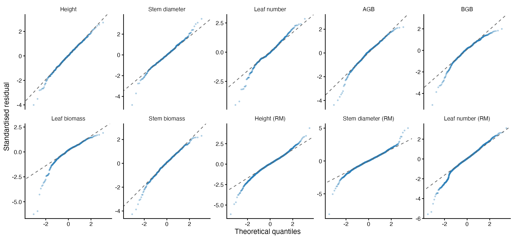

# Supplementary Materials

This document provides full methodological detail and results supporting analyses described in the Methods and Discussion. The first part (Model Structure through Sensitivity Analyses) supports the *Cultivar Impact Analysis* subsection of the Methods, including model equations, variance-component and heritability derivations, diagnostic procedures, and sensitivity analyses. The second part (Multilocus Linkage Disequilibrium through Summary of Marker Analyses) provides full detail for two supplementary tests referenced in the Discussion: a test for non-random multilocus allelic association (linkage disequilibrium) between the native and cultivar groups, and a discriminant analysis of principal components (DAPC) testing whether native and cultivar maternal trees separate on their full multilocus genotype. Both marker-based tests complement the individual-allele-sharing approach (Admixture Percentage, AP) used in the main text, which considers each of the nine microsatellite loci independently. Annotated analysis code and the underlying data are available in the online supplementary materials.

## Model Structure

Two general mixed-effects model forms were used, depending on whether a trait was measured once per individual or repeatedly across the study.

Germination date (GD), seedling survival (SS), and the traits measured at harvest (AGB, BGB, leaf biomass, stem biomass) were modeled as:

$$
y_{ijk} = \mu + Days + Sw + Family_j + Origin_k + \varepsilon_{ijk}
$$

where $y_{ijk}$ is the trait value of the $i^{th}$ individual from the $j^{th}$ maternal family (*Family*) and the $k^{th}$ origin class (*Origin*). Fixed effects included the scaled developmental time since germination (*Days*, a proxy for germination timing that accounts for differences in developmental stage at measurement; omitted when the response variable was GD itself) and the scaled mean seed weight of the $j^{th}$ maternal family ($S_w$, to account for maternal provisioning effects). Random effects were maternal family (*Family*) and origin (*Origin*), with residual error $\varepsilon_{ijk}$. Survival was fit under this same general structure using a binomial error distribution and logit link rather than a Gaussian residual.

Height, stem diameter, and number of leaves were measured at the beginning and end of each growing season and were modeled with a repeated-measures extension:
$$
y_{ijkm} = \mu + Days + Sw + Time_m + Plant_i + Family_j + Origin_k + \varepsilon_{ijkm}
$$
which adds a fixed effect of census occasion (*Time*) and a random effect of individual plant (*Plant*) to account for repeated sampling of the same seedlings.

Random effects were assumed independent and normally distributed:
$$
Family_j \sim N(0,\sigma^2_{family}), \quad Origin_k \sim N(0,\sigma^2_{origin}), \quad Plant_i \sim N(0,\sigma^2_{plant}), \quad \varepsilon \sim N(0,\sigma^2)
$$
Cultivar ancestry was represented two different ways — the binary, maternal-location *Origin* classification (a random effect) and the continuous Admixture Percentage (AP; a fixed covariate) — and each trait was modeled separately under both, allowing us to compare inference across classification schemes.

Missing maternal seed weights ($n = 1$ maternal tree, 14 cultivar-origin seedlings; $n = 8$ maternal trees, 61 native-origin seedlings) were imputed using the origin-specific mean seed weight, which reduces variance in seed weight among affected families and should be considered a conservative choice with respect to detecting seed-weight effects.

## Model Comparison

For each trait we compared a fixed-effects-only model, a model adding *Family* as a random effect, and a model adding both *Family* and *Origin*, using Akaike Information Criterion (AIC and, for the small samples, AICc), and calculated Akaike weights across the candidate set. For the admixture-based analysis the candidate set was the *Family* model with and without AP as a fixed covariate. Models within $\Delta AIC \leq 2$ were treated as having comparable empirical support; where no single model was clearly preferred, we report variance and heritability estimates under both variance decompositions rather than selecting a single "best" model (see Results). Models compared by AIC were fit by maximum likelihood; final variance-component and heritability estimates were taken from models fit by restricted maximum likelihood (REML).

## Variance Partitioning and Heritability Estimation

Variance components for origin, maternal family, and residual variation were extracted from each fitted model using `VarCorr` (*lme4*; Bates et al. 2015). We assumed a half-sib design, under which additive genetic variance is estimated as four times the maternal-family variance component ($V_A = 4V_{family}$). Total phenotypic variance was estimated as $V_P = V_{origin} + V_{family} + V_{residual}$ across origin classes, and as $V_P(s) = V_{family}(s) + V_{residual}(s)$ within each origin class $s$. The proportion of phenotypic variance attributed to each random effect was calculated by dividing that component by the corresponding total.

Narrow-sense heritability was estimated as:

$$
h^2 = \frac{4V_{family}}{V_P}, \qquad h^2(s) = \frac{4V_{family}(s)}{V_P(s)}
$$

Survival heritability was estimated on the latent liability scale, with residual variance fixed at the distribution-specific value $\pi^2/3 = 3.29$ (Gilmour et al. 1985), following the same general form.

For the repeated-measures models, $V_P$ additionally included the among-plant variance component $V_{plant}$. Ninety-five percent confidence intervals for variance components and heritability estimates were obtained from 1,000 parametric bootstrap replicates using `bootMer` (*lme4*; Bates et al. 2015). The statistical significance of each random effect was evaluated using likelihood-ratio tests (`ranova`, *lmerTest*; Kuznetsova et al. 2017, for the linear mixed models; the equivalent boundary-corrected test for the survival GLMM).

## Repeated-Measures Models

As an additional check on the growth-trait results (Results, Cultivar Impacts), the three traits measured repeatedly across both growing seasons -- plant height, stem diameter, and number of leaves -- were modeled under the repeated-measures structure described above (Model Structure) rather than using only the end-of-experiment value. These models reproduce the same pattern reported for the single end-of-experiment traits: origin adds little to model fit beyond maternal family, and the confidence intervals for the origin variance component include zero for every trait.

**Tab_RepeatedAIC.** Comparison of repeated-measures models for plant height, stem diameter, and number of leaves across four censuses (start and end of each growing season). Candidate models: fixed only (germination timing + seed weight, no random effects); + individual plant; + plant and family; + plant and origin; + plant, family, and origin. Models compared by maximum likelihood.

(A) Plant height

| Model | AIC | ΔAIC | *w*AIC | AICc | ΔAICc | *w*AICc |
| :-- | --: | --: | --: | --: | --: | --: |
| plant + family | −915.247 | 0.000 | 0.517 | −915.158 | 0.000 | 0.520 |
| plant + family + origin | −915.109 | 0.138 | 0.483 | −915.000 | 0.158 | 0.480 |
| plant + origin | −858.968 | 56.279 | 0.000 | −858.879 | 56.279 | 0.000 |
| plant | −801.361 | 113.887 | 0.000 | −801.289 | 113.869 | 0.000 |
| fixed only | −96.875 | 818.372 | 0.000 | −96.820 | 818.338 | 0.000 |

(B) Stem diameter

| Model | AIC | ΔAIC | *w*AIC | AICc | ΔAICc | *w*AICc |
| :-- | --: | --: | --: | --: | --: | --: |
| plant + family | −1389.793 | 0.000 | 0.731 | −1389.703 | 0.000 | 0.733 |
| plant + family + origin | −1387.793 | 2.000 | 0.269 | −1387.683 | 2.020 | 0.267 |
| plant | −1346.875 | 42.918 | 0.000 | −1346.803 | 42.900 | 0.000 |
| plant + origin | −1346.362 | 43.431 | 0.000 | −1346.272 | 43.431 | 0.000 |
| fixed only | −1062.438 | 327.355 | 0.000 | −1062.382 | 327.321 | 0.000 |

(C) Number of leaves

| Model | AIC | ΔAIC | *w*AIC | AICc | ΔAICc | *w*AICc |
| :-- | --: | --: | --: | --: | --: | --: |
| plant + family | 2321.183 | 0.000 | 0.731 | 2321.278 | 0.000 | 0.733 |
| plant + family + origin | 2323.183 | 2.000 | 0.269 | 2323.299 | 2.021 | 0.267 |
| plant + origin | 2342.074 | 20.891 | 0.000 | 2342.169 | 20.891 | 0.000 |
| plant | 2342.144 | 20.961 | 0.000 | 2342.219 | 20.942 | 0.000 |
| fixed only | 2469.840 | 148.656 | 0.000 | 2469.898 | 148.621 | 0.000 |

**Tab_RepeatedHeritability.** Variance components (origin, family, plant, residual — residual not shown), proportion of phenotypic variance, and narrow-sense heritability (*h*²) from the repeated-measures origin + family and family models, with 1000-replicate bootstrap 95% CIs, for the original data and after removing outlier observations (obs) or the most influential family (fam). Significance from `ranova`: · *p* < 0.1, * *p* < 0.05, ** *p* < 0.01, *** *p* < 0.001.

| Trait | Model | Sensitivity | *V*origin | *V*family | *V*plant | *h*² |
| :-- | :-- | :-- | :-- | :-- | :-- | :-- |
| Plant height | origin + family | original | 0.021 [0.000, 0.111]* | 0.008 [0.004, 0.014]*** | 0.023 [0.019, 0.027]*** | 0.438 [0.150, 0.849] |
| Plant height | origin + family | obs | 0.019 [0.000, 0.098]* | 0.009 [0.004, 0.014]*** | 0.020 [0.017, 0.024] | 0.517 [0.185, 0.957] |
| Plant height | origin + family | fam | 0.009 [0.000, 0.052] | 0.006 [0.002, 0.011]*** | 0.023 [0.019, 0.026] | 0.381 [0.137, 0.691] |
| Plant height | family | original | — | 0.012 [0.006, 0.019]*** | 0.023 [0.020, 0.027]*** | 0.796 [0.432, 1.158] |
| Plant height | family | obs | — | 0.012 [0.006, 0.021]*** | 0.021 [0.018, 0.024] | 0.926 [0.508, 1.347] |
| Plant height | family | fam | — | 0.007 [0.003, 0.013]*** | 0.023 [0.019, 0.026] | 0.555 [0.280, 0.882] |
| Stem diameter | origin + family | original | 0.000 [0.000, 0.006] | 0.003 [0.001, 0.005]*** | 0.010 [0.008, 0.012]*** | 0.291 [0.109, 0.496] |
| Stem diameter | origin + family | obs | 0.001 [0.000, 0.009] | 0.003 [0.001, 0.004]*** | 0.009 [0.007, 0.010] | 0.337 [0.143, 0.556] |
| Stem diameter | origin + family | fam | 0.002 [0.000, 0.013] | 0.002 [0.001, 0.004]*** | 0.010 [0.008, 0.012] | 0.250 [0.072, 0.452] |
| Stem diameter | family | original | — | 0.003 [0.001, 0.005]*** | 0.010 [0.008, 0.012]*** | 0.303 [0.131, 0.524] |
| Stem diameter | family | obs | — | 0.003 [0.001, 0.005]*** | 0.009 [0.007, 0.010] | 0.375 [0.175, 0.595] |
| Stem diameter | family | fam | — | 0.003 [0.001, 0.005]*** | 0.010 [0.008, 0.012] | 0.310 [0.121, 0.534] |
| Number of leaves | origin + family | original | 0.003 [0.000, 0.030] | 0.008 [0.001, 0.016]*** | 0.043 [0.033, 0.055]*** | 0.153 [0.026, 0.296] |
| Number of leaves | origin + family | obs | 0.004 [0.000, 0.032] | 0.008 [0.002, 0.015]*** | 0.043 [0.033, 0.054] | 0.167 [0.044, 0.311] |
| Number of leaves | origin + family | fam | 0.008 [0.000, 0.053] | 0.007 [0.002, 0.015]*** | 0.041 [0.030, 0.053] | 0.134 [0.031, 0.263] |
| Number of leaves | family | original | — | 0.009 [0.002, 0.017]*** | 0.043 [0.032, 0.055]*** | 0.164 [0.044, 0.316] |
| Number of leaves | family | obs | — | 0.009 [0.003, 0.017]*** | 0.042 [0.032, 0.054] | 0.187 [0.065, 0.353] |
| Number of leaves | family | fam | — | 0.003 [0.000, 0.008]· | 0.043 [0.032, 0.054] | 0.060 [0.000, 0.152] |

## Covariate Effects on Survival and Growth

Every model included two family-level covariates -- developmental time since germination and the maternal family's mean seed weight -- to account for early developmental and maternal provisioning effects (Model Structure). The main text summarizes their effects narratively (Results, Family-Level Variation and Trait Heritability); full trait-by-trait coefficient estimates, for the full sample and within each origin class, are given here.

**Tab_CovariateEffects.** Estimated effects of the two family-level covariates on survival (logit scale) and on each end-of-experiment growth trait (ln scale), from the family model, for the full sample and within each origin class. Cells give the coefficient (SE). Germination timing is scaled developmental time since germination (higher = earlier germination, more growing time before measurement); seed weight is the scaled maternal family mean. · *p* < 0.1, * *p* < 0.05, ** *p* < 0.01, *** *p* < 0.001.

| Response | Subset | Germination timing | Seed weight |
| :-- | :-- | --: | --: |
| Survival | Total | +2.000 (0.241)*** | −0.381 (0.162)* |
| Survival | Native | +1.480 (0.360)*** | −1.036 (0.455)* |
| Survival | Cultivar | +2.336 (0.336)*** | −0.503 (0.349) |
| Plant height | Total | +0.095 (0.012)*** | +0.030 (0.019) |
| Plant height | Native | +0.150 (0.029)*** | −0.016 (0.073) |
| Plant height | Cultivar | +0.080 (0.013)*** | −0.055 (0.031)· |
| Stem diameter | Total | +0.087 (0.011)*** | +0.001 (0.013) |
| Stem diameter | Native | +0.134 (0.027)*** | +0.022 (0.048) |
| Stem diameter | Cultivar | +0.074 (0.011)*** | −0.037 (0.023) |
| Number of leaves | Total | −0.003 (0.027) | −0.017 (0.032) |
| Number of leaves | Native | −0.013 (0.059) | −0.060 (0.102) |
| Number of leaves | Cultivar | −0.004 (0.031) | −0.026 (0.064) |
| Above-ground biomass | Total | +0.265 (0.032)*** | +0.013 (0.045) |
| Above-ground biomass | Native | +0.359 (0.075)*** | −0.081 (0.131) |
| Above-ground biomass | Cultivar | +0.237 (0.035)*** | −0.188 (0.076)* |
| Below-ground biomass | Total | +0.375 (0.039)*** | +0.003 (0.049) |
| Below-ground biomass | Native | +0.576 (0.094)*** | +0.074 (0.203) |
| Below-ground biomass | Cultivar | +0.324 (0.041)*** | −0.190 (0.081)* |
| Leaf biomass | Total | +0.289 (0.046)*** | −0.025 (0.056) |
| Leaf biomass | Native | +0.386 (0.105)*** | −0.174 (0.184) |
| Leaf biomass | Cultivar | +0.256 (0.050)*** | −0.289 (0.089)** |
| Stem biomass | Total | +0.255 (0.030)*** | +0.040 (0.044) |
| Stem biomass | Native | +0.347 (0.070)*** | −0.007 (0.148) |
| Stem biomass | Cultivar | +0.230 (0.032)*** | −0.142 (0.077)· |

## Model Diagnostics

For the linear mixed models, residual normality was assessed with normal quantile–quantile plots (Fig_LMM_QQ), homoscedasticity with residual-vs-fitted and scale–location plots, and group-level influence with leave-one-out Cook's distance on the fixed effects. Response variables were log-transformed where these plots indicated right-skew or non-constant variance. Formal Shapiro–Wilk tests rejected residual normality for most traits. At these sample sizes ($n$ = 465–2021) the test detects small departures, and the Q–Q plots show that the central distribution of residuals is well behaved for every model; the departures are confined to the lower tail and reflect mild left-skew — a small number of unusually low residuals — most pronounced for below-ground and leaf biomass. The outlier-removal sensitivity analysis below was run specifically to check that these tail observations do not drive the variance-component estimates: the estimates are qualitatively unchanged and, where they shift, the maternal-family signal strengthens rather than weakens. The correlation between residual scale and fitted value was small for every model ($|r| \leq 0.17$), indicating no meaningful heteroscedasticity. Residual-vs-fitted, scale–location, and Q–Q panels for every model are available in the code repository.

For the generalized linear mixed models (survival), fit was assessed using simulation-based residual diagnostics (1,000 simulated residuals per model via `simulateResiduals`, *DHARMa*; Hartig 2016). Tests for residual uniformity, dispersion, and outliers were non-significant for the full sample and both origin subsets (all $p > 0.2$), with the single exception of a marginal outlier test in the cultivar subset ($p = 0.02$); we detected no meaningful violations of GLMM assumptions. Family-specific conditional modes (BLUPs) were extracted from the cultivar-origin survival model using `ranef` (*lme4*; Bates et al. 2015) to visualize among-family variation in survival (Fig_BLUPs).

**Fig_LMM_QQ.** Normal quantile–quantile plots of the standardized residuals from the top-supported model of each trait: the seven end-of-experiment single-measurement traits and the three repeated-measures traits (RM). Points on the dashed line indicate normally distributed residuals. The central distribution is well behaved for every model; departures are confined to the lower tail (mild left-skew), most visible for below-ground and leaf biomass. Shapiro–Wilk tests reject normality for most models (see text).

## Sensitivity Analyses

To assess the robustness of fixed- and random-effects inference, we refit each model after temporarily removing (a) individual-level outliers, identified by standardized residuals with $|z| > 3$, and (b) influential maternal families, identified by large Cook's distance values.

Removing outlier individual-level observations did not substantially change heritability estimates for most traits, and the significance of family-level random effects generally increased slightly; the largest shift was in below-ground biomass ($h^2 = 0.23 \rightarrow 0.36$).

Removing the single most influential maternal family (identified by the largest leave-one-out Cook's distance on the fixed effects) had a larger effect on variance-component and heritability estimates than removing outlier individuals. For most growth traits this family was urb09. For example, in the stem biomass model, removing urb09 reduced the family variance component ($V_{family} = 0.046 \rightarrow 0.016$) and heritability ($h^2 = 0.51 \rightarrow 0.19$), and weakened but did not eliminate support for the family random effect ($\chi^2 = 5.3$, df $= 1$, $p = 0.022$).

## Native Collection Site

Native-origin maternal trees were sampled from two forest sites, Pocahontas State Park and the VCU Rice Rivers Center. Before pooling them into a single *native* category (Sampling Design), we tested for an effect of collection site on survival and each growth trait, restricted to native-origin seedlings and controlling for germination timing, seed weight, and maternal family. No site effect was significant for any response.

**Tab_SiteEffect.** Test of native collection site (Pocahontas State Park, 11 families / 147 seedlings; VCU Rice Rivers Center, 5 families / 27 seedlings) on survival and each growth trait, native-origin seedlings only. Each row is a likelihood-ratio test of a `site` fixed-effect term added to a model with germination timing, seed weight, and maternal family.

| Response | *n* | Site coefficient (SE) | χ² | df | *p* |
| :-- | --: | --: | --: | --: | --: |
| Survival | 174 | −0.424 (0.523) | 0.640 | 1 | 0.424 |
| Plant height | 138 | −0.026 (0.063) | 0.169 | 1 | 0.681 |
| Stem diameter | 138 | −0.047 (0.056) | 0.698 | 1 | 0.403 |
| Number of leaves | 137 | 0.131 (0.119) | 1.215 | 1 | 0.270 |
| Above-ground biomass | 138 | −0.121 (0.158) | 0.582 | 1 | 0.446 |
| Below-ground biomass | 138 | −0.222 (0.197) | 1.259 | 1 | 0.262 |
| Leaf biomass | 138 | −0.119 (0.223) | 0.286 | 1 | 0.593 |
| Stem biomass | 138 | −0.212 (0.146) | 2.089 | 1 | 0.148 |

## Marker Panel Diversity and Validation

Basic diversity statistics for the nine cultivar-diagnostic microsatellite loci, maximum-likelihood estimates of null-allele frequency at each locus, and the composition of the cultivar voucher panel used as the reference key for admixture scoring (Genetic Analyses) are given here.

**Tab_MarkerDiversity.** Diversity of the nine cultivar-diagnostic microsatellite loci in the maternal trees and in the offspring arrays: number of alleles (*A*), effective number of alleles (*A*ₑ), observed and expected heterozygosity (*H*ₒ, *H*ₑ), inbreeding coefficient (*F*IS), and single-locus exclusion probability (*P*ₑ).

| Sample | Locus | *A* | *A*ₑ | *H*ₒ | *H*ₑ | *F*IS | *P*ₑ |
| :-- | :-- | --: | --: | --: | --: | --: | --: |
| Maternal | cf020 | 13 | 8.309 | 0.842 | 0.880 | 0.043 | 0.883 |
| Maternal | cf125 | 5 | 3.296 | 0.707 | 0.697 | −0.015 | 0.670 |
| Maternal | cf213 | 26 | 16.291 | 0.948 | 0.939 | −0.010 | 0.942 |
| Maternal | cf273 | 9 | 2.220 | 0.552 | 0.549 | −0.004 | 0.581 |
| Maternal | cf581 | 5 | 1.384 | 0.207 | 0.278 | 0.255 | 0.245 |
| Maternal | cf585 | 18 | 9.737 | 0.862 | 0.897 | 0.039 | 0.893 |
| Maternal | cf597 | 11 | 7.258 | 0.810 | 0.862 | 0.060 | 0.875 |
| Maternal | cf634 | 13 | 6.513 | 0.828 | 0.846 | 0.022 | 0.841 |
| Maternal | cf701 | 9 | 4.904 | 0.690 | 0.796 | 0.134 | 0.792 |
| Maternal | **all loci** | 109 | 59.912 | 0.716 | 0.749 | 0.058 | — |
| Offspring | cf020 | 18 | 8.569 | 0.816 | 0.883 | 0.077 | 0.883 |
| Offspring | cf125 | 6 | 3.008 | 0.670 | 0.668 | −0.004 | 0.670 |
| Offspring | cf213 | 33 | 17.352 | 0.933 | 0.942 | 0.010 | 0.942 |
| Offspring | cf273 | 10 | 2.398 | 0.571 | 0.583 | 0.020 | 0.581 |
| Offspring | cf581 | 7 | 1.321 | 0.234 | 0.243 | 0.036 | 0.245 |
| Offspring | cf585 | 21 | 9.333 | 0.810 | 0.893 | 0.093 | 0.893 |
| Offspring | cf597 | 18 | 8.035 | 0.790 | 0.876 | 0.098 | 0.875 |
| Offspring | cf634 | 17 | 6.250 | 0.830 | 0.840 | 0.012 | 0.841 |
| Offspring | cf701 | 13 | 4.803 | 0.729 | 0.792 | 0.079 | 0.792 |
| Offspring | **all loci** | 143 | 61.068 | 0.709 | 0.747 | 0.047 | — |

**Tab_NullAlleles.** Maximum-likelihood estimates of null-allele frequency per locus for the cultivar- and native-origin samples (Genepop; Rousset 2008), with 95% confidence intervals. A locus is excluded from the reduced marker panel when its confidence interval excludes zero in both origin classes.

| Locus | Cultivar | Native | In reduced panel |
| :-- | :-- | :-- | :--: |
| cf020 | 0.043 [0.026, 0.062] | 0.023 [0.006, 0.045] | no |
| cf125 | 0.004 [0.000, 0.029] | 0.010 [0.000, 0.042] | yes |
| cf213 | 0.011 [0.002, 0.025] | 0.000 [0.000, 0.012] | yes |
| cf273 | 0.028 [0.011, 0.051] | 0.013 [0.000, 0.040] | yes |
| cf581 | 0.009 (no CI) | 0.018 [0.000, 0.053] | yes |
| cf585 | 0.062 [0.045, 0.083] | 0.017 [0.004, 0.035] | no |
| cf597 | 0.042 [0.025, 0.062] | 0.033 [0.012, 0.059] | no |
| cf634 | 0.010 [0.000, 0.027] | 0.002 [0.000, 0.022] | yes |
| cf701 | 0.022 [0.004, 0.043] | 0.043 [0.021, 0.070] | no |

Combined multilocus exclusion probability (gstudio; Dyer 2009): full nine-locus panel *P*excl = 1.00000; reduced five-locus panel (cf125, cf213, cf273, cf581, cf634) *P*excl = 0.99904.

**Tab_CultivarVoucherPanel.** Named cultivar accessions genotyped as the reference voucher panel for admixture scoring, sorted alphabetically. Sample tags are lab shorthand; a trailing number is part of an accession's identity, not a replicate index.

| Accession | Sample tag |
| :-- | :-- |
| *Appalachian Blush* | Appalachianblush |
| *Appalachian Joy* | Appalachianjoy |
| *Appalachian Mist* | Appalachianmist |
| *Appalachian Snow* | Appalchiansnow |
| *Appalachian Snow 15* | Appalachiansnow15 |
| *Appalachian Spring* | Appalachianspring |
| *Cherokee Brave* | Cherokeebrave |
| *Cherokee Chief* | Cherokeechief |
| *Cherokee Princess* | Cherokeeprincess |
| *Cherokee Princess 3* | Cherokeeprincess3 |
| *Cloud Nine* | Cloudnine |
| *Cornus Hyperion* | Cornushyperion |
| *Double Pink* | Doublepink |
| *Little Princess* | Littleprincess |
| *Plena* | Plena |
| *Red Beauty* | RedBeauty |
| *Red Pygmy* | Redpygmy |
| *Rubra* | Rubra |
| *Rubra Pink 15* | Rubrapink15 |
| *Spring Grove* | Springgrove |
| *Stellar Pink* | Stellarpink |

## Multilocus Linkage Disequilibrium (Index of Association)

AP and the comparison of the full nine-locus panel against the reduced six-locus panel of Wadl et al. (2008) (Results, Genetic Analysis) both examine individual alleles one locus at a time, and both found a diffuse pattern of allele sharing with no sharp separation between the native and cultivar groups. This leaves open a different question: do the nine loci co-vary with one another more than expected under random mating within a group, even though no single locus, or a simple sum across loci, separates the groups? Elevated multilocus linkage disequilibrium can arise from cryptic structure of exactly this kind, and is also the standard signature used to detect clonal or partially clonal reproduction — relevant here because cultivars are clonally propagated.

We used the standardized index of association ($\bar{r}_D$, and the related $I_A$; Agapow and Burt 2001), with a 999-permutation test of the null hypothesis of linkage equilibrium (no multilocus association), implemented in `poppr` (Kamvar et al. 2014). This was computed for two datasets:

1. **Maternal trees only** (58 unrelated individuals) — the clean test. No two of these individuals are siblings, so any $I_A$ signal here cannot be a family or kinship artifact.
2. **Maternal trees pooled with their offspring** (886 individuals) — included for reference only. This dataset contains many maternal half- and full-sib families, and sibling groups are *expected* to show elevated multilocus association purely from shared parentage (a Wahlund-type effect of family structure), regardless of any cultivar signal. A positive result here, without a matching positive result in the maternal-only dataset, is not evidence of a native/cultivar effect.

Both datasets were analyzed separately within each origin group (native, cultivar) and for the pooled/total sample.

**Tab_LinkageDisequilibrium.** Index of association ($I_A$) and standardized index of association ($\bar{r}_D$; Agapow and Burt 2001), with permutation-based *p*-values (999 permutations; `poppr`, Kamvar et al. 2014).

| Dataset | Group | N | $I_A$ | *p* ($I_A$) | $\bar{r}_D$ | *p* ($\bar{r}_D$) |
|---|---|---|---|---|---|---|
| Maternal trees only (unrelated individuals) | Native | 26 | -0.071 | 0.717 | -0.009 | 0.718 |
| Maternal trees only (unrelated individuals) | Cultivar | 32 | 0.063 | 0.235 | 0.008 | 0.235 |
| Maternal trees only (unrelated individuals) | Total | 58 | -0.012 | 0.542 | -0.002 | 0.542 |
| Pooled maternal + offspring (family-structured) | Native | 330 | 0.063 | 0.004 | 0.008 | 0.004 |
| Pooled maternal + offspring (family-structured) | Cultivar | 471 | 0.167 | 0.001 | 0.021 | 0.001 |
| Pooled maternal + offspring (family-structured) | Total | 801 | 0.061 | 0.001 | 0.008 | 0.001 |

In the maternal-only dataset — the test unconfounded by family structure — neither the native nor the cultivar group showed evidence of multilocus linkage disequilibrium ($p > 0.2$ in both groups). The pooled dataset showed strongly significant linkage disequilibrium in both groups ($p \leq 0.004$), exactly as expected from the family (sibship) structure it contains rather than from any native/cultivar effect, and is reported here only to confirm that the test correctly detects the association it is known to be sensitive to. Judged from the maternal-only rows, we find no evidence of non-random multilocus allelic association distinguishing the native and cultivar groups.

## Discriminant Analysis of Principal Components (DAPC)

As a complementary multivariate test, we asked whether native and cultivar maternal trees separate on their full nine-locus genotype, considered jointly rather than one locus or one linkage relationship at a time, using discriminant analysis of principal components (DAPC; Jombart et al. 2010). This analysis was restricted to the 58 unrelated maternal trees for the same reason given above: no two of these individuals are siblings, so the result cannot reflect family structure.

DAPC is known to be prone to manufacturing apparent group separation when too many principal-component axes are retained relative to sample size, since additional axes give the discriminant step more ways to fit idiosyncratic differences between arbitrarily labeled groups. We guarded against this in two ways. First, rather than fixing the number of retained axes by inspection, we selected it by cross-validation (`xvalDapc`, capped at a maximum of 20 axes given $N = 58$), which chooses the number of axes that maximizes out-of-sample classification accuracy. Second, we assessed statistical significance by permutation rather than by treating any visual separation as evidence on its own: repeated (30 replicates) 80/20 stratified holdout classification accuracy was computed for the true native/cultivar labels, and this entire procedure was then repeated on 999 random relabelings of the same 58 trees (holding the number of retained axes fixed) to build an empirical null distribution.

**Tab_DAPC.** DAPC classification of native versus cultivar maternal trees on the full nine-locus genotype.

| $N$ (native, cultivar) | PCA axes retained (cross-validated) | Observed accuracy | No-information rate | Permutation mean | Permutation 95th percentile | *p*-value (999 permutations) |
|---|---|---|---|---|---|---|
| 58 (26, 32) | 18 | 0.561 | 0.552 | 0.509 | 0.615 | 0.237 |

Cross-validation retained 18 of the 20 allowed principal-component axes — a large number relative to $N = 58$, and the regime in which DAPC is most prone to overfitting. Even so, observed classification accuracy (56.1%) was close to the no-information rate set by the class imbalance (55.2% native/cultivar split) and indistinguishable from the permutation null (permutation mean 50.9%, 95th percentile 61.5%, $p = 0.237$). That the test had ample room to overfit and still did not exceed chance strengthens, rather than weakens, the conclusion that native and cultivar maternal trees are not distinguishable on overall multilocus genotype at these nine loci.

## Pairwise Relatedness Among Maternal Trees

The origin classification used throughout the main text groups maternal trees by sampling location -- native forest sites versus urban cultivar plantings -- rather than by any direct measure of ancestry, so the two groups could differ in relatedness structure independent of cultivar status per se. Native-origin mothers were sampled from only two nearby forest sites, while cultivar-origin mothers represent independently propagated named lines. Given evidence for isolation by distance in *C. florida* (Dyer et al. 2012), it is plausible a priori that native mothers are more closely related to one another than cultivar mothers are, and that this -- rather than a genuine origin effect -- could account for some of the asymmetry in family-level variance components reported in the main text (Results, Family-Level Variation and Trait Heritability).

We tested this using Nason's pairwise coancestry coefficient ($F_{ij}$, expressed on the relatedness scale as $r = 2F_{ij}$; `gstudio`; Dyer 2009), computed for all pairwise comparisons among the same 58 genotyped maternal trees used in the linkage-disequilibrium and DAPC analyses above. Pairwise relatedness values are not independent -- every individual contributes to multiple pairs -- so within-group pairs were not treated as independent samples. Instead, the native/cultivar origin label was permuted across the same 58 individuals 9,999 times, holding the true group sizes (26 native, 32 cultivar) fixed, and the mean within-group relatedness and a two-sample Kolmogorov-Smirnov statistic between the within-native and within-cultivar relatedness distributions were recomputed under each relabeling, giving an empirical null for both statistics without requiring the pairs to be independent.

**Tab_Relatedness.** Pairwise relatedness (Nason's coancestry, expressed as $r = 2F_{ij}$) among native versus cultivar maternal trees, with permutation-based *p*-values (9,999 relabelings) for the difference in means and for a two-sample Kolmogorov-Smirnov statistic.

| N (native, cultivar) | Mean *r*, native | Mean *r*, cultivar | Observed difference | *p* (mean difference) | Observed *D* (KS) | *p* (KS) |
|---|---|---|---|---|---|---|
| 58 (26, 32) | -0.000 | -0.001 | 0.001 | 0.923 | 0.034 | 0.995 |

Neither statistic showed evidence of a difference in relatedness structure between the two groups: the observed difference in mean pairwise relatedness was smaller than expected under random relabeling of the same 58 individuals (*p* = 0.923), and the two within-group relatedness distributions were, if anything, more similar to each other than a random split would typically produce (*p* = 0.995). We therefore find no evidence that native-origin maternal trees are more closely related to one another than cultivar-origin maternal trees are, and conclude that the family-level variance asymmetry between origin groups reported in the main text is unlikely to be an artifact of differential kinship structure between them.

## Realized Within-Mother Offspring Relatedness and Heritability

Every heritability estimate in the main text assumes open-pollinated maternal arrays are half-sib families ($r = 0.25$, so $h^2 = 4 V_{\text{family}}/V_P$), which the main text already flags as an upper-bound assumption (Results, Family-Level Variation and Trait Heritability): open pollination can mix in full-sib pairs (shared father, $r = 0.5$) within a mother's own offspring array, which would push the true relatedness-based multiplier below 4 (down to a floor of 2 if every pair were full sibs).

To gauge how much this matters in practice, we estimated realized pairwise relatedness (Nason's coancestry, $r = 2F_{ij}$; `gstudio`; Dyer 2009; same method as Tab_Relatedness above) among each mother's own genotyped offspring, restricted to offspring with a complete nine-locus genotype, and pooled all within-mother sibling pairs within each origin (native, cultivar) rather than averaging per mother first, since the question of interest is the shape of the realized relatedness distribution across each origin's half-sib arrays rather than any individual mother's estimate. We then re-expressed heritability for each trait's origin-specific family-variance estimate ($P_{\text{family}} = V_{\text{family}}/V_P$; the same quantity behind Tab_OriginHeritability) as $h^2 = P_{\text{family}} / r$, using each origin's pooled median realized relatedness in place of the assumed $r = 0.25$ (median rather than mean: with only nine loci, a minority of pairwise $F_{ij}$ estimates are noisy outliers well outside the biologically sensible [0, 1] range, which disproportionately distort the mean but not the median). Full method, including two `gstudio`-specific estimation pitfalls this avoids (a missing-genotype imputation bug, and family-local rather than population-level reference allele frequencies), is documented in `R/16_offspring_relatedness.R`.

**Tab_HeritabilityRelatedness.** Heritability re-expressed under realized within-mother offspring relatedness, bracketed by the half-sib ($r = 0.25$) and full-sib ($r = 0.5$) assumptions. $h^2_{\text{dist}}$ is the point estimate at each origin's pooled median pairwise relatedness among complete-genotype offspring (native median $r$ = 0.259, $n$ = 1421 pairs among 24 mothers; cultivar median $r$ = 0.291, $n$ = 1810 pairs among 31 mothers).

| Trait                | Origin   | Half Sibling | Relatedness | Full Sibling |
|----------------------|----------|:------------:|:-----------:|:------------:|
| Plant height         | Native   | 0.238        | 0.230       | 0.119        |
| Stem diameter        | Native   | 0.008        | 0.008       | 0.004        |
| Number of leaves     | Native   | 0.000        | 0.000       | 0.000        |
| Above-ground biomass | Native   | 0.000        | 0.000       | 0.000        |
| Below-ground biomass | Native   | 0.103        | 0.099       | 0.051        |
| Leaf biomass         | Native   | 0.000        | 0.000       | 0.000        |
| Stem biomass         | Native   | 0.090        | 0.087       | 0.045        |
| Plant height         | Cultivar | 0.474        | 0.408       | 0.237        |
| Stem diameter        | Cultivar | 0.247        | 0.213       | 0.124        |
| Number of leaves     | Cultivar | 0.263        | 0.226       | 0.131        |
| Above-ground biomass | Cultivar | 0.322        | 0.277       | 0.161        |
| Below-ground biomass | Cultivar | 0.233        | 0.201       | 0.117        |
| Leaf biomass         | Cultivar | 0.130        | 0.112       | 0.065        |
| Stem biomass         | Cultivar | 0.438        | 0.376       | 0.219        |

Across both origins and every trait, the realized-relatedness point estimate falls below the published half-sib value, consistent with a modest admixture of full-sib pairs within maternal offspring arrays rather than a pure half-sib design; native traits whose family-variance estimate is already at or near zero (number of leaves, above-ground biomass, leaf biomass) are unaffected by the relatedness assumption, since $h^2 = 0$ regardless of the divisor. This does not change the qualitative pattern reported in the main text — heritability differs more by origin than it does across relatedness assumptions within an origin — but it does confirm that the half-sib figures reported there are best read as upper bounds.

## Summary of Marker Analyses

Together with the admixture-percentage comparisons in the main text (Results, Genetic Analysis), these three analyses — examining correlation structure among loci, multivariate separability of the full genotype, and pairwise relatedness structure — find no evidence that native and cultivar maternal trees form distinguishable genetic groups, or differ systematically in relatedness, at these nine microsatellite loci.

## Software

All statistical analyses were performed in `R` (version 4.5.3; R Core Team 2026). Mixed-effects models used `lme4` (version 2.0.6; Bates et al. 2015), `lmerTest` (version 3.2.1; Kuznetsova et al. 2017), `MuMIn` (version 1.48.19) for AICc, and `DHARMa` (version 0.5.0; Hartig 2016) for GLMM diagnostics. Marker-based analyses used `gstudio` (version 1.14; Dyer 2009) and `genepop` (version 1.2.17; Rousset 2008) for exclusion probabilities and null-allele frequency estimation, `poppr` (version 2.9.8; Kamvar et al. 2014) for the multilocus linkage-disequilibrium analysis, and `adegenet` (version 2.1.11; Jombart 2008) for the DAPC analysis. Annotated code and data are available in the online supplementary materials.

# Literature Cited

Agapow PM, Burt A (2001) Indices of multilocus linkage disequilibrium. Mol Ecol Notes 1:101–102. https://doi.org/10.1046/j.1471-8278.2000.00014.x

Bates D, Mächler M, Bolker B, Walker S (2015) Fitting linear mixed-effects models using lme4. J Stat Softw 67:1–48. https://doi.org/10.18637/jss.v067.i01

Dyer RJ (2009) GeneticStudio: a suite of programs for spatial analysis of genetic-marker data. Mol Ecol Resour 9:110–113. https://doi.org/10.1111/j.1755-0998.2008.02384.x

Dyer RJ, Chan DM, Gardiakos VA, Meadows CA (2012) Pollination graphs: quantifying pollen pool covariance networks and the influence of intervening landscape on genetic connectivity in the North American understory tree, Cornus florida L. Landsc Ecol 27:239–251. https://doi.org/10.1007/s10980-011-9696-x

Gilmour AR, Anderson RD, Rae AL (1985) The analysis of binomial data by a generalized linear mixed model. Biometrika 72:593–599

Hartig F (2016) DHARMa: residual diagnostics for hierarchical (multi-level/mixed) regression models. R package. https://doi.org/10.32614/CRAN.package.DHARMa

Jombart T (2008) adegenet: a R package for the multivariate analysis of genetic markers. Bioinformatics 24:1403–1405. https://doi.org/10.1093/bioinformatics/btn129

Jombart T, Devillard S, Balloux F (2010) Discriminant analysis of principal components: a new method for the analysis of genetically structured populations. BMC Genet 11:94. https://doi.org/10.1186/1471-2156-11-94

Kamvar ZN, Tabima JF, Grünwald NJ (2014) Poppr: an R package for genetic analysis of populations with clonal, partially clonal, and/or sexual reproduction. PeerJ 2:e281. https://doi.org/10.7717/peerj.281

Kuznetsova A, Brockhoff PB, Christensen RHB (2017) lmerTest package: tests in linear mixed effects models. J Stat Softw 82:1–26. https://doi.org/10.18637/jss.v082.i13

R Core Team (2026) R: a language and environment for statistical computing. R Foundation for Statistical Computing, Vienna

Rousset F (2008) genepop'007: a complete re-implementation of the genepop software for Windows and Linux. Mol Ecol Resour 8:103–106. https://doi.org/10.1111/j.1471-8286.2007.01931.x

Wadl PA, Wang X, Trigiano AN, et al (2008) Molecular identification keys for cultivars and lines of Cornus florida and C. kousa based on simple sequence repeat loci. J Am Soc Hortic Sci 133:783–793. https://doi.org/10.21273/JASHS.133.6.783
